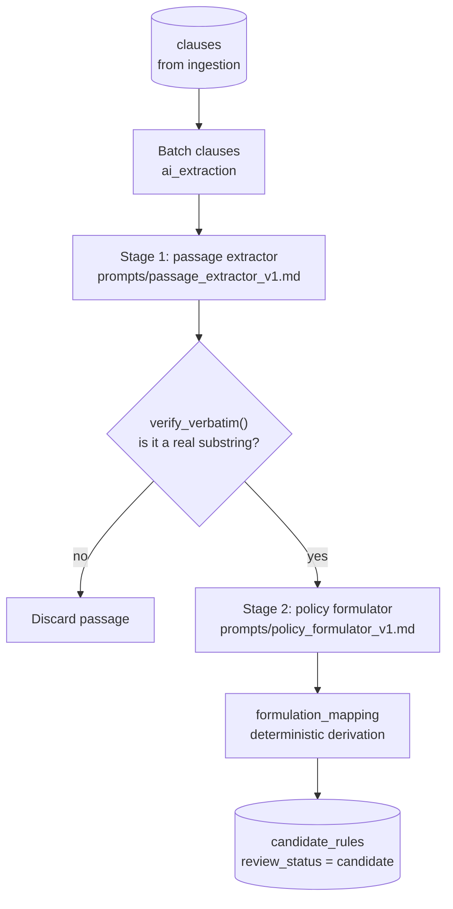
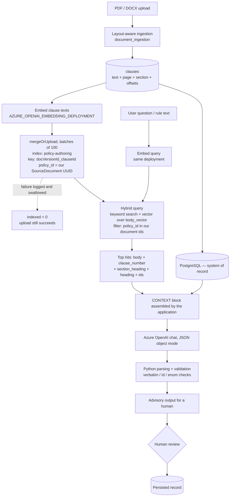

# AI assistance

What the AI actually does in this platform, where it is invoked from, and what it
is never allowed to do. This page describes the implementation, not AI in
general.

AI is **required**, not optional. The product this repository implements is an
AI-assisted policy formalization platform: without Azure OpenAI there is no
extraction, no quality review, no correlation, no rewrite, no test proposal and
no Ask AI — only the deterministic evaluator running over rules someone imported
or typed by hand. A **grounding/search layer is equally required** for the
intended behaviour, because grounded answers and grounded test proposals are the
point: an ungrounded model answer about policy is exactly the recollection this
platform exists to replace.

Two configuration blocks are therefore mandatory for a full-product deployment:

| Requirement | Variables | Enforced by |
|---|---|---|
| **Azure OpenAI** — chat + embeddings | `AZURE_OPENAI_ENDPOINT`, `_API_KEY`, `_DEPLOYMENT`, `_EMBEDDING_DEPLOYMENT` (and `_FAST_DEPLOYMENT` for chat latency) | `Settings.ai_enabled` |
| **Grounding/search layer** — currently Azure AI Search | `AZURE_SEARCH_ENDPOINT`, `_API_KEY` | `Settings.search_enabled` |

> **Current runtime enforcement is weaker than the product requirement.** The
> process still starts with both blocks blank. That is a **degraded, diagnostic
> mode allowed by the current code**, not a supported deployment: AI routes
> return `503`, the UI shows an "AI disabled" pill, clause indexing is skipped,
> Ask AI cannot retrieve, and only deterministic features (import, evaluate,
> policy tests, export, decision log, audit) still work. There is no fail-fast
> startup check that refuses to boot without AI and search configured — that gap
> is recorded in [Known limitations](known-limitations.md).

For diagrams of each AI-touching flow see
[Capability flows](capability-flows.md); for what is and is not covered by
automated tests, see [Testing and scripts](testing.md); for Microsoft's own
documentation on the services used, see
[Microsoft technologies](microsoft-technologies.md).

## The one rule

> **No model participates in a runtime policy decision.**

Models draft, suggest, classify and narrate. Humans approve. Deterministic Python
decides. Concretely:

| Concern | Owner |
|---|---|
| Deciding which text is policy-bearing and copying it verbatim | Model (Stage 1), re-verified in code |
| Deciding what a policy statement *means* as structured data | Model (Stage 2) |
| Identifiers, rule-type mapping, condition compilation | Deterministic code (`formulation_mapping.py`) |
| Approving, rejecting, publishing | Human |
| Evaluating facts against rules | Deterministic code (`evaluator/engine.py`) |
| Deciding whether a policy test passes | Deterministic code (`evaluator/test_runner.py`) |
| Rule-level diffs, structural quality checks, export | Deterministic code |

## Model configuration

Two Azure OpenAI deployments are used for different jobs, both called through a
thin `httpx` REST client (`infrastructure/ai/openai_client.py`) rather than an
SDK:

| Setting | Used for |
|---|---|
| `AZURE_OPENAI_DEPLOYMENT` | Reasoning work where correctness matters: extraction, quality review, correlation, rewrite, compare. |
| `AZURE_OPENAI_FAST_DEPLOYMENT` | Interactive Ask AI chat, where latency matters more. |
| `AZURE_OPENAI_EMBEDDING_DEPLOYMENT` | Embeddings for clause indexing and retrieval. |

Azure AI Search holds indexed clauses for retrieval grounding — see
[How the AI is grounded](#how-the-ai-is-grounded) for the full path. Writes are
scoped by the platform's own document IDs so it can safely share an index with
unrelated data, and indexing is best-effort.

Structured responses are requested with JSON *object* mode
(`response_format: {"type": "json_object"}`) and then validated in Python with
Pydantic — not with JSON-Schema-constrained structured outputs. The shape is
enforced by the prompt contract *and* re-checked in code, so a malformed or
hallucinated field is rejected rather than persisted.

## The extraction pipeline

Extraction is deliberately two agents, not one prompt. Scanning and formulating
are different jobs with different failure modes.

**Stage 1 — verbatim passage extraction** (`passage_extractor.py`) decides which
spans of a document are policy-bearing and copies them out character for
character. It never writes policy text. Because its output must be a contiguous
substring of the source, a fabricated passage is detectable by string containment
— and `verify_verbatim()` re-checks every passage in code. A model's promise
about its own output is not evidence.

**Stage 2 — policy formulation** (`policy_formulator.py`) turns passages into
canonical + DMN-shaped JSON: subject/predicate/object decomposition, rule type,
effect, conditions, exceptions, ambiguity status. Its system prompt is shipped as
a reviewable Markdown document (`infrastructure/prompts/policy_formulator_v1.md`)
rather than inlined in Python, so a prompt revision is a visible file change.

**Deterministic derivation** (`formulation_mapping.py`) is the boundary back into
the platform. Identifier generation, rule-type/effect mapping and condition
compilation are ordinary Python a reviewer can step through and unit-test. The
FEEL-expression parser is intentionally strict: an expression it does not fully
understand yields *no* condition rather than a plausible guess, because a wrong
condition is far more dangerous than an absent one. The untouched formulation is
retained on every rule, so the platform's classification stays a projection and
the canonical record stays the source of truth.

A rule is only marked `machine_executable` when the fact model supplied every
fact path it needs — governed by the policy set's `trusted_config`, which maps
source terms as they appear in the text to their target fact paths.

Batching is sized in characters so a batch plus its prompt fits comfortably in
the model's budget; losing a whole batch to truncation costs more than the extra
calls a smaller batch requires. Progress is published in memory
(`extraction_progress.py`) so the UI can show real progress rather than a
spinner, and re-running extraction over a document classifies each rule against
the previous run's baseline as new, continued or changed (`rule_delta.py`).

## Where each AI component is invoked

| Component | Module | Invoked from |
|---|---|---|
| Passage extraction (Stage 1) | `passage_extractor.py` | `ai_extraction.extract_candidate_rules` |
| Policy formulation (Stage 2) | `policy_formulator.py` | `ai_extraction.extract_candidate_rules` |
| Extraction orchestration | `ai_extraction.py` | `POST /api/ai/policy-sets/{key}/documents/{id}/extract` |
| Quality review pass | `ai_quality.py` | `GET /api/ai/policy-sets/{key}/quality`, `.../candidates/quality` |
| Correlation classification | `correlation_agent.py` via `correlation_service.py` | `POST /api/ai/policy-sets/{key}/correlate` |
| Rewrite suggestion | `ai_rewrite.py` | `POST /api/ai/candidate-rules/{id}/rewrite` (+ `/apply`) |
| Draft from free text | `ai_draft.py` | `POST /api/ai/policy-sets/{key}/rules/draft-from-text` |
| Compare narrative | `ai_compare.py` | `GET /api/ai/policy-sets/{key}/compare` |
| Policy-set summary | `ai_summary.py` | `GET /api/ai/policy-sets/{key}/summary` |
| Scenario reasoning (advisory) | `ai_scenario_eval.py` | `POST /api/ai/policy-sets/{key}/rules/{rule_id}/test-scenario` |
| Scenario → facts, then real engine | `ai_scenario_engine.py` | `POST /api/ai/rules/evaluate-scenario` |
| Change explanation | `rule_change_explainer.py` | `GET /api/ai/candidate-rules/{id}/explain-change` |
| Test proposal | `ai_test_proposal.py` | `POST /api/policy-tests/policy-sets/{key}/propose` |
| Aggregate-limit proposal | `ai_aggregate_proposal.py` | `POST /api/policy-sets/{key}/aggregate-limits/propose` |
| Grounded chat | `ai_chat.py` | `POST /api/ai/ask` |
| Clause indexing (write) | `search/indexing.py` | Document upload (`POST /api/documents/upload`), and the `backfill_clause_extraction` / `reextract_document` scripts |
| Clause retrieval (read) | `search/search_client.py` | `ai_chat.ask` and `ai_test_proposal` in `json_search` mode — **these are the only two retrieval callers in the codebase** |

## Quality checks, in two layers

`ai_quality.py` produces findings tagged by provenance so a reader always knows
what is computed and what is judged:

- `source: "deterministic"` — duplicate identifiers, conflicting effects, expired
  rules, review backlog, definitions with a decision effect, eligibility polarity
  inversions, degenerate predicates, non-blocking ambiguity, machine
  executability. Plain code, exact by construction.
- `source: "ai_review"` — gaps, redundancy and ambiguous wording, with a
  structured impact statement, acceptance criteria and review questions. The
  model is given the complete decision context (exceptions, precedence,
  effective window, executability, source text) and its output is validated and
  normalised — including checking that every rule ID it references exists —
  before it becomes an immutable quality run.

Correlation applies the same division: the application decides **which rules to
compare** using deterministic signals; the model decides only **what the
relationship is**. Grouping never classifies anything.

## How the AI is grounded

"Grounded" here means something narrower and more checkable than usual: every AI
call in this platform is given context assembled by the application from the
organisation's own records, and the application — not the model — decides what
that context is. Nothing is retrieved from the public web.

### Grounding sources and their authority

Ordered by how much weight the platform places on them:

| Source | Where it comes from | Authority |
|---|---|---|
| **Verbatim source clauses** | `clauses` rows produced by layout-aware ingestion, each with page, section, element id and exact source offsets | Highest. Offsets are exact by construction, and Stage 1 output must be a contiguous substring of the clause text. |
| **Approved policy version rules** | The active `ApprovedPolicyVersion`, rebuilt into an `ApprovedPolicyPackage` by `mappers.approved_policy_version_to_package` | Authoritative for "what the policy currently *is*" — this is the same package the deterministic evaluator reads. |
| **Candidate rules under review** | `candidate_rules` rows, including a focused rule and its `group_label` siblings | Draft status. Used when a reviewer asks about the rule in front of them. |
| **Evidence references** | `evidence_references` persisted at publish: document version, source hash, page, section, offsets, clause id | The receipt that ties a rule back to a sentence. |
| **Deterministic computations** | Rule diffs, structural quality findings, eligibility assessments, summary statistics, engine results | Facts computed in Python and handed *to* the model so it narrates rather than invents. |
| **Indexed clauses in Azure AI Search** | Embedded copies of the clause rows above | A retrieval index over source 1, not an independent source. It can go stale relative to the database. |

The database is the system of record throughout. Azure AI Search is a retrieval
accelerator over a subset of it, never the authority.

### Ingestion and indexing path

Verified in
[`infrastructure/search/indexing.py`](../src/policy_platform/infrastructure/search/indexing.py):

- **Trigger.** `index_clauses_best_effort(...)`, called from the documents
  router immediately after clauses are committed on upload, and by two
  maintenance scripts.
- **Gate.** It returns `0` immediately unless *both* `ai_enabled` and
  `search_enabled` are true, and unless there are clauses to index.
- **Embedding.** All clause texts for the version are embedded in one
  `AzureOpenAIClient.embed(...)` call, using `AZURE_OPENAI_EMBEDDING_DEPLOYMENT`
  (default dimensions `3072`).
- **Index.** Documents are written to `AZURE_SEARCH_AUTHORING_INDEX`, default
  `policy-authoring`, with `@search.action: mergeOrUpload`, in batches of 100.
  The evidence index (`policy-evidence`, default) is **never written**. The
  client never creates or alters an index schema — it assumes the index already
  exists.
- **Key.** `clause_search_document_id(document_version_id, clause_id)` →
  `"{document_version_id}_{clause_id}"`. The same helper backs the API's
  provenance view, so the two cannot drift; it is the one thing in this path
  with a unit test ([`test_search_indexing.py`](../tests/unit/test_search_indexing.py)).
- **Fields written per clause.** `id`, `policy_id`, `policy_version`,
  `policy_release_id`, `document_id`, `document_version`, `clause_id`,
  `clause_number`, `section_heading`, `heading`, `body`, `content_type`
  (`"clause"`), `status` (`"draft"`), `source_hash`, `content_hash`,
  `source_uri` (`local://documents/{document_id}`), `embedding_deployment`,
  `embedding_dimensions`, and the `body_vector` embedding.
- **Scoping.** `policy_id` is set to this platform's own `SourceDocument` UUID.
  The shared Search resource also holds thousands of unrelated documents under a
  different `policy_id`, and a UUID can never collide with those, so writes and
  reads are isolated by construction.
- **Failure behaviour.** The whole body is wrapped in a broad `except` that logs
  a warning and returns `0`. An upload therefore **never fails because indexing
  failed** — see [degraded behaviour](#grounding-limitations-and-failure-modes).

### Retrieval behaviour

`AzureSearchClient.vector_search(...)` issues a **hybrid** query: a keyword
`search` term *and* a `vectorQueries` entry of kind `vector` over the
`body_vector` field, with `k` and `top` both set to the caller's `top`. There is
no semantic reranker configuration and no query rewriting.

- **Scoping filter.** Callers pass the platform's own document IDs. One ID
  becomes `policy_id eq '<id>'`; several become
  `search.in(policy_id, '<comma-separated>', ',')`. This is data scoping, not
  security trimming — there is no identity to trim by.
- **Selected fields.** `id`, `policy_id`, `document_id`, `document_version`,
  `clause_id`, `clause_number`, `section_heading`, `heading`, `body`, `status`.
- **Query embedding.** Produced by the same embedding deployment used at index
  time, so query and document vectors share a space.
- **Other operations.** `find_ids_by_filter` (paged OData filter, used to locate
  stale documents) and `delete_documents` (delete by key) exist for re-indexing;
  neither is on a request path.

### What each AI function is actually grounded in

Only two code paths query Azure AI Search. Everything else is grounded in the
database directly, and saying otherwise would overstate the retrieval layer.

| AI function | Module | Context it is given | Uses Azure AI Search? |
|---|---|---|---|
| **Ask AI chat** | `ai_chat.py` | Optional focused candidate rule + its `group_label` siblings; top-6 hybrid hits over *all* of this platform's documents; the active version's approved rules when a policy set is named; the last 6 conversation turns | **Yes** — when `search_enabled`; retrieval failure is caught and the answer proceeds from the remaining context |
| **Test proposal** | `ai_test_proposal.py` | The selected approved rules serialised in full (condition, facts, scope, effect, exceptions, dates, priority); in `json_search` mode also the top-8 hits, scoped to the documents behind those rules' evidence | **Yes, opt-in.** `grounding_mode="json_search"` raises if search is unconfigured; `json_only` is the other mode |
| **Extraction — Stage 1** | `passage_extractor.py` | A character-budgeted batch of clause texts from the document being extracted | No |
| **Extraction — Stage 2** | `policy_formulator.py` | The verbatim passages from Stage 1 plus the policy set's `trusted_config` fact model | No |
| **Draft from text** | `ai_draft.py` | The text a human typed; Stage 1 is skipped because the human already performed the selection | No |
| **Quality review** | `ai_quality.py` | The full rule package plus the deterministic findings already computed, so the model is asked only for *additional* qualitative issues | No |
| **Correlation** | `correlation_agent.py` via `correlation_service.py` | Only the rules inside a deterministically formed comparison group | No |
| **Rewrite** | `ai_rewrite.py` | The candidate rule's current payload and the reviewer's instruction | No |
| **Compare narrative** | `ai_compare.py` | The already-computed deterministic diff between two published versions | No |
| **Change explanation** | `rule_change_explainer.py` | The already-computed field-level diff between two candidate payloads | No |
| **Policy-set summary** | `ai_summary.py` | The deterministic `stats` block computed from the package | No |
| **Scenario reasoning (advisory)** | `ai_scenario_eval.py` | One rule and the scenario text; explicitly has no evaluator access | No |
| **Scenario → facts → real engine** | `ai_scenario_engine.py` | The rule and scenario for fact translation; the decision itself comes from `evaluate_policy` | No |
| **Aggregate-limit proposal** | `ai_aggregate_proposal.py` | Only rules that `aggregate_eligibility.assess_rules` already found eligible | No |

### Citations, verbatim verification and structured output

- **Ask AI returns citations by contract.** Its JSON schema forces a split
  between `groups[].facts[]` — excerpts that must be copied character-for-
  character from CONTEXT, each with a `source_label` — and a single
  `reflection` field that is the only place the model may use its own words.
  The retrieved hits are returned separately as `sources` (heading, section,
  `clause_id`, `document_id`) and rendered as provenance chips, so a reader can
  see what was retrieved regardless of what the model quoted.
- **Extraction verification is enforced in code, not by the prompt.**
  `verify_verbatim()` re-checks every Stage 1 passage for containment in the
  source clause and discards anything that fails, before Stage 2 ever sees it.
  A model's assurance about its own output is not evidence.
- **Structured output is JSON object mode plus Pydantic**, not
  JSON-Schema-constrained structured outputs: `response_format:
  {"type": "json_object"}` on the request, then parsing and validation in
  Python. `AzureOpenAIClient.chat` additionally refuses truncated JSON and
  empty reasoning-only responses rather than passing corrupt content upward.
- **Deterministic post-processing decides everything downstream.**
  `formulation_mapping.py` derives identifiers, rule types and conditions; the
  FEEL parser emits *no* condition when it does not fully understand an
  expression; quality findings that reference non-existent rule ids are
  discarded; proposed tests are validated against real rule ids and enum values;
  Ask AI's parser degrades to a reflection-only answer if the JSON contract is
  broken.
- **Ask AI runs at `temperature=0`** to minimise run-to-run drift in which
  excerpts are selected.

### Deterministic versus probabilistic, restated for grounding

Retrieval and context assembly are deterministic application code. Grouping,
eligibility, diffing, structural quality checks and every evaluation are
deterministic. What is probabilistic is confined to *selection and phrasing*
inside a context the application already chose — and none of it reaches a
published version without the human gates listed in
[Human review is the gate](#human-review-is-the-gate).

### Grounding limitations and failure modes

- **No web grounding.** No AI call reaches the public internet for content.
  Everything the model sees comes from this platform's database or its index.
- **Indexing is best-effort and silent.** A failed embed or upload is logged at
  warning level and reported as `indexed = 0`; the upload still succeeds. A
  document can therefore exist, be extractable and be evidence-linked while
  being invisible to Ask AI retrieval.
- **The index can go stale.** Nothing re-indexes on re-extraction except the
  `reextract_document.py` script, and nothing deletes index entries when a
  document version is superseded through the normal flow. Retrieval may return
  clause bodies that no longer match the database.
- **Retrieval breadth is fixed and unranked beyond the hybrid score.** Top 6 for
  chat, top 8 for test proposal, no reranker, no chunk-size tuning, no
  freshness weighting.
- **Chat retrieval is not scoped to the policy set.** `ai_chat.ask` filters to
  *all* of this platform's documents, not just those linked to the policy set in
  question, so an unrelated document can supply a hit.
- **Direct Azure AI Search coupling.** Retrieval is hard-wired to
  `AzureSearchClient` with hand-built request bodies. There is no retrieval
  interface or adapter seam, so substituting another grounding backend means
  editing the two calling modules.
- **No Foundry IQ integration.** Microsoft Foundry IQ knowledge bases are an
  architectural target for the mandatory grounding layer, not a current backend
  — see [Microsoft technologies](microsoft-technologies.md#microsoft-foundry-iq-not-integrated-architectural-alternative).
- **Most AI functions have no retrieval at all.** Extraction, quality,
  correlation, rewrite, compare and summary are grounded in the database only.
  That is a deliberate design choice, but it means "grounded" does not mean
  "retrieval-augmented" for those paths.
- **Grounding quality is not automatically tested.** No test calls Azure AI
  Search or Azure OpenAI; only the index key contract is covered. See
  [Testing and scripts — gaps](testing.md#current-coverage-gaps).

## Human review is the gate

- Extracted rules land as `candidate`. Publishing requires an explicit human
  action.
- Rewrites are *suggestions*; a human applies or discards them.
- AI-proposed policy tests start as `pending_review` and do not run or count as
  findings until accepted.
- Quality and correlation findings are advisory evidence, not automatic changes;
  findings carry a disposition a reviewer sets.
- Scenario reasoning in `ai_scenario_eval.py` is explicitly labelled advisory and
  has no access to the deterministic evaluator. When a real answer is needed,
  `ai_scenario_engine.py` resolves the scenario to facts and then runs the *real*
  engine.

## Known AI-side limitations

Extraction quality depends on the source document and on model judgement.
Grouping labels can be sparse, template documents produce placeholder-shaped
rules, and long candidate-quality runs have no incremental progress reporting.
See [known limitations](known-limitations.md) for the full register.
