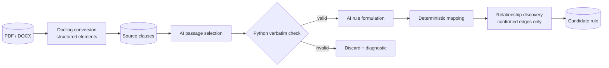

# AI assistance

This page is for reviewers, operators and implementers who need to know where AI is used and how it is bounded. AI drafts, classifies, and explains. It never participates in runtime policy evaluation.

AI-assisted features require Azure OpenAI. Retrieval-grounded features also require Azure AI Search. Configuration is documented in [Configuration](configuration.md).

## Trust boundary

| Activity | Owner |
|---|---|
| Select policy-bearing source passages | AI, then Python verbatim verification |
| Formulate structured candidate rules | AI, then schema and reference validation |
| Approve, reject, and publish | Human |
| Compile conditions and identifiers | Deterministic Python |
| Evaluate facts and policy tests | Deterministic Python |
| Structural quality checks and diffs | Deterministic Python |
| Qualitative quality/correlation findings | AI, presented for human confirmation |

> **No model participates in a runtime policy decision.**

## Model configuration

| Setting | Use |
|---|---|
| `AZURE_OPENAI_DEPLOYMENT` | Extraction, quality, correlation, rewrite, compare |
| `AZURE_OPENAI_FAST_DEPLOYMENT` | Ask AI |
| `AZURE_OPENAI_EMBEDDING_DEPLOYMENT` | Clause and query embeddings |
| `AZURE_SEARCH_*` | Hybrid retrieval over indexed clauses |

The implementation uses thin `httpx` REST clients. JSON responses are parsed and validated with Pydantic before use or persistence.

## Extraction pipeline



Conversion turns the document into offset-anchored elements — see [Docling](docling.md).

Stage 1 copies policy-bearing text. `verify_verbatim()` rejects passages the model did not copy. [What the verbatim check proves](#what-the-verbatim-check-proves) states what that does and does not establish.

Stage 2 produces canonical and DMN-shaped rule data. Deterministic mapping derives identifiers, conditions, effects, and the route each record travels. Unsupported FEEL expressions produce no condition rather than a guessed condition.

Linking ties each rule to the others the *document* places it with — a table row to its table, a subsection to the rule it qualifies. Only relationships the source establishes enter `related_rule_ids`; similarity-based candidates are surfaced for review and never written there. See [Relationships](relationships.md).

A rule compiles to an executable condition only when the project's `trusted_config` supplies the required fact/output mappings. A rule that does not compile is still a complete policy record: it is routed `ai_ready` and decided by a judge reading it.

### What the verbatim check proves

`verify_verbatim` (`infrastructure/extraction/passage_extractor.py`) compares a returned passage against the `source_text` its agent was handed. On the running path that argument is the string built by `_render_batch` (`infrastructure/extraction/ai_extraction.py`), which is assembled from the `Clause.text` already stored for the batch.

So the check establishes one thing exactly: **the model copied rather than composed.** A passage that is not a substring of what the agent was shown is discarded, and a passage that points at a real clause but transcribes it imperfectly is repaired from the clause text by `resolve_span` rather than lost.

It does not establish that the stored text matches the source document. Both sides of the comparison descend from the same stored clauses, so if ingestion stored a clause wrongly, the agent copies the wrong text faithfully and the check passes. This is a real limitation and it has been observed: a fidelity figure read clean over text that had been stored in the order its glyphs were painted rather than the order they are read. Anchoring the comparison to the canonical page instead would close the gap, and `_canonical_from_clauses` (`api/routers/extraction.py`) rebuilds pages with `raw_text=""`, so there is nothing there to anchor against today.

The two checks are independent, and only the second is missing:

| Question | Answered by |
|---|---|
| Did the model copy rather than compose? | `verify_verbatim`, on the running path |
| Does the stored text match the source document? | Nothing on the running path |

### When a rule does not compile

A rule whose projection is `enrichment_required`, `ambiguous` or `not_directly_mappable` carries no compiled condition. The formulator still records what the source *stated* in its semantic projection, and the review UI shows that in XACML terms. The record is labelled **AI Ready**, with one sentence naming what the source did and what follows from it; the wording per provenance code lives in `conditionRoute.ts`. Nothing the formulator could not compile is written into the rule's condition. A statement whose subject is the document itself ("This template is provided as a tool…") is tagged `document_guidance` and made non-enforcing, but kept for a reviewer to decide.

## AI capabilities

| Capability | Context |
|---|---|
| Extraction | Source clauses, verified passages, trusted fact configuration |
| Quality | Full rule context plus deterministic findings |
| Correlation | Deterministically selected rule groups |
| Rewrite | One candidate and reviewer instruction |
| Compare narrative | A deterministic version diff |
| Test proposal | Selected canonical rules, optionally retrieved clauses |
| Ask AI | Approved rules, optional focused candidate, and retrieved clauses |
| Summary | Deterministic package statistics |
| Policy case | One policy's lean payload: rules by ID, verbatim source, and the facts the case supplies |

Only Ask AI and test proposal use Azure AI Search retrieval. Other AI functions receive database records selected by the application.

## How the AI is grounded

Authority order:

1. canonical source clauses;
2. immutable approved rules;
3. candidate rules under review;
4. persisted evidence references;
5. deterministic calculations;
6. Azure AI Search copies of source clauses.

PostgreSQL is the system of record. Search is a retrieval index, not policy authority.

### Indexing

Document upload embeds and writes clauses to the authoring index on a best-effort path. The API reports the result as `clauses_search_indexed`, which counts search-index writes, not stored clauses. Keys use:

```text
key = document_version_id + "_" + clause_id
```

Records include document, clause, section, source hash, and embedding metadata. Writes are scoped to this platform's document IDs.

### Retrieval

Ask AI and Search-grounded test generation use a hybrid keyword + vector query, filtered to platform-owned documents. The same embedding deployment is used for index and query vectors.

### Citations

- Ask AI separates source facts from model synthesis.
- Extraction evidence is rechecked in Python.
- Quality and test proposals reject unsupported rule IDs.
- Published rule evidence keeps document-version and clause references.

## Putting a case to a policy

`POST /api/ai/policy-case/answer` answers a plain-English case put to one policy. The dialog behind it — **Put a case to this policy**, reached from a policy's view and from any rule's row — takes a provision and a described situation, never a caller-supplied rule set, so the answer can only ever be attributed to what the policy already holds. The case is grounded on the same lean payload the [`policy-payload`](api.md) endpoint serves: each rule by ID, its verbatim source, and the facts the case states.

The endpoint sorts the question before it answers, and the two kinds are answered differently:

- an **informational** question asks after a quantity the rules themselves state — a limit, a rate, an eligibility line — and is answered from what the policy holds, quoting each rule the answer rests on by ID and source sentence;
- a **determination** supplies the facts and asks for the outcome, and is settled one rule at a time by the same deterministic engine or judge a live evaluation would use — the endpoint classifies and answers at the policy level; it does not stand up a second decider of its own.

Classification is deterministic: a temperature-0 read on the fast deployment, keyed on the shape of the question rather than trigger words, in English or Arabic.

A determination a reviewer confirms can be **kept as a guard** from the dialog. That write lands in this policy's tests (`policy_tests`) and runs first on the next publish, flagging the case under Quality if the outcome ever moves. It is never written to the evaluation audit trail, which records what calling systems asked of a published policy; a reviewer keeping a guard must not read as production traffic. An informational answer reports the value a determination would otherwise be handed, so there is nothing separate to keep, and the dialog says as much rather than offering a guard with nothing to test.

## Quality and correlation

Quality findings are labeled by source:

- `deterministic` findings are computed structural facts;
- `ai_review` findings are potential issues requiring human confirmation.

AI quality findings must include affected rules, impact, acceptable and unacceptable conditions, reviewer questions, and a recommended correction. References are validated before persistence.

Correlation uses deterministic grouping to choose what to compare. AI only classifies the relationship inside a bounded group.

## Human review is the gate

- Extracted rules remain candidates until approved.
- Rewrites are suggestions until applied.
- AI-proposed tests remain pending until accepted.
- Quality and correlation findings do not change policy.
- Publication is an explicit human action.

## Limitations

- Search indexing is best-effort. Every write reconciles that document version's entries against the store (`infrastructure/search/reconciliation.py`), so an entry orphaned by re-extraction stops being searchable; there is no scheduled sweep independent of a write.
- The verbatim check proves the model copied, not that the stored text matches the source. See [What the verbatim check proves](#what-the-verbatim-check-proves).
- Ask AI retrieval is scoped to all platform documents, not per user.
- Retrieval uses fixed result counts and no semantic reranker.
- Most AI paths do not use Search; they are grounded in database records.
- No automated test calls live Azure OpenAI or Azure AI Search.
- Access control is off by default; production authorization still needs operator configuration and validation before exposure beyond a trusted environment.

See [Known limitations](known-limitations.md) and [Capability flows](capability-flows.md).
