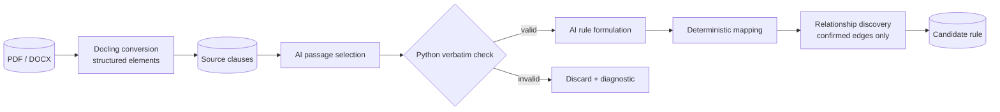

# AI assistance

AI drafts, classifies, and explains. It never participates in runtime policy
evaluation.

AI-assisted features require Azure OpenAI. Retrieval-grounded features also
require Azure AI Search. Configuration is documented in
[Configuration](configuration.md).

## Trust boundary

| Activity | Owner |
|---|---|
| Select policy-bearing source passages | AI, then Python verbatim verification |
| Formulate structured candidate rules | AI, then schema and reference validation |
| Approve, reject, and publish | Human |
| Compile conditions and identifiers | Deterministic Python |
| Evaluate facts and policy tests | Deterministic Python |
| Structural quality checks and diffs | Deterministic Python |
| Qualitative quality/correlation findings | AI, presented for human confirmation |

> **No model participates in a runtime policy decision.**

## Model configuration

| Setting | Use |
|---|---|
| `AZURE_OPENAI_DEPLOYMENT` | Extraction, quality, correlation, rewrite, compare |
| `AZURE_OPENAI_FAST_DEPLOYMENT` | Ask AI |
| `AZURE_OPENAI_EMBEDDING_DEPLOYMENT` | Clause and query embeddings |
| `AZURE_SEARCH_*` | Hybrid retrieval over indexed clauses |

The implementation uses thin `httpx` REST clients. JSON responses are parsed and
validated with Pydantic before use or persistence.

## Extraction pipeline



Conversion turns the document into offset-anchored elements — see
[Docling](docling.md).

Stage 1 copies policy-bearing text. `verify_verbatim()` rejects passages that are
not present in the canonical source.

Stage 2 produces canonical and DMN-shaped rule data. Deterministic mapping derives
identifiers, conditions, effects, and executability. Unsupported FEEL expressions
produce no condition rather than a guessed condition.

Linking ties each rule to the others the *document* places it with — a table row
to its table, a subsection to the rule it qualifies. Only relationships the
source establishes enter `related_rule_ids`; similarity-based candidates are
surfaced for review and never written there. See
[Relationships](relationships.md).

Rules become machine-executable only when the project's `trusted_config` supplies
the required fact/output mappings.

### When a rule does not compile

A rule whose projection is `enrichment_required`, `ambiguous` or
`not_directly_mappable` has no executable condition. The formulator still
records what the source *stated* in its semantic projection, and the review UI
shows that in XACML terms — labelled **not executable**, and never written into
the rule's condition. A statement whose subject is the document itself ("This
template is provided as a tool…") is tagged `document_guidance` and made
non-enforcing, but kept for a reviewer to decide.

## AI capabilities

| Capability | Context |
|---|---|
| Extraction | Source clauses, verified passages, trusted fact configuration |
| Quality | Full rule context plus deterministic findings |
| Correlation | Deterministically selected rule groups |
| Rewrite | One candidate and reviewer instruction |
| Compare narrative | A deterministic version diff |
| Test proposal | Selected canonical rules, optionally retrieved clauses |
| Ask AI | Approved rules, optional focused candidate, and retrieved clauses |
| Summary | Deterministic package statistics |

Only Ask AI and test proposal use Azure AI Search retrieval. Other AI functions
receive database records selected by the application.

## How the AI is grounded

Authority order:

1. canonical source clauses;
2. immutable approved rules;
3. candidate rules under review;
4. persisted evidence references;
5. deterministic calculations;
6. Azure AI Search copies of source clauses.

PostgreSQL is the system of record. Search is a retrieval index, not policy
authority.

### Indexing

Document upload embeds and writes clauses to the authoring index using:

```text
key = document_version_id + "_" + clause_id
```

Records include document, clause, section, source hash, and embedding metadata.
Writes are scoped to this platform's document IDs.

### Retrieval

Ask AI and Search-grounded test generation use a hybrid keyword + vector query,
filtered to platform-owned documents. The same embedding deployment is used for
index and query vectors.

### Citations

- Ask AI separates source facts from model synthesis.
- Extraction evidence is rechecked in Python.
- Quality and test proposals reject unsupported rule IDs.
- Published rule evidence keeps document-version and clause references.

## Quality and correlation

Quality findings are labeled by source:

- `deterministic` findings are computed structural facts;
- `ai_review` findings are potential issues requiring human confirmation.

AI quality findings must include affected rules, impact, acceptable and
unacceptable conditions, reviewer questions, and a recommended correction.
References are validated before persistence.

Correlation uses deterministic grouping to choose what to compare. AI only
classifies the relationship inside a bounded group.

## Human review is the gate

- Extracted rules remain candidates until approved.
- Rewrites are suggestions until applied.
- AI-proposed tests remain pending until accepted.
- Quality and correlation findings do not change policy.
- Publication is an explicit human action.

## Limitations

- Search indexing is best-effort and has no scheduled reconciliation.
- Ask AI retrieval is scoped to all platform documents, not per user.
- Retrieval uses fixed result counts and no semantic reranker.
- Most AI paths do not use Search; they are grounded in database records.
- No automated test calls live Azure OpenAI or Azure AI Search.
- Authentication and production authorization are pending.

See [Known limitations](known-limitations.md) and
[Capability flows](capability-flows.md).
