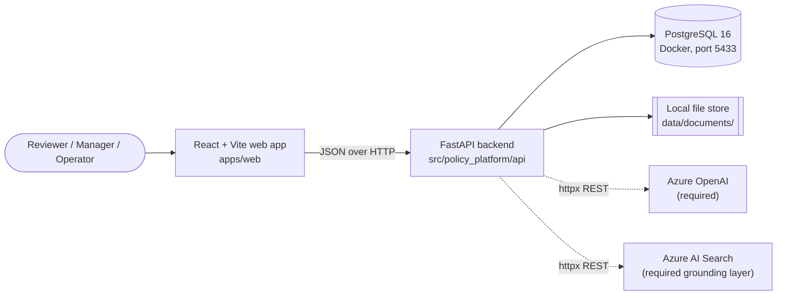
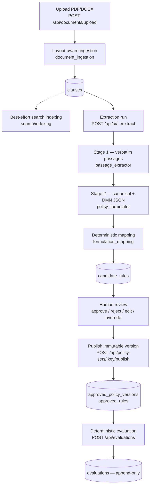
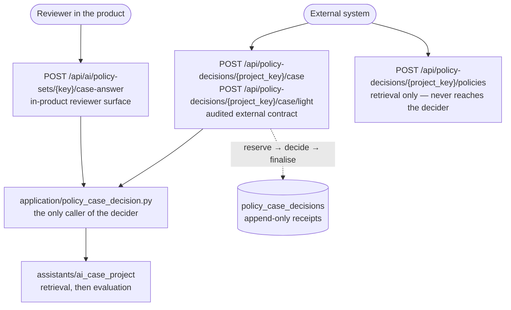
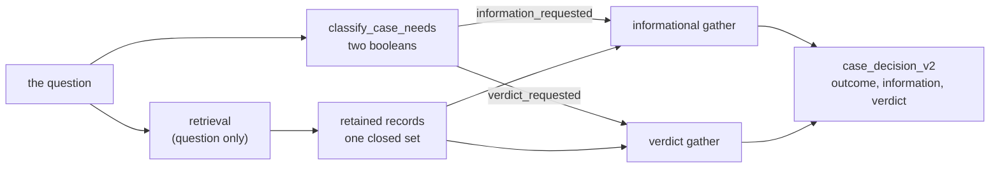
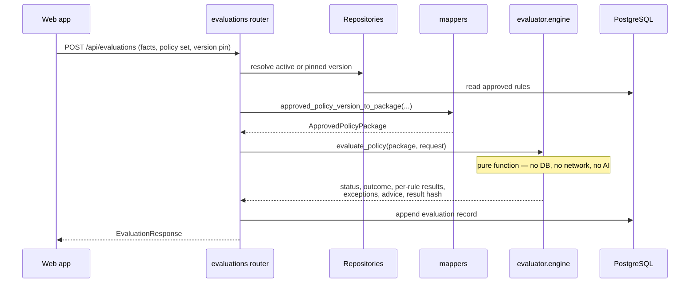

# Architecture

This page is for implementers and architecture reviewers. It is a light map of the runtime: what the pieces are, what each is responsible for, and how they call each other. For per-capability detail — one diagram per capability, with triggers, outputs and limits — see [Capability flows](capability-flows.md), which is the detailed companion to this page rather than a duplicate of it. For what the automated suite actually defends, see [Testing and scripts](testing.md#test-architecture). For the frameworks involved see [Frameworks and technologies](frameworks.md); deeper ingestion and extraction detail is available in the [specs](specs/).

## Shape of the system

Three processes plus the Azure services the product requires:

Azure OpenAI and a grounding/search layer are product requirements, not add-ons: without them the platform has no extraction, quality, correlation or grounded chat. The current code nevertheless *starts* without them, which is a degraded diagnostic mode — AI routes return `503`, clause indexing is skipped — rather than a supported deployment. See [AI assistance](ai-assistance.md) and [Configuration and operations](configuration.md#environment).

The web app is a pure client: it holds no policy logic, and every decision, extraction and quality result comes from the API. Extraction runs inside the request that starts it, which is why a large document takes minutes rather than returning immediately.

## Backend layers

The backend is layered by dependency direction: contracts and the evaluator sit at the centre and depend on nothing else in the codebase.

| Layer | Package | Responsibility |
|---|---|---|
| Contracts | `policy_platform.contracts` | Pydantic models for the canonical rule, the condition AST, evaluation request/response, policy tests, correlation findings, and the canonical hash. No I/O. |
| Evaluator | `policy_platform.evaluator` | The deterministic decision core: condition interpretation, precedence resolution, the evaluation engine, and the policy-test runner. No database, no network, no AI. |
| Domain | `policy_platform.domain` | SQLAlchemy ORM entities and table definitions. |
| Application | `policy_platform.application` | Use cases that coordinate infrastructure for more than one entry point. Currently one module, `policy_case_decision.py`, which owns the project-case decision for both the in-product route and the audited external API. |
| Infrastructure | `policy_platform.infrastructure` | Everything that touches the outside world, grouped into thirteen sub-packages by responsibility (see below). Two modules stay at the root: `settings.py`, imported across every sub-package, and `prompt_assets.py`, which must sit level with the `prompts/` directory it locates. |
| API | `policy_platform.api` | FastAPI app, request/response schemas, and fifteen routers. |

### Inside infrastructure

Grouped by the question each answers, not by the technology each uses. A module that calls a model sits with the capability it serves — `quality/ai_quality.py`, `extraction/ai_extraction.py` — because "calls an LLM" is a transport detail while "is part of extraction" is what someone changing extraction needs to find together. `ai/` holds the client itself.

| Sub-package | Responsibility |
|---|---|
| `persistence/` | Async engine and session, repositories, mappers, version import, audit |
| `ingestion/` | PDF/DOCX parsing into clauses, source numbering, manual entry |
| `docling/` | Docling conversion and graph discovery, under its own dependency boundary — see [Docling](docling.md) |
| `extraction/` | The two model stages, then the condition compiler and what a record can support |
| `consolidation/` | Collapsing a record the model emitted more than once into a single record |
| `assembly/` | Grouping rules into the policies their source stated, with provision history and the rule-name and topic-label lookups |
| `projection/` | Restating an approved rule: XACML, DMN parity, version diff, export |
| `quality/` | Faithfulness to source, and the duplicate/contradiction/instability passes |
| `correlation/` | Deterministic relationship discovery, and model-assisted contradiction finding |
| `policy_tests/` | Proposing, committing to and running saved tests |
| `assistants/` | Chat, draft, rewrite, summary, compare, scenario — advisory only |
| `ai/`, `search/` | Azure OpenAI and Azure AI Search clients |

### Key modules

| Concern | Module |
|---|---|
| App factory, CORS, startup reconciliation | `api/app.py` |
| Deterministic decision | `evaluator/engine.py`, `evaluator/conditions.py`, `evaluator/precedence.py` |
| Policy-test execution | `evaluator/test_runner.py` (pure) + `infrastructure/policy_tests/policy_test_execution.py` (DB-aware) |
| Document parsing | `infrastructure/ingestion/document_ingestion.py` → `infrastructure/ingestion/document_extraction.py` |
| Document conversion & graph discovery | `infrastructure/docling/` (converter, pipeline, verification, handoff) — see [Docling](docling.md) |
| Extraction pipeline | `infrastructure/extraction/ai_extraction.py`, `passage_extractor.py`, `policy_formulator.py`, `formulation_mapping.py` |
| Rule relationships | `contracts/relationships.py`, `infrastructure/correlation/relationship_discovery.py` — see [Relationships](relationships.md) |
| Quality analysis | `infrastructure/quality/ai_quality.py` |
| Cross-rule correlation | `infrastructure/correlation/correlation_service.py` + `correlation_agent.py` |
| Version diff & narrative | `infrastructure/projection/rule_delta.py` (computes) + `infrastructure/assistants/ai_compare.py`, `infrastructure/assistants/rule_change_explainer.py` (narrate) |
| Grounded chat | `infrastructure/assistants/ai_chat.py` |
| Project-case decision | `application/policy_case_decision.py` (reserve/decide/finalise, idempotency, envelope) + `contracts/case_decision.py` (`case_decision_v2`, its hash preimage, and `case_decision_v1` kept readable) + `infrastructure/assistants/ai_case_project.py` (retrieval and whole-policy fitting) + `infrastructure/projection/policy_rule_slice.py` (rule-level retrieval for a large policy) + `infrastructure/assistants/ai_case_intent.py` (what a case asks for, and the two gathers) |
| Azure clients | `infrastructure/ai/openai_client.py`, `infrastructure/search/search_client.py`, `search/indexing.py` |
| Configuration | `infrastructure/settings.py` |
| Persistence access | `infrastructure/persistence/repositories/` (seven modules, one per part of the lifecycle), `infrastructure/persistence/mappers.py`, `infrastructure/persistence/db.py` |

## How components are invoked

Everything is request-driven: a call arrives, the work happens inside that request, and the response carries the result. Extraction is the visible consequence — a large document takes minutes rather than returning a job id.

- **Browser → API.** The web app calls the API over HTTP/JSON from `apps/web/src/api.ts`, using `VITE_API_BASE_URL`. CORS is configured in `api/app.py` for the local Vite ports.
- **Router → service.** Each router injects an `AsyncSession` via FastAPI dependency injection and calls one infrastructure service or repository.
- **Service → Azure.** AI services construct an `AzureOpenAIClient` / `AzureSearchClient` and issue direct REST calls with `httpx`. If Azure OpenAI is not configured, AI routes reject with `503` before any work starts; if search is not configured, clause indexing is skipped and retrieval-backed grounding is unavailable. `ai_chat.py` and `ai_test_proposal.py` read the shared clause index; `ai_case_project.py` reads a project's own policy index, and `search/policy_index.py` is the only module that creates, rebuilds or drops one — see [AI assistance → How the AI is grounded](ai-assistance.md#how-the-ai-is-grounded).
- **Anything → evaluator.** The evaluator is called as a plain function with an in-memory `ApprovedPolicyPackage` and a fact dictionary. Callers are the evaluation endpoint, the policy-test executor, and the AI scenario tester.
- **Startup.** A lifespan hook marks an `extraction_runs` row it owns (`owner_kind == OWNER_API`) still flagged `running`/`pending` as `failed`, because an in-process extraction does not survive an API restart. Runs owned by another process are left untouched, so the API only cleans up after itself.

## The document-to-decision path

Solid arrows are the governed path. The dotted arrow is best-effort: a search indexing failure is logged and swallowed so an upload never fails because Azure is unavailable. That resilience is deliberate, but it means a document can be fully usable while being invisible to retrieval — see [grounding limitations](ai-assistance.md#limitations).

## Where the trust boundary sits

This is the single most important architectural property of the platform.

```mermaid
flowchart LR
    subgraph Probabilistic["Probabilistic — advisory only"]
        P1["Passage extraction"]
        P2["Policy formulation"]
        P3["Quality review pass"]
        P4["Correlation classification"]
        P5["Rewrite, draft, compare narrative"]
        P6["Test proposal"]
        P7["Ask AI chat"]
    end

    subgraph Human["Human decision"]
        H1["Approve, reject, request changes"]
        H2["Publish version"]
        H3["Accept or reject a proposed test"]
    end

    subgraph Deterministic["Deterministic — code only"]
        D1["Condition AST interpreter"]
        D2["Precedence resolution"]
        D3["Evaluation engine and result hash"]
        D4["Policy test runner"]
        D5["Rule diff, structural quality checks, export"]
    end

    Probabilistic --> Human --> Deterministic
```

No model participates in a runtime decision. Every AI output is a *draft* or an *observation* that a human accepts before it can influence a published version, and the evaluator only ever reads approved, versioned rules.

That statement is about the deterministic decision path — `POST /api/evaluations` and the policy-test runner. A **project case** is a different thing and is labelled as one: a model reads published, human-approved records and answers a question in prose. It cannot alter a rule, a version or a determination made by the evaluator, and its receipt names the route that produced it so a reader never mistakes it for an engine result. See [one decider, two surfaces](#one-decider-two-surfaces).

Supporting invariants, all enforced in code:

- Stage 1 passages are re-checked in Python for verbatim containment; a fabricated quote is caught by string comparison, not by re-reading.
- Structured rule identity, rule-type mapping and condition compilation are plain Python in `formulation_mapping.py`; an expression the parser does not fully understand yields *no* condition rather than a guess.
- Published versions are full immutable snapshots, never edited in place.
- `evaluations`, `policy_test_runs` and `audit_events` are append-only.
- Quality and correlation findings are stored as *runs*, so a finding is always a statement about the rules as they stood at that moment.

Each invariant above has a test module behind it — the mapping is in [Testing and scripts → active test capability groups](testing.md#active-test-capability-groups), and the boundaries the suite deliberately does not cross are in [gaps](testing.md#current-coverage-gaps).

## One decider, two surfaces

A project case — a question in plain English, put to a project's published policies — is reachable two ways, and the difference between them is not the decision but what is owed to the caller afterwards.

Both routes go through one application module, and that module is the **only** place in the codebase that calls the project-case decider — a static test counts the call sites and fails when a second appears. Wiring the external route straight into the decider would have turned every reviewer click into an audited external call; wiring it into a copy would have produced two deciders that agree until one is edited.

**`/case` and `/case/light` are one surface, not two.** They accept the same request, execute the same `_execute_case_decision` path, and store the same full `case_decision_v2` receipt. Only the immediate response differs: Light is projected down to a fixed compact schema that still carries the full receipt's `decision_id`, `correlation_id`, `decision_hash`, `hash_basis` and `receipt_url`. Light is **output-light, not processing-light** — it is not a cheaper adjudicator, and describing it as a faster one would be wrong in the one direction that matters, because a caller would choose it for latency it does not get.

**`/policies` is deliberately outside all of this.** It runs retrieval and stops: no classifier, no plan, no gathers, no response rendering, no hash, no receipt, and not even the decision path's embedding stage. It is drawn separately above because a diagram that routed it through the decider would suggest its output is a determination, which is exactly the misreading the split exists to prevent.

**The legacy reviewer route is unchanged in what it owes.** It persists nothing, returns no decision identity, and its response *keys* are the ones it always returned — `intent`, `informational` and `decision` all still mean what they meant, with the two-track booleans added beside them. A reviewer exercising a policy is not making an external commitment, and the audit trail should not fill with screen work.

**The external route is reserve → decide → finalise.** A case runs for tens of seconds of model time, and that single fact shapes the order:

1. **Reserve, and commit.** A `pending` receipt row is written and committed *before* the model is called. If the process dies mid-call, the evidence that the call was made survives. If the reservation cannot be written, no model call is made and the caller gets a non-2xx.
2. **Decide, holding no transaction.** The model call runs with nothing open.
3. **Finalise, in a short transaction.** `completed` with the full envelope and its hash, or `failed` with a reason and no outcome.

If finalisation fails, the caller is told so and is **not** given the verdict. There is no "here is your answer, but we could not save it" response: a verdict that cannot be cited later is precisely what this endpoint exists to stop shipping.

### One retrieval, two tracks

A case asks for up to two things — what the retained policies *state*, and a *verdict* on the case — and the two are independent. `ai_case_intent.classify_case_needs` reads both from the question in one model call, returning two booleans and no derived choice; both requested gathers then run, concurrently, over the records retrieval already settled.

Three properties are load-bearing, and each rules out a specific failure:

- **Retrieval is upstream of the classification and reads the question alone.** Retrieving per track would let the statement a caller is told and the verdict they are given rest on two different sets of policies inside one receipt — two answers to one question, from two corpora. The cost is recorded in [known limitations](known-limitations.md): one retrieval, tuned to the whole question.
- **Caller guidance reaches the gathers and nothing above them.** Not retrieval, so it cannot steer which policies are read; not the classifier, so it cannot choose which tracks run and therefore cannot choose the shape of its own answer. There is no request field for the booleans for the same reason.
- **Neither track can borrow the other's outcome.** Each section carries its own status, citations and grounding, and the envelope refuses a section that disagrees with its `outcome`. `verdict.decision` is non-empty *iff* `verdict.reached` *iff* `verdict.status == "answered"`, so a refusal — "not compliant" — is a reached verdict and an undecided case carries no decision at all.

### One internal language, crossed twice and only twice

Every stage between the request and the receipt — retrieval, rule classification, both gathers — reasons in English. Not because the corpus is English (it is bilingual), but because a pipeline that reasoned in two languages would score a question in one against text in the other and score nothing. The boundary is drawn in two places and nowhere else:

| Crossing | Where | Contract |
|---|---|---|
| The **question and the prose** | `assistants/ai_case_language`, at the edge of the decision | `case-language-v4` |
| The **corpus** | `search/english_projection`, at index-build time | `policy-english-projection-v1` |

They version independently, and the second did not move when the first went to v4 — the transport change that produced v4 had nothing to do with how a policy is rendered.

The corpus is crossed **once per build, not once per query**: rendering per query would put a model call in front of every retrieval and would render the same policy differently on two calls, which is precisely the terminology drift that makes a fused ranking meaningless. Within a build, texts are rendered in batches, but **a batch never crosses a policy boundary** — terminology has to be consistent within the unit the relevance weighting is computed over, and two calls can legitimately choose two words for one term.

What does *not* cross, in either direction: the caller's own scenario and guidance bytes and their digests, every machine-readable value, and **every verbatim source sentence**. The original is never written into an English-labelled field, because that would manufacture exactly the cross-language match the boundary exists to prevent. A citation stays in the language the document was written in; only prose the decision composed itself is rendered back.

The receipt carries the whole crossing in its `language` block, and the language hash bases — `case_decision_v2_lang`, and the current `case_decision_v2_lang_verification` — seal it along with `processing_scenario_hash`, the digest of the English text that was actually adjudicated. Sealing the caller's words without sealing the words the decision read would leave the substituted text unverifiable.

### The policy index holds three kinds of document

| Kind | How many | Why |
|---|---|---|
| `policy` | one per published provision | A provision under the rule threshold is one governing statement; its own document carries it. |
| `rule` | one per rule, **only** above `LARGE_POLICY_RULE_THRESHOLD` (15) | Above the threshold a provision is a schedule, and a single document cannot represent seventy-four independent rows. Below it, per-rule documents would multiply the corpus for nothing. |
| `manifest` | exactly one per project | The readiness gate. Carries `manifest_state`, the `projection_profile` and language the build ran under, and expected against uploaded counts. |

Retrieval is `direct_policy_rrf_elbow_rule_rescue_v1`. Direct policy documents own the primary ranking: a strong semantic lead selects by semantic identity, while moderate rankings use symmetric Reciprocal Rank Fusion over the hybrid and semantic ranks of those same policy documents. Rule documents never add a second score to a direct policy. A strong rule match can only rescue its parent when it independently clears the absolute floor and the margin above the direct cutoff; `rule_rescued_policies` reports when that changed the retained set, and `policies_elevated_by_rule` remains only as its compatibility alias. This preserves the reason rule documents exist — a large policy can still be found through one bearing row — without rewarding that policy twice merely because it was split into rule documents.

Rule selection then fuses three rankings of its own — the rule index, lexical relevance over the English projection, and **quantity compatibility**, which matches a quantity the question states against the quantities and ranges the rules state, so a threshold row is reachable without shared vocabulary. `rule_selection.method` names which of those actually ran (`hybrid_rule_v1`, `scenario_relevance_v3`, `scenario_relevance_v2`), because claiming a ranking that did not run is the same class of untruth as claiming a rule was read.

### A build is a state machine, because Search has no transaction

`policy_index_states.projection_profile` (migration `c1d4e8a92b73`) records the contract an index was built under. It is **nullable and deliberately not backfilled**: a row written before projections existed records a build that really did index documents and really did not render them, and NULL is that fact. Backfilling the current profile would claim a rendering that never ran and the readiness gate would then trust an index it must refuse.

The gate is read from the index itself rather than from that row — an OData filter for a `manifest` document with `manifest_state eq 'ready'` **and** the expected `projection_profile`. Absent, incomplete or superseded all produce `index_projection_unavailable` and a `503`. Refusing is the only safe answer: a query rendered under one contract, scored against a corpus rendered under another, returns results whose ranking means nothing.

The rebuild sequences its writes so no partial corpus is ever queryable — manifest to `incomplete` first (and if *that* write is not acknowledged, nothing is written at all), then documents with acknowledgements counted by key rather than by HTTP status, then the stale sweep, then `ready` last. There is no rollback because the build is a pure function of the database: re-running it is the recovery, producing the same ids and overwriting in place. A rendering failure for any one policy fails the whole build, since a corpus that is English in part is the one thing the profile must never mean.

Two assurances sit at different strengths. Each rendering is checked **structurally** as it is produced — empty, implausibly grown or shrunk, or a lost number or identifier rejects the whole batch. The completed **projection-quality gate** then compares every built document with the authoritative record under `policy-projection-quality-v1`; any structural finding, below-floor pair, or unavailable check fails the corpus. Readiness requires a `passed` quality state under that profile, so an older unvalidated manifest does not match. The live AIS and HW projections passed 138/138 and 115/115 documents with zero findings. The gate is decisive against gross substitution but cannot separate every faithful rendering from a near-identical sibling record, which is the narrower remaining limitation.

### The retained set is fitted before it is read

Between the ranking and the gathers sit further narrowings, and they exist because rank says nothing about size, nor about whether the set already says the same thing twice. A question about annual leave retained the governing policy at rank 0 (ten rules) and an unrelated `Table of Violations and Penalties` at rank 3 (seventy-four rows, pages 21–27); their combined record was 229,389 characters against a 200,000-character budget, so the gather refused the whole set and the reviewer received nothing — for a question the corpus could answer.

**`projection/policy_semantic_identity` decides what "the same" means, at two strengths.** Both are computed over the lean published record with identity and provenance removed — record and rule ids, document-version ids, span keys, clause and page locators — and with relationship targets resolved to *what they point at* rather than what they are called, so a re-extraction that renumbers a link does not look like a different policy. The two strengths are deliberately not the same test:

| Strength | Withholds | May justify |
|---|---|---|
| `policy_semantic_fingerprint` — **equality** | nothing beyond identity and provenance | calling one policy a duplicate of another |
| `policy_normative_group_key` — **ordering** | `related_rule_ids` only | offering one before the other |

`related_rule_ids` is withheld from the ordering key because being told which rules to read together is a reading aid, not a term binding anyone. **`supersedes_rule_ids` is kept in both**, because displacing one rule and displacing another are different acts. Nothing about a heading, a project, a language, a question's words or any identifier reaches either key.

Both compare the rules of a policy as a **sorted multiset**, so the order an extractor emitted them in cannot decide identity. The governing fields the lean record omits — `authority` and `priority` — are therefore attached to the rule each entry describes and compared only there. Carrying them again as positional lists beside the rules would reintroduce exactly the ordering dependence the multiset removes: the same rules in a different order, with authority varying row to row, would have equal rules and unequal lists. Extras that cannot be attributed to a rule are compared as a whole instead of dropped, so the alignment guard fails safe rather than silent.

**`ai_case_project` applies them in that order.** Exact duplicates are collapsed first — `duplicate_policy_content`, naming the representative in `duplicate_of_provision_key`, counted in `policies_duplicate_collapsed`. Then `order_by_normative_diversity` reorders what survives so the highest-ranked member of each normative group is offered before any second member. That is ordering only: a deferred candidate keeps its own rank and score and carries the ordinary `outside_budget`, and `policy_selection_order` / `policies_diversity_deferred` record which ordering produced the set and what it cost. The count is deliberately the *displacement*, not the deferral — the candidates that would have been read on rank alone and are not read now — because a member that ranked outside the budget anyway lost nothing, and a count that included it would sit beside prose claiming it ranked inside. The distinction between the two mechanisms is load-bearing: the measured pair differs only in that one copy records forty-two `related_rule_ids` and the other records none, which is a real difference in the record and so cannot be called sameness, yet the two of them took two of five slots while the provision that decided the case ranked sixth.

**`projection/policy_rule_slice` reads a large policy by rule.** Past fifteen rules a provision is a schedule of independent rows, not one governing statement, so its rules are ranked against the question and at most fifteen are read — *including* any context rules, which fill only slots the selection left unused and never extend the budget. Ranking is an inverse document frequency over *that policy's own rules*, which is what makes a table of near-identical rows separable at all: the words every row shares clamp to zero weight, so only what distinguishes row 41 from row 42 can decide. It is deterministic and carries no wordlist for any language — a second model call here would add cost, latency and an unaudited judgement between the question and the record.

The same two strengths apply between the rules of one policy, and the weaker one matters more here. Exactly identical rules are collapsed (`duplicate_rules_collapsed`, with `represented_rule_ids` naming the unread copies of read rules). But **repeated source text is not duplicate rule semantics**: one sentence commonly states several obligations and is extracted into one rule each, so a single passage can carry a permission, a prohibition, an obligation and a routing rule. Collapsing those would merge a rule that permits with one that forbids. Instead, among the rules that matched, the best of each distinct source passage is taken before a second rule from a passage already covered — priority, never equality, and it can only reorder rules that already matched.

**`ai_case_project.fit_within_payload_budget` admits whole policies while they fit.** Slicing makes each record smaller; it does not promise several together fit, so this remains the backstop.

All of them refuse the same easier designs:

| Instead of | Because |
|---|---|
| trimming a rule, or a policy, to fit | An answer composed from part of a rule or part of a policy while presenting as the whole is the one narrowing a reader cannot detect. |
| stopping at the first overflow | Later, smaller policies that fit would be discarded for no defensible reason. The scan continues in rank order, so one large record costs only itself. |
| dropping a policy no rule of which matched | The search layer already judged it relevant; a lexical miss is a weaker signal and must not overrule it. A bounded sample is read and `rule_selection.method` says `document_order`, so the weakness is visible rather than hidden. |
| dropping a sole oversized policy or an oversized slice | An empty retained set reads as "no published policy matched", which is false. It is kept, `size.oversize` stands, and the gather's existing refusal is what the reviewer sees. |
| grouping on a heading, a title, or a shared source sentence | Two provisions can share a heading and bind differently; one sentence can back four different rules. Grouping on either merges terms that do not govern the same case, which is worse than the crowding it would relieve. |
| calling a near-copy a duplicate to free a slot | A duplicate claim says the terms were read elsewhere. Where that is not provable, the honest tool is ordering, and the receipt says which was used. |

Every policy read as a slice carries `rule_selection` — `total_rules`, `selected_rules`, `selected_rule_ids`, the method, the context rules that followed a selected rule in or did not fit, and the duplicate-rule counts — and the receipt's seal covers the ids, because the same policy read whole and read as eight of its rows are two different accounts of the same question. The ordering fields are *not* sealed: they describe how the retained set was chosen, and its outcome is already sealed in each policy's retained/discarded state. Every narrowing is in the disclosure, each under its own reason and count, because a policy that ranked first-class and was then narrowed is precisely the one a reader would otherwise assume was read entire.

### Two records, two meanings

| Record | Written by | Holds |
|---|---|---|
| `evaluations` | `POST /api/evaluations` | A deterministic decision: structured facts in, per-rule determinations out, a `result_hash` that reproduces. The evaluator is a pure function — no database, no network, no model. |
| `policy_case_decisions` | `POST /api/policy-decisions/{project_key}/case` and `.../case/light` | A model-mediated case decision: prose in, a receipt out, with retrieval disclosure, per-track citations and a `decision_hash` that seals content rather than promising reproduction. Both operations write the same full `case_decision_v2` row; only the response shape differs. `schema_version` names which envelope the stored `response_json` holds, and the per-track columns beside it are an index over that envelope, not a second source of truth. |

They are separate tables because generalising one over the other would be a lie rather than an abstraction: `Evaluation` requires a non-null policy version (a case can legitimately answer with none published), requires structured facts (a case has prose), and carries the XACML status enum (a case has its own two-track vocabulary, with `not_requested` and `not_evaluated` on top of the gathers' own statuses). Keeping them apart is what lets each state exactly what it is.

### Public identity

External routing is on the project's stable `key`. The UUID `id` is returned on every receipt as trace identity and is never routed on; the `name` is a display string and changes. A URL built from a display name would break the first time someone renamed a project, so a name in the path is a `404`.

All four `policy-decisions` operations — the full case, the light case, policy retrieval, and receipt replay — additionally require a proved authenticated principal, resolved independently of the global `RBAC_ENABLED` flag. The decision routes must name who asked for a receipt; the retrieval route exposes approved policy records. See [API](api.md#audited-external-decisions-policy-decisions) and [External consumption](external-consumption.md).

## Evaluation call, end to end

The same `ApprovedPolicyPackage` mapper feeds the live evaluation endpoint, the policy-test executor and the on-publish test re-run, so all three share identical semantics.

## Frontend structure

`apps/web/src` is a single-page app with local state (no router library):

- `App.tsx` — the shell: sidebar navigation, health/AI status pills, the actor switcher, and the global Ask AI drawer.
- `api.ts` — one typed client for the whole backend surface.
- `ActorContext.tsx` — the "acting as" identity (name + role), persisted in `localStorage`. It is not authentication, but the backend does enforce `policy_manager` on manager-only endpoints.
- `components/` — pages and building blocks; `ProjectWorkspace.tsx` hosts the per-project tabs, and `RuleCard` / `ConditionView` / `PolicyInspector` render canonical rules and their condition trees.

See [Workflows](workflows.md) for what each screen does.

## Deployment shape

Local development continues to use `infra/local/docker-compose.yml` for PostgreSQL and separate API/Vite processes.

A deployment-ready Azure design now exists under `infra/` for future use with Bicep and `azd`. The recommended topology is a public React/Nginx Container App that reverse-proxies to an internal FastAPI Container App, all inside a VNet-integrated Container Apps environment. PostgreSQL uses its own delegated subnet; Key Vault, Azure Files, Azure OpenAI and Azure AI Search use a private endpoint subnet. Uploaded documents persist through an Azure Files mount at the existing `data/documents` path.

The initialization job creates a **fresh** PostgreSQL schema with Alembic and creates Search index definitions. It does not migrate local policy rows or files. See [Azure deployment](azure-deployment.md) and [deployment options](azure-deployment-options.md).

No Azure deployment was executed while preparing these assets. CI/CD remains outside this repository; a future operator invokes the documented `azd up` workflow interactively.
