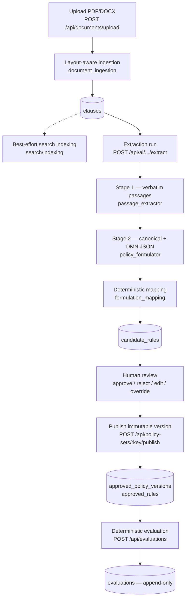
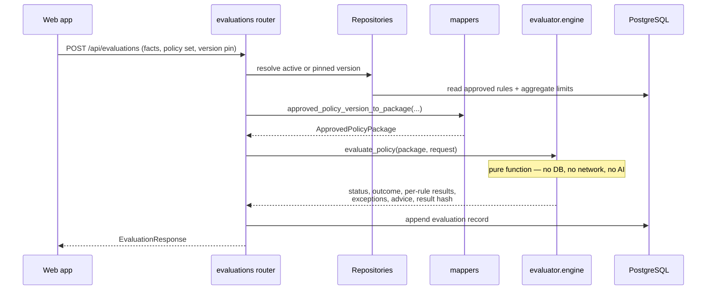

# Architecture

A light map of the runtime: what the pieces are, what each is responsible for,
and how they call each other. For per-capability detail — one diagram per
capability, with triggers, outputs and limits — see
[Capability flows](capability-flows.md), which is the detailed companion to this
page rather than a duplicate of it. For what the automated suite actually
defends, see [Testing and scripts](testing.md#test-architecture).
For the frameworks involved see [Frameworks and technologies](frameworks.md);
deeper ingestion and extraction detail is available in the [specs](specs/).

## Shape of the system

Three processes plus the Azure services the product requires:

Azure OpenAI and a grounding/search layer are product requirements, not
add-ons: without them the platform has no extraction, quality, correlation or
grounded chat. The current code nevertheless *starts* without them, which is a
degraded diagnostic mode — AI routes return `503`, clause indexing is skipped —
rather than a supported deployment. See
[AI assistance](ai-assistance.md) and
[Configuration and operations](configuration.md#environment).

The web app is a pure client: it holds no policy logic, and every decision,
extraction and quality result comes from the API. Extraction runs inside the
request that starts it, which is why a large document takes minutes rather than
returning immediately.

## Backend layers

The backend is layered by dependency direction: contracts and the evaluator sit
at the centre and depend on nothing else in the codebase.

| Layer | Package | Responsibility |
|---|---|---|
| Contracts | `policy_platform.contracts` | Pydantic models for the canonical rule, the condition AST, evaluation request/response, policy tests, correlation findings, and the canonical hash. No I/O. |
| Evaluator | `policy_platform.evaluator` | The deterministic decision core: condition interpretation, precedence resolution, the evaluation engine, and the policy-test runner. No database, no network, no AI. |
| Domain | `policy_platform.domain` | SQLAlchemy ORM entities and table definitions. |
| Infrastructure | `policy_platform.infrastructure` | Everything that touches the outside world, grouped into eleven sub-packages by responsibility (see below). Two modules stay at the root: `settings.py`, imported across every sub-package, and `prompt_assets.py`, which must sit level with the `prompts/` directory it locates. |
| API | `policy_platform.api` | FastAPI app, request/response schemas, and ten routers. |

### Inside infrastructure

Grouped by the question each answers, not by the technology each uses. A module
that calls a model sits with the capability it serves — `quality/ai_quality.py`,
`extraction/ai_extraction.py` — because "calls an LLM" is a transport detail
while "is part of extraction" is what someone changing extraction needs to find
together. `ai/` holds the client itself.

| Sub-package | Responsibility |
|---|---|
| `persistence/` | Async engine and session, repositories, mappers, version import, audit |
| `ingestion/` | PDF/DOCX parsing into clauses, source numbering, manual entry |
| `docling/` | Docling conversion and graph discovery, under its own dependency boundary — see [Docling](docling.md) |
| `extraction/` | The two model stages, then the condition compiler and what a record can support |
| `projection/` | Restating an approved rule: XACML, DMN parity, version diff, export |
| `quality/` | Faithfulness to source, and the duplicate/contradiction/instability passes |
| `correlation/` | Deterministic relationship discovery, and model-assisted contradiction finding |
| `aggregates/` | Limits that apply across a run of requests rather than within one |
| `policy_tests/` | Proposing, committing to and running saved tests |
| `assistants/` | Chat, draft, rewrite, summary, compare, scenario — advisory only |
| `ai/`, `search/` | Azure OpenAI and Azure AI Search clients |

### Key modules

| Concern | Module |
|---|---|
| App factory, CORS, startup reconciliation | `api/app.py` |
| Deterministic decision | `evaluator/engine.py`, `evaluator/conditions.py`, `evaluator/precedence.py` |
| Policy-test execution | `evaluator/test_runner.py` (pure) + `infrastructure/policy_tests/policy_test_execution.py` (DB-aware) |
| Document parsing | `infrastructure/ingestion/document_ingestion.py` → `infrastructure/ingestion/document_extraction.py` |
| Document conversion & graph discovery | `infrastructure/docling/` (converter, pipeline, verification, handoff) — see [Docling](docling.md) |
| Extraction pipeline | `infrastructure/extraction/ai_extraction.py`, `passage_extractor.py`, `policy_formulator.py`, `formulation_mapping.py` |
| Rule relationships | `contracts/relationships.py`, `infrastructure/correlation/relationship_discovery.py` — see [Relationships](relationships.md) |
| Quality analysis | `infrastructure/quality/ai_quality.py` |
| Cross-rule correlation | `infrastructure/correlation/correlation_service.py` + `correlation_agent.py` |
| Version diff & narrative | `infrastructure/projection/rule_delta.py` (computes) + `infrastructure/assistants/ai_compare.py`, `infrastructure/assistants/rule_change_explainer.py` (narrate) |
| Grounded chat | `infrastructure/assistants/ai_chat.py` |
| Azure clients | `infrastructure/ai/openai_client.py`, `infrastructure/search/search_client.py`, `search/indexing.py` |
| Configuration | `infrastructure/settings.py` |
| Persistence access | `infrastructure/persistence/repositories/` (seven modules, one per part of the lifecycle), `infrastructure/persistence/mappers.py`, `infrastructure/persistence/db.py` |

## How components are invoked

Everything is request-driven: a call arrives, the work happens inside that
request, and the response carries the result. Extraction is the visible
consequence — a large document takes minutes rather than returning a job id.

- **Browser → API.** The web app calls the API over HTTP/JSON from
  `apps/web/src/api.ts`, using `VITE_API_BASE_URL`. CORS is configured in
  `api/app.py` for the local Vite ports.
- **Router → service.** Each router injects an `AsyncSession` via FastAPI
  dependency injection and calls one infrastructure service or repository.
- **Service → Azure.** AI services construct an `AzureOpenAIClient` /
  `AzureSearchClient` and issue direct REST calls with `httpx`. If Azure OpenAI
  is not configured, AI routes reject with `503` before any work starts; if
  search is not configured, clause indexing is skipped and retrieval-backed
  grounding is unavailable. Only `ai_chat.py` and `ai_test_proposal.py` read from
  Azure AI Search — see
  [AI assistance → How the AI is grounded](ai-assistance.md#how-the-ai-is-grounded).
- **Anything → evaluator.** The evaluator is called as a plain function with an
  in-memory `ApprovedPolicyPackage` and a fact dictionary. Callers are the
  evaluation endpoint, the policy-test executor, and the AI scenario tester.
- **Startup.** A lifespan hook marks any `extraction_runs` row still flagged
  `running`/`pending` as `failed`, because an in-process extraction cannot
  survive an API restart.

## The document-to-decision path

Solid arrows are the governed path. The dotted arrow is best-effort: a search
indexing failure is logged and swallowed so an upload never fails because Azure
is unavailable. That resilience is deliberate, but it means a document can be
fully usable while being invisible to retrieval — see
[grounding limitations](ai-assistance.md#limitations).

## Where the trust boundary sits

This is the single most important architectural property of the platform.

```mermaid
flowchart LR
    subgraph Probabilistic["Probabilistic — advisory only"]
        P1["Passage extraction"]
        P2["Policy formulation"]
        P3["Quality review pass"]
        P4["Correlation classification"]
        P5["Rewrite, draft, compare narrative"]
        P6["Test proposal"]
        P7["Ask AI chat"]
    end

    subgraph Human["Human decision"]
        H1["Approve, reject, request changes"]
        H2["Publish version"]
        H3["Accept or reject a proposed test"]
    end

    subgraph Deterministic["Deterministic — code only"]
        D1["Condition AST interpreter"]
        D2["Precedence resolution"]
        D3["Evaluation engine and result hash"]
        D4["Policy test runner"]
        D5["Rule diff, structural quality checks, export"]
    end

    Probabilistic --> Human --> Deterministic
```

No model participates in a runtime decision. Every AI output is a *draft* or an
*observation* that a human accepts before it can influence a published version,
and the evaluator only ever reads approved, versioned rules.

Supporting invariants, all enforced in code:

- Stage 1 passages are re-checked in Python for verbatim containment; a
  fabricated quote is caught by string comparison, not by re-reading.
- Structured rule identity, rule-type mapping and condition compilation are
  plain Python in `formulation_mapping.py`; an expression the parser does not
  fully understand yields *no* condition rather than a guess.
- Published versions are full immutable snapshots, never edited in place.
- `evaluations`, `policy_test_runs` and `audit_events` are append-only.
- Quality and correlation findings are stored as *runs*, so a finding is always
  a statement about the rules as they stood at that moment.

Each invariant above has a test module behind it — the mapping is in
[Testing and scripts → active test capability groups](testing.md#active-test-capability-groups),
and the boundaries the suite deliberately does not cross are in
[gaps](testing.md#current-coverage-gaps).

## Evaluation call, end to end

The same `ApprovedPolicyPackage` mapper feeds the live evaluation endpoint, the
policy-test executor and the on-publish test re-run, so all three share identical
semantics.

## Frontend structure

`apps/web/src` is a single-page app with local state (no router library):

- `App.tsx` — the shell: sidebar navigation, health/AI status pills, the actor
  switcher, and the global Ask AI drawer.
- `api.ts` — one typed client for the whole backend surface.
- `ActorContext.tsx` — the "acting as" identity (name + role), persisted in
  `localStorage`. It is not authentication, but the backend does enforce
  `policy_manager` on manager-only endpoints.
- `components/` — pages and building blocks; `ProjectWorkspace.tsx` hosts the
  per-project tabs, and `RuleCard` / `ConditionView` / `PolicyInspector` render
  canonical rules and their condition trees.

See [Workflows](workflows.md) for what each screen does.

## Deployment shape

Local development continues to use `infra/local/docker-compose.yml` for
PostgreSQL and separate API/Vite processes.

A deployment-ready Azure design now exists under `infra/` for future use with
Bicep and `azd`. The recommended topology is a public React/Nginx Container App
that reverse-proxies to an internal FastAPI Container App, all inside a
VNet-integrated Container Apps environment. PostgreSQL uses its own delegated
subnet; Key Vault, Azure Files, Azure OpenAI and Azure AI Search use a private
endpoint subnet. Uploaded documents persist through an Azure Files mount at the
existing `data/documents` path.

The initialization job creates a **fresh** PostgreSQL schema with Alembic and
creates Search index definitions. It does not migrate local policy rows or
files. See [Azure deployment](azure-deployment.md) and
[deployment options](azure-deployment-options.md).

No Azure deployment was executed while preparing these assets. CI/CD remains
outside this repository; a future operator invokes the documented `azd up`
workflow interactively.
