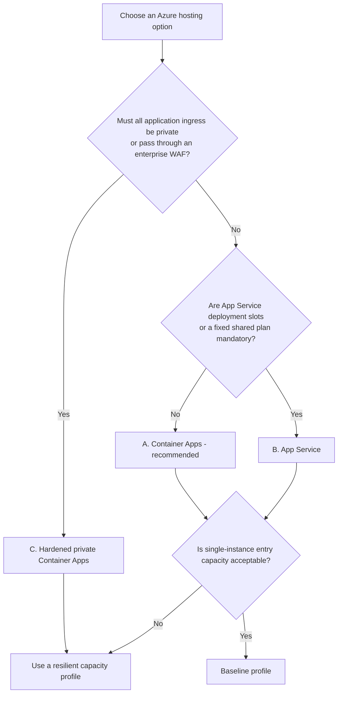

# Azure deployment options

This guide separates three decisions that should not be mixed:

1. **Hosting** - where the web and API processes run.
2. **Exposure and resilience** - how private, redundant, and operationally
   isolated the deployment must be.
3. **AI grounding** - whether the application uses its current Azure AI Search
   integration or a future Foundry IQ adapter.

The repository currently provides executable Bicep only for the recommended
**Azure Container Apps** option. The App Service and hardened-private options
are documented target designs, not selectable parameters in the current
infrastructure.

No option migrates local policy data or uploaded files. Every Azure environment
starts with an empty PostgreSQL database, an empty document share, and newly
initialized Search indexes.

## Support status

| Option | Repository support | Can use the current `azd up` path? | Intended use |
|---|---|---:|---|
| **A. Container Apps** | **Implemented and statically validated** | Yes | Default small-to-medium Azure deployment |
| **B. App Service** | Architecture guidance only | No | Teams standardized on App Service plans and deployment slots |
| **C. Hardened private Container Apps** | Architecture guidance only | No | Private or regulated access with a dedicated ingress boundary |
| **Azure AI Search grounding** | **Implemented** | Yes | Required grounding path for the current code |
| **Foundry IQ grounding** | Future application design | No | Managed knowledge retrieval after an adapter is built |

"Statically validated" means the Bicep, azd project, container images, hooks,
parameter sources, and documentation were validated without provisioning an
Azure subscription. No Azure environment has been deployed from this
repository.

## Quick decision guide



Choose **A** unless an explicit platform, compliance, or network requirement
justifies **B** or **C**. Do not select a more complex option only because it
appears more enterprise-oriented.

## Services common to every option

The hosting choice changes the web/API compute and ingress topology. The core
product dependencies remain the same:

| Capability | Azure service | Required behavior |
|---|---|---|
| Relational metadata | Azure Database for PostgreSQL Flexible Server | Private access; schema initialized with Alembic |
| Uploaded documents | Azure Files | Mounted at the application's existing `data/documents` path |
| AI reasoning and embeddings | Azure OpenAI | Reasoning, fast, and embedding deployments |
| Grounding | Azure AI Search | Hybrid/vector clause retrieval for the current implementation |
| Secrets | Azure Key Vault | Database, Entra, OpenAI, and Search secrets |
| Images | Azure Container Registry | Managed-identity image pulls; admin account disabled |
| Monitoring | Log Analytics and Application Insights | Platform logs and monitoring surface |
| Identity | Microsoft Entra ID and managed identities | User authentication at ingress and workload access to Azure resources |
| Initialization | One-time deployment job/process | Fresh schema and Search index creation only; no sample or legacy data |

AI is mandatory for the intended product in every hosting option. The current
application also requires Azure AI Search for grounded behavior; Foundry IQ is
not yet interchangeable with it.

## Option A: Azure Container Apps

**Status: implemented in `infra/` and selected by `azure.yaml`.**

### Topology

- Public React/Nginx web Container App.
- Internal FastAPI Container App.
- Nginx proxies same-origin API requests to the internal API.
- Manual Container Apps job initializes PostgreSQL and Search schemas.
- Workload-profile Container Apps environment injected into a dedicated VNet
  subnet.
- Minimum one web and one API replica to avoid cold starts.

### Network layout

| Subnet | Baseline prefix | Purpose |
|---|---|---|
| `snet-container-apps` | `10.20.0.0/23` | Container Apps environment and NAT Gateway |
| `snet-postgresql` | `10.20.4.0/24` | Exclusive PostgreSQL Flexible Server delegation |
| `snet-private-endpoints` | `10.20.5.0/24` | Key Vault, Azure Files, Azure OpenAI, and AI Search private endpoints |

The web app is the only public application endpoint. Built-in Container Apps
Microsoft Entra authentication protects that ingress. The API is internal, and
data/AI services have public network access disabled.

### Baseline compute

| Component | Baseline |
|---|---|
| Web | Consumption workload profile, 0.25 vCPU, 0.5 GiB, 1-2 replicas |
| API | Consumption workload profile, 1 vCPU, 2 GiB, 1-3 replicas |
| Initialization job | 0.5 vCPU, 1 GiB, manual trigger |

This is a paid consumption configuration, not a Free-tier deployment.

### Why it is recommended

- Web and API resources scale independently.
- The API remains private without an additional API private endpoint.
- Container images make Python/PDF dependencies predictable.
- Revisions provide controlled service updates without Kubernetes operations.
- It matches the two-process application boundary with the least new platform
  machinery.

### Limitations

- There are no App Service-style deployment slots.
- Extraction, quality, and correlation remain synchronous HTTP operations.
- The baseline is single-region and starts with one replica per service.
- The application still needs trusted server-side authorization; Entra ingress
  authentication does not make the client-supplied actor role authoritative.
- ACR Standard uses a secured public endpoint. A private registry endpoint
  requires ACR Premium and additional Bicep.

Use this option when container-native operation, private API ingress, and
independent sizing matter more than fixed-plan capacity or deployment slots.

## Option B: Azure App Service

**Status: target architecture only. No App Service resources are generated by
the current Bicep.**

### Proposed topology

- Two Linux custom-container Web Apps: one React/Nginx web app and one FastAPI
  API app.
- One Standard S1 App Service Plan as the lower Standard starting point.
- Public web app with built-in Microsoft Entra authentication.
- API app with a private endpoint and public access disabled.
- Web app VNet integration so Nginx can resolve and reach the private API.
- Separate initialization mechanism, such as an App Service deployment job or
  controlled operator task, for Alembic and Search index setup.

### Required network layout

At minimum, this design needs:

- a dedicated App Service VNet integration subnet (recommended `/26`)
- the PostgreSQL delegated subnet
- the private-endpoint subnet
- the `privatelink.azurewebsites.net` private DNS zone for the API
- the same private DNS zones used by PostgreSQL, Files, Key Vault, OpenAI, and
  Search

The App Service integration subnet and private-endpoint subnet must remain
separate.

### Advantages

- Standard tier provides deployment slots, autoscale, and a familiar Web App
  operational model.
- Both apps can share one plan when cost control matters more than workload
  isolation.
- Teams already standardized on App Service may have established monitoring,
  backup, and support processes.

### Trade-offs

- Web and API compete for the same S1 plan capacity. PDF parsing and concurrent
  AI orchestration may require S2, Premium v3, or separate plans.
- A shared plan cannot independently size web and API CPU/memory.
- Private API access requires more explicit VNet integration, private endpoint,
  and DNS configuration than Container Apps internal ingress.
- This repository does not contain App Service Bicep, parameters, health-check
  configuration, or an App Service initialization hook.

Choose App Service only when deployment slots, fixed-plan operations, or an
organizational App Service standard outweigh independent workload sizing.
Implement and validate a separate IaC path before deployment; changing a SKU
parameter in the current kit does not switch the host.

## Option C: hardened private Container Apps

**Status: target architecture only. The current Container Apps environment has
a public web endpoint and does not create a WAF gateway, firewall, VPN, or
private ACR endpoint.**

### Proposed topology

- Internal Container Apps environment.
- Application Gateway WAF_v2, or an approved enterprise ingress platform, as
  the only application ingress.
- Private access through VPN/ExpressRoute, or a controlled public WAF listener
  when internet access is required.
- ACR Premium with Private Link.
- Resilient capacity profile: at least two web/API replicas, PostgreSQL
  zone-redundant HA, Storage ZRS, and at least two Search replicas.
- Azure Firewall and user-defined routes only when centralized egress inspection
  is a stated requirement.

### Additional network components

Depending on the enterprise network standard, this option may require:

- an Application Gateway subnet
- an `AzureFirewallSubnet` and route table
- private DNS forwarding/resolution for connected networks
- VPN Gateway or ExpressRoute connectivity
- WAF policy, certificates, and public/private DNS ownership

These components materially increase cost and operational responsibility. They
must not be added without confirmed ingress, egress, certificate, DNS, and
connectivity ownership.

### When it is justified

- policy or compliance requires private application ingress
- all access originates from trusted corporate networks
- centralized WAF and egress inspection are mandatory
- zone-level service resilience is required
- the operating team can support gateway, firewall, DNS, and private-link
  troubleshooting

This option is not justified solely to make every diagram show private links.
Use the simpler Container Apps baseline when Entra-protected public web ingress
is acceptable.

## Capacity profiles

Capacity is separate from the hosting option. The supplied parameter profiles
apply to **Option A**.

| Service | Baseline profile | Resilient profile |
|---|---|---|
| Container Apps | Web 1-2 replicas; API 1-3 | Web/API 2-5 replicas |
| PostgreSQL | Burstable `Standard_B1ms`, 32 GiB, 7-day backup, no HA | General Purpose `Standard_D2ds_v5`, 128 GiB, 14-day backup, zone-redundant HA |
| Azure AI Search | Standard S1, 1 replica, 1 partition | Standard S1, 2 replicas, 1 partition |
| Azure Files | `Standard_LRS`, 10 GiB | `Standard_ZRS`, 100 GiB |
| ACR | Standard | Premium |
| Log retention | 30 days | 90 days |

Apply a profile to the selected azd environment:

```powershell
.\infra\scripts\Set-AzdProfile.ps1 -Profile baseline
# or
.\infra\scripts\Set-AzdProfile.ps1 -Profile resilient
```

Important qualifications:

- The resilient profile remains **single-region**; it is not a disaster recovery
  design.
- Setting ACR to Premium does not create a registry private endpoint. Option C
  needs additional Bicep for that connection.
- Zone-redundant PostgreSQL and model deployments depend on the selected
  region's capabilities and subscription quota.
- Search replica requirements should be validated against the desired query and
  indexing availability target.
- Azure OpenAI costs and capacity are usage/model dependent and are not fixed by
  these profiles.

## Grounding choice: Azure AI Search or Foundry IQ

Grounding is not a hosting variant.

### Azure AI Search - current implementation

The application directly creates embeddings and sends hybrid keyword/vector
queries to Azure AI Search. The generated infrastructure provisions Search S1,
private connectivity, and the `policy-authoring` and `policy-evidence` index
schemas.

This is the only grounding choice that works with the current code and current
`azd up` path.

### Foundry IQ - future implementation

Foundry IQ cannot be enabled by changing a Bicep parameter. Adoption requires an
application adapter that defines:

- how uploaded clauses become knowledge sources
- how policy/document scope becomes a knowledge-base filter
- how Foundry citations map back to persisted evidence references
- how index freshness and policy lifecycle events trigger synchronization
- how retrieval failures are represented to callers

Until that adapter, its tests, and its infrastructure are implemented, deploy
Azure AI Search as generated. Foundry IQ may replace or build on Search in a
future design, but it is not currently a supported deployment choice.

See [AI assistance](ai-assistance.md#how-the-ai-is-grounded) for the current
runtime grounding path.

## Well-Architected trade-offs

| Pillar | Option A: Container Apps | Option B: App Service | Option C: hardened private |
|---|---|---|---|
| Security | Private API and dependencies; Entra-protected public web | Private API possible, but requires extra endpoint/DNS wiring | Strongest ingress/egress control; largest configuration surface |
| Reliability | Revisions and independent scaling; baseline remains single-replica/single-region | Slots and fixed plan; shared-plan contention is possible | Redundant services and controlled ingress; still needs a regional/DR plan |
| Performance | Independent web/API resources | Shared S1 capacity unless plans are separated | Dedicated ingress and optional dedicated profiles; more network hops |
| Cost | Lowest operational baseline of the three | Predictable fixed plan; may need S2/Premium as load grows | Highest fixed networking and operations cost |
| Operational excellence | Generated and validated in this repository | Familiar to App Service teams, but IaC is not supplied | Requires mature network, WAF, DNS, certificate, and firewall operations |

## Selection checklist

Before choosing a variant:

1. Confirm whether public Entra-protected web ingress is acceptable.
2. Confirm whether deployment slots are mandatory.
3. Decide whether web and API need independent resource sizing.
4. Define availability, RTO, and RPO requirements.
5. Confirm whether private ACR, WAF, firewall, VPN, or ExpressRoute are mandated.
6. Select baseline or resilient capacity independently from the host.
7. Use Azure AI Search unless the Foundry IQ adapter has been implemented and
   validated.
8. Validate subscription policy, regional service availability, SKU capacity,
   model versions, and quota immediately before deployment.
9. Keep the fresh-start decision explicit: no local policy records or documents
   are copied automatically.

## Microsoft references

- [Azure Container Apps workload profiles](https://learn.microsoft.com/azure/container-apps/workload-profiles-overview)
- [Azure Container Apps networking](https://learn.microsoft.com/azure/container-apps/networking)
- [Azure App Service plans](https://learn.microsoft.com/azure/app-service/overview-hosting-plans)
- [Azure App Service VNet integration](https://learn.microsoft.com/azure/app-service/overview-vnet-integration)
- [Application Gateway WAF](https://learn.microsoft.com/azure/web-application-firewall/ag/ag-overview)
- [Azure Container Registry tiers](https://learn.microsoft.com/azure/container-registry/container-registry-skus)
- [PostgreSQL Flexible Server compute tiers](https://learn.microsoft.com/azure/postgresql/flexible-server/concepts-compute)
- [Azure AI Search service tiers](https://learn.microsoft.com/azure/search/search-sku-tier)
- [Microsoft Foundry IQ](https://learn.microsoft.com/azure/foundry/agents/concepts/what-is-foundry-iq)
- [Azure Well-Architected Framework](https://learn.microsoft.com/azure/well-architected/)
