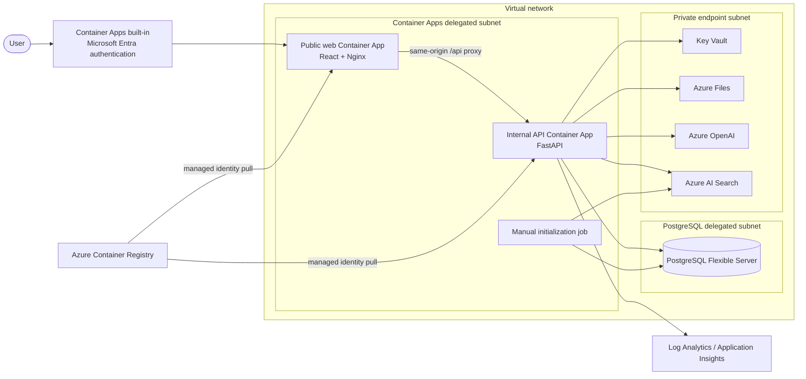

# Azure deployment (pending)

**Status: pending.** This guide explains the prepared Azure deployment. It is a future operator procedure: **no Azure-hosted application environment has been provisioned from this repository**.

The currently available path is the **Local deployment**. Calling Azure OpenAI or Azure AI Search endpoints from the local API does not make the application an Azure deployment.

## Recommended architecture

Azure Container Apps is the default because the product has two containerized runtime boundaries, needs private service connectivity, and does not require a Kubernetes control plane.



Only the web app has public ingress. The API receives traffic through Nginx inside the Container Apps environment. PostgreSQL, Key Vault, Azure Files, Azure OpenAI and Azure AI Search have public network access disabled.

## Baseline resources

| Service | Baseline | Notes |
|---|---|---|
| Container Apps web | Consumption, 0.25 vCPU / 0.5 GiB, 1-2 replicas | Public HTTPS ingress and Entra gate |
| Container Apps API | Consumption, 1 vCPU / 2 GiB, 1-3 replicas | Internal ingress; Azure Files mounted at `/app/data/documents` |
| Initialization job | 0.5 vCPU / 1 GiB, manual | Creates schema and Search indexes only |
| PostgreSQL Flexible Server | Burstable `Standard_B1ms`, 32 GiB, 7-day backup | Entry tier, private delegated subnet, no HA |
| Azure AI Search | Standard S1, 1 replica / 1 partition | Hybrid/vector grounding; not Free tier |
| Azure OpenAI | S0 | Reasoning, fast and embedding deployments are parameters |
| Container Registry | Standard | Admin disabled; managed-identity pulls |
| Storage | `Standard_LRS`, 10 GiB Azure Files share | Existing filesystem contract without application rewrite |
| Key Vault | Standard | RBAC, purge protection and private endpoint |
| Monitoring | Log Analytics pay-as-you-go + workspace Application Insights | Platform logs and monitoring surface |
| Network egress | Standard NAT Gateway and public IP | Stable Container Apps outbound identity |

See [deployment options](azure-deployment-options.md) for a resilient profile and App Service alternative.

## Network design

| Subnet | Default range | Requirement |
|---|---|---|
| `snet-container-apps` | `10.20.0.0/23` | Exclusive delegation to `Microsoft.App/environments`; NAT Gateway attached |
| `snet-postgresql` | `10.20.4.0/24` | Exclusive delegation to `Microsoft.DBforPostgreSQL/flexibleServers` |
| `snet-private-endpoints` | `10.20.5.0/24` | Private endpoint policies disabled |

The VNet defaults to `10.20.0.0/16`; every prefix is parameterized. The baseline uses Azure system routes plus NAT rather than forced tunneling. A firewall/UDR is part of the private-network option because it adds cost and requires the complete Container Apps outbound allowlist.

Private DNS zones are created and linked for PostgreSQL, Key Vault, Azure Files, Azure OpenAI and Azure AI Search.

## Parameters and prompts

`infra/main.parameters.json` carries every Bicep input through azd environment substitution. It contains no secret values.

When an operator eventually runs `azd up`:

1. azd asks for environment name, subscription and location.
2. `infra/scripts/Initialize-AzdEnvironment.ps1` applies safe baseline defaults.
3. It prompts only for missing values: resource group, PostgreSQL credentials, Entra app details, and region-supported model names/versions.
4. `infra/scripts/Test-AzurePrerequisites.ps1` performs read-only provider, quota, region, model and CIDR checks.
5. Bicep provisions resources with public placeholder images.
6. azd builds and deploys the API and web images.
7. The postdeploy hook adds the generated web callback URL to the Entra app.
8. The initialization job creates the fresh PostgreSQL schema and Search indexes.

Non-secret defaults are visible in:

- `infra/parameters/baseline.env.example`
- `infra/parameters/resilient.env.example`

Apply a profile to a selected environment before deployment:

```powershell
.\infra\scripts\Set-AzdProfile.ps1 -Profile baseline
# or
.\infra\scripts\Set-AzdProfile.ps1 -Profile resilient
```

## Fresh database behavior

The Azure database is deliberately empty. The postdeploy job runs:

```text
alembic upgrade head
PUT policy-authoring index schema
PUT policy-evidence index schema
```

It does **not** run files under `scripts/`, restore a PostgreSQL dump, import sample JSON, copy `data/documents`, or upload any policy. The application opens with no policy sets or source documents.

## Future `azd up` procedure

Complete [prerequisites](azure-prerequisites.md), then:

```powershell
azd auth login
azd env new policy-dev
azd up
```

To choose a pre-existing resource-group name before `azd up` creates it:

```powershell
azd env set AZURE_RESOURCE_GROUP rg-policy-dev
```

To inspect planned Bicep changes without applying them, use the documented subscription and parameter values with Azure Resource Manager what-if. Do not put secrets on a command line; keep them in the ignored azd environment.

## Outputs

After a future deployment, Bicep returns these azd environment values:

- `WEB_URL`
- `API_URL` (internal Container Apps FQDN)
- `AZURE_RESOURCE_GROUP`
- `AZURE_CONTAINER_REGISTRY_ENDPOINT`
- `AZURE_KEY_VAULT_NAME`
- `AZURE_CONTAINER_APP_API_NAME`
- `AZURE_CONTAINER_APP_WEB_NAME`
- `AZURE_BOOTSTRAP_JOB_NAME`
- `AZURE_OPENAI_ENDPOINT`
- `AZURE_SEARCH_ENDPOINT`
- `AZURE_POSTGRESQL_SERVER_NAME`

The public product entry point is `WEB_URL`; the API URL is not intended for internet clients.

## Known deployment constraints

- The application still uses API keys for OpenAI and Search. They are stored in Key Vault and injected by reference, but managed-identity data-plane auth requires an application change.
- Entra authenticates users at ingress, but application actor roles are still client-supplied and are not trusted authorization claims.
- Long AI/extraction requests remain synchronous and can approach ingress timeout limits. A durable job architecture is a future improvement.
- ACR Standard has a secured public endpoint because ACR Private Link requires Premium. The resilient profile selects Premium when a private registry is required.
- Application Insights is provisioned, but code-level tracing requires SDK instrumentation; Container Apps console/platform logs work immediately.

## Microsoft references

- [Azure Container Apps networking](https://learn.microsoft.com/azure/container-apps/networking)
- [Authentication in Azure Container Apps](https://learn.microsoft.com/azure/container-apps/authentication)
- [PostgreSQL Flexible Server private networking](https://learn.microsoft.com/azure/postgresql/flexible-server/concepts-networking-private)
- [Azure AI Search network security](https://learn.microsoft.com/azure/search/service-configure-firewall)
- [Azure AI services virtual networks](https://learn.microsoft.com/azure/ai-services/cognitive-services-virtual-networks)
- [Azure Key Vault Private Link](https://learn.microsoft.com/azure/key-vault/general/private-link-service)
- [Azure Developer CLI schema](https://learn.microsoft.com/azure/developer/azure-developer-cli/azd-schema)
