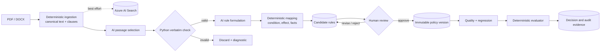
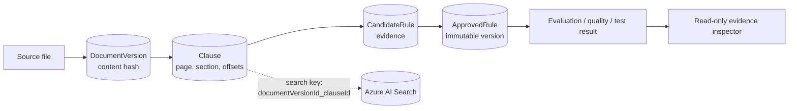
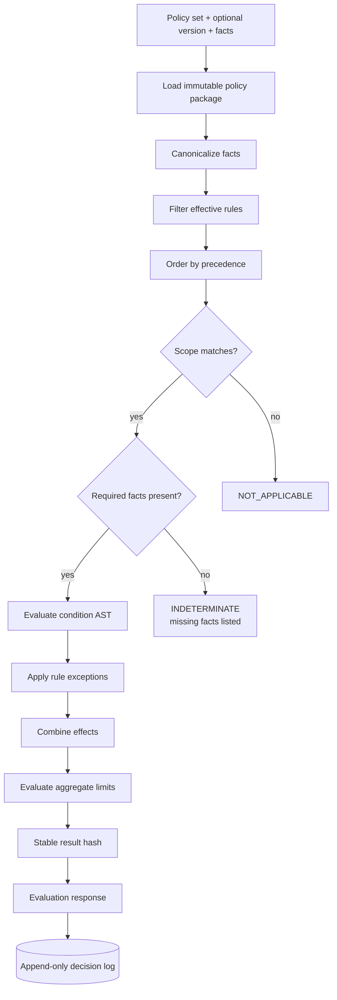
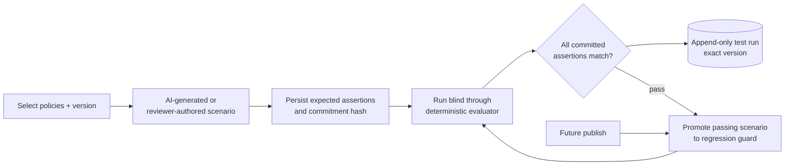
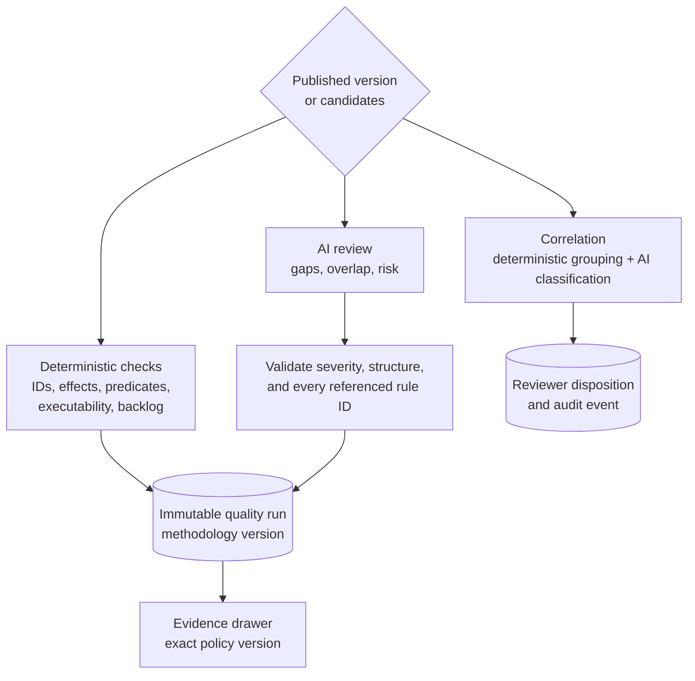
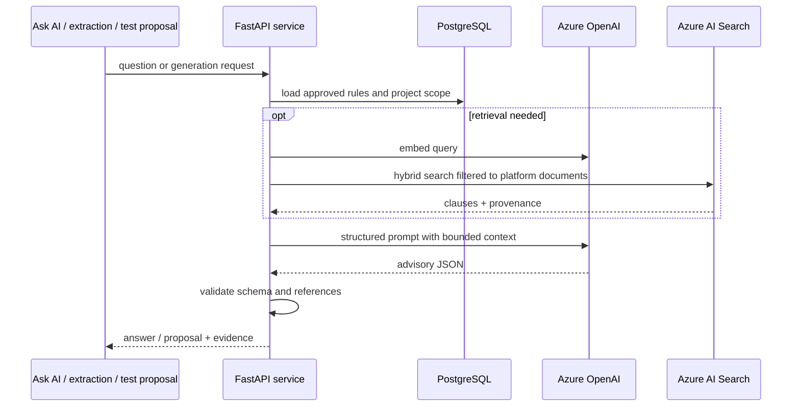
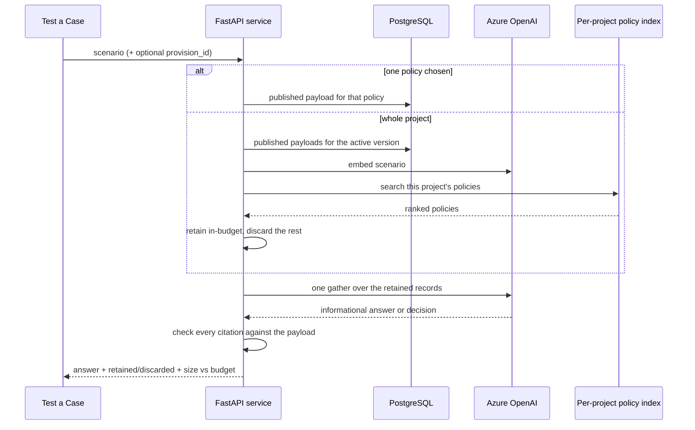
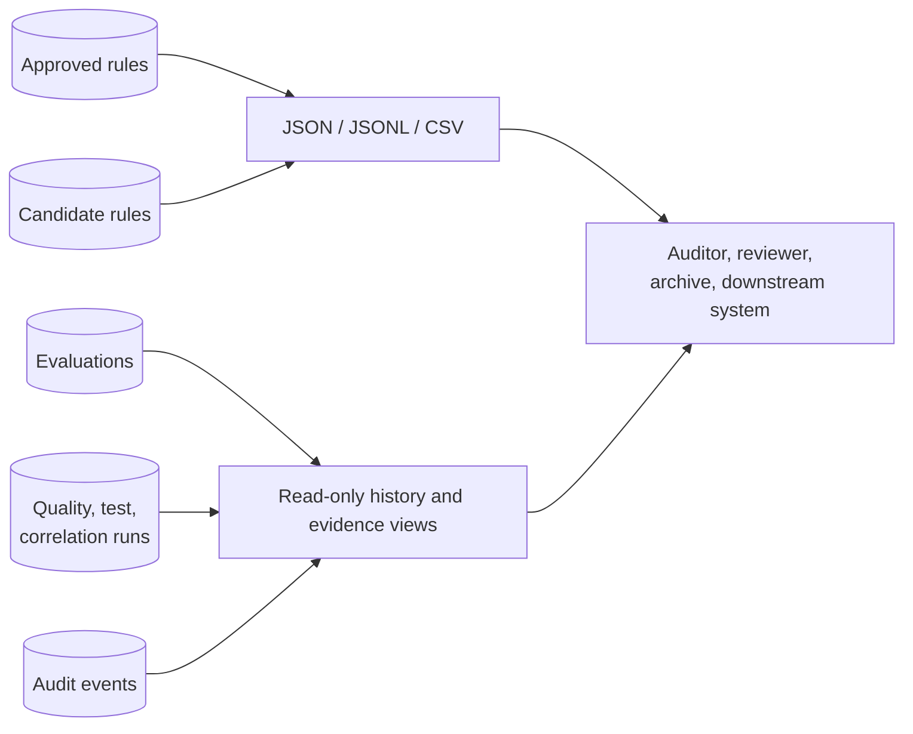

# Capability flows

This page keeps only the diagrams that explain the platform's highest-impact
boundaries. The task-oriented journey is in [Workflows](workflows.md); detailed
ingestion design remains in [PDF ingestion architecture](specs/pdf-ingestion-architecture-v1.md).

## How to read the diagrams

- Plain arrows are required steps.
- Dotted arrows are best-effort or optional.
- **AI** steps are probabilistic and advisory.
- **Python** and evaluator steps are deterministic.
- **Human review** is the publication gate.

## 1. End-to-end document control

This is the primary product flow.

**Boundary.** AI locates and formulates. Python verifies source text and compiles
the executable representation. A human decides what may be published.

**Outputs.** Immutable source versions, clauses, candidate rules, approved policy
versions, test history, decisions, and audit events.

## 2. Evidence and provenance

Every governed decision must lead back to one source passage.

The verbatim check proves the excerpt exists in the canonical source. It does not
replace human judgement about whether the excerpt was the right policy statement.

## 3. Deterministic evaluation

All runtime decisions pass through the same engine.

The evaluator imports no database, network, or AI dependency. The same package,
facts, and evaluation time produce the same result.

## 4. Tests and regression proof

Expected assertions are committed before execution. AI may draft scenarios; it
never decides pass or fail. Historical evidence resolves rules from the exact
tested version.

## 5. Quality and correlation assurance

Deterministic findings are confirmed structural checks. AI findings are potential
issues requiring human confirmation. Quality trends compare only runs produced by
the same methodology version.

## 6. Grounded AI

Search is grounding, never execution. Retrieval failure must not silently convert
an ungrounded answer into authoritative policy.

### 6a. Putting a case to a whole project

A reviewer can describe a situation in plain English and put it to one policy or
to a whole project. The project scope never evaluates every policy: it retrieves
the ones that bear on the question from that project's **own** policy index, and
discards the rest before anything is evaluated.

Three things this flow guarantees, each of which was a defect first:

- **It never fans out.** The retained policies are evaluated in one gather, not
  one call per policy, and the combined size is reported against a budget. An
  oversize payload is refused rather than silently trimmed.
- **It never falls back to "evaluate everything".** When retrieval cannot be
  relied on, the reviewer is told which of the distinct states applies — no
  published version, index not built, index stale, index empty, search
  unavailable, search failed, or a genuine no-match — and no evaluation is made.
  Those are kept apart because collapsing any pair reports one situation as
  another.
- **It retrieves policies, not clauses.** The indexed unit is a policy at its
  published version, keyed on identity that survives re-parsing. An earlier
  design keyed retrieval on clause ids, which are regenerated whenever a
  document is re-read, and it failed silently on every project with history.

The index holds only published policies at the latest approved version, which is
what makes it cheap to maintain: edits, approvals, rejections and re-extractions
all act on candidates and cannot change it. Only two events can — publishing
rebuilds a project's index, and deleting the project drops it.

## 7. Outputs and audit

Exports are verbatim structural re-serialization. Decision, quality, and test
history remain version-owned and read-only.

## Secondary capabilities

These are important but do not need separate diagrams:

| Capability | Control boundary |
|---|---|
| **Version compare** | Python computes added/removed/changed rules; AI may narrate the already-correct diff. |
| **Exceptions** | Human waiver record; currently not consumed by the evaluator. |
| **Attestations** | Human acknowledgement tied to one published version. |
| **Notes** | Mutable collaboration context, not audit evidence. |
| **Navigation** | Browser state and typed API client; no URL router or deep links. |

## Known boundaries

- AI, Search, and extraction work are synchronous request-driven operations.
- Search indexing is best-effort and has no scheduled reconciliation.
- Actor persona is workflow attribution, not production authorization.
- Hidden Correlation, Exceptions, and Attestations surfaces remain callable by
  API but are not in current navigation.
- There is no transactional outbox publisher, notification delivery, or
  scheduled policy run.
