# Capability flows

One diagram per implemented capability, with a short note on what triggers it,
which components take part, what it produces, and where the deterministic /
probabilistic line sits.

Read [Architecture](architecture.md) first for the system shape; this page is the
per-feature detail. For the technologies these flows run on, see
[Frameworks and technologies](frameworks.md). For which test modules defend each
capability below, see the
[active test capability groups](testing.md#active-test-capability-groups) in
[Testing and scripts](testing.md); for how the AI-touching flows get their
context, see [How the AI is grounded](ai-assistance.md#how-the-ai-is-grounded).

**How to read the diagrams**

- **Deterministic** steps are plain Python — same input, same output, no model.
- **Probabilistic** steps call Azure OpenAI and are always advisory. Azure
  OpenAI and a grounding/search layer are required for these flows to run at
  all; without them the flow returns `503` rather than degrading silently.
- **Human** steps are the gates: nothing probabilistic reaches a published
  version without one.
- Dotted arrows are best-effort: they can fail without failing the flow.

Anything below labelled *hidden* is fully implemented in backend and frontend but
deliberately not surfaced in the current navigation. Anything labelled *not
implemented* is not diagrammed as if it exists.

---

## 1. Navigation and UI-to-API invocation

**Purpose.** Show how a user reaches a capability and how the browser reaches the
backend. **Trigger:** opening the web app.

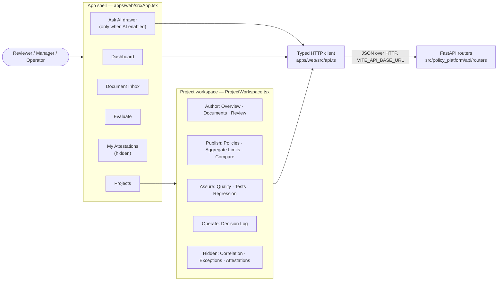

**Components.** `App.tsx` holds page state in memory — there is no router
library and no URL routing. `ProjectWorkspace.tsx` owns the tab strip, grouped
Author → Publish → Assure → Operate. `api.ts` is the single typed client for the
whole backend surface.

**Outputs / state.** None persisted client-side except the "acting as" identity
in `localStorage` (`ActorContext.tsx`).

**Human control.** Every write in the app is an explicit user action; nothing
polls-and-writes.

**Limitations.** `my-attestations`, and the `correlation` / `exceptions` /
`attestations` tabs, are filtered out of both the rendered menu and the
navigation guard, so they cannot be reached in the UI even though their APIs
work. There is no deep-linking: a browser refresh returns to the Dashboard.

---

## 2. Document ingestion and clause extraction

**Purpose.** Turn an uploaded PDF/DOCX into stable, offset-anchored `Clause`
rows. **Trigger:** `POST /api/documents/upload` from **Documents** or the
**Document Inbox**.

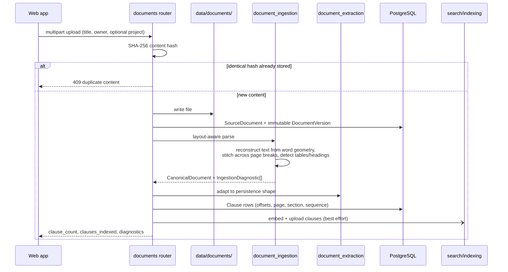

**Deterministic vs probabilistic.** Entirely deterministic. No model is involved
in parsing — that is the point: offsets are exact *by construction* because the
ingester builds the canonical page string itself.

**Outputs.** A `DocumentVersion` (content hash + storage path) and its `Clause`
rows; `ingestion_diagnostics` in the response when coverage is degraded.

**Limitations.** Clause extraction failure is caught and reported as
`extraction_error` rather than failing the upload. A scan with no text layer
produces diagnostics, not silent emptiness. Files are written to the local
filesystem with no scanning or encryption — Azure Blob Storage is not
implemented.

---

## 3. AI-assisted extraction: source passages to candidate rules

**Purpose.** Draft structured candidate rules from a document version.
**Trigger:** `POST /api/ai/policy-sets/{key}/documents/{document_version_id}/extract`
(the **Extract with AI** action).

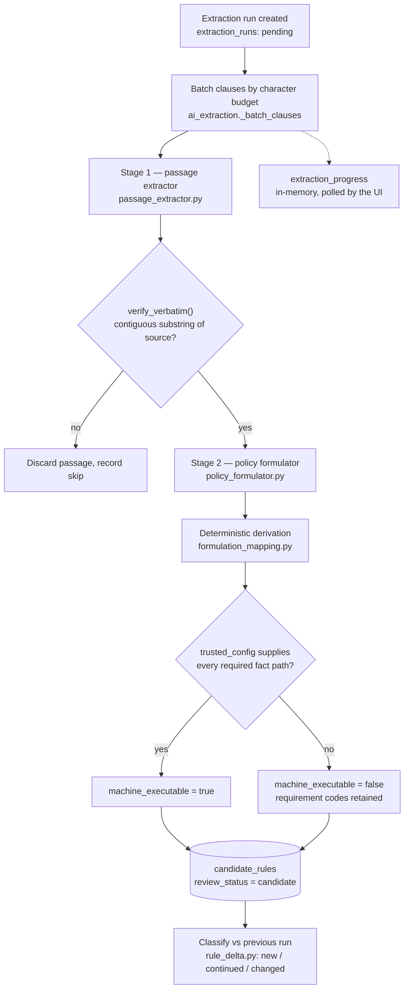

**Why two agents.** Scanning ("where does a policy statement start and stop")
and formulating ("what does it mean as data") have different failure modes.
Splitting them makes Stage 1's output verifiable by string containment.

**Deterministic boundary.** Identifier generation, rule-type/effect mapping and
condition compilation are plain Python. The FEEL-expression parser is strict: an
expression it does not fully understand yields *no* condition rather than a
guess. The untouched formulation payload is kept on every candidate.

**Outputs.** `candidate_rules` rows (never published), an `extraction_runs`
record, and per-rule delta status.

**Limitations.** Long-running — tens of model calls. Progress is in-memory
telemetry, not a source of truth. Prior candidates are superseded only once the
new run has rules to replace them, so a run that fails every batch cannot leave a
reviewer with less than they started with. An API restart marks in-flight runs
`failed` and keeps rules already committed.

---

## 4. Evidence, provenance and verbatim verification

**Purpose.** Guarantee every published rule can be traced back to the exact
source text. **Trigger:** implicit in extraction, publish, and evaluation.

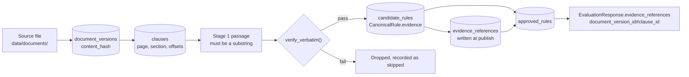

**Deterministic boundary.** The verbatim check is a normalised string
containment test in Python — a model's assurance about its own output is not
accepted as evidence. `policy_version_import.py` writes `evidence_references`
at publish time so the clause linkage survives approval.

**Outputs.** `evidence_references` rows; evidence IDs on satisfied rules in
every evaluation response.

**Limitations.** Verification proves the quote is real, not that it was the
*right* quote to pick. Evidence for a rule nobody curated is only as good as the
clause boundaries ingestion produced.

---

## 5. Human review and the candidate lifecycle

**Purpose.** The governance gate. **Trigger:** the **Review** tab, or the
candidate-rules endpoints directly.

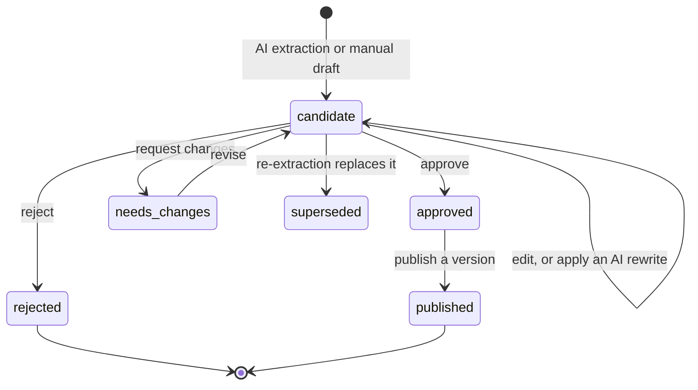

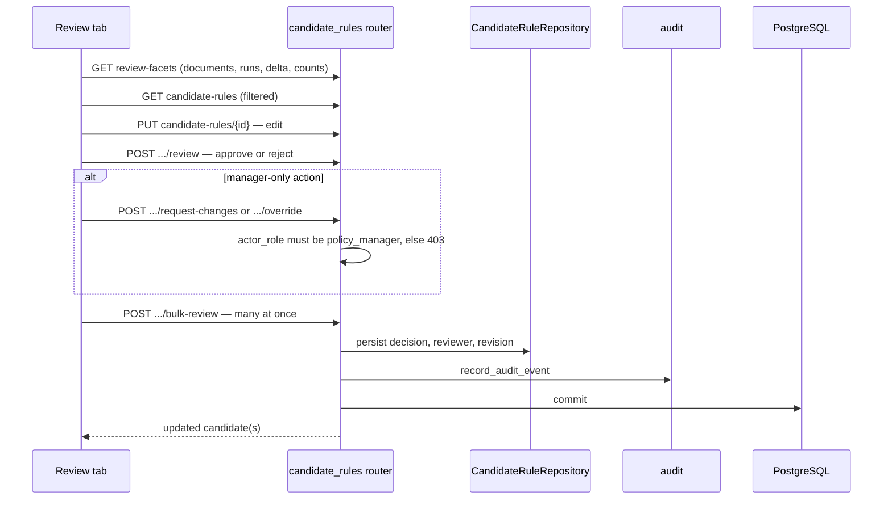

**Human control.** This *is* the human control point. Every decision records the
reviewer and a timestamp; `request-changes` and `override` require the
`policy_manager` role.

**Outputs.** Updated `candidate_rules` rows plus `audit_events`.

**Limitations.** The role check reads `actor_role` from the request body. It is a
local-trust convention, trivially spoofable, and is not authentication.

---

## 6. Publishing, versioning and release

**Purpose.** Turn approved candidates into an immutable, evaluable version.
**Trigger:** `POST /api/policy-sets/{key}/publish`.

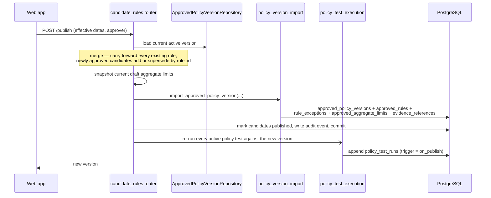

**Outputs / state changes.** A new `approved_policy_versions` row (exactly one
active per policy set), its full rule snapshot, and a fresh set of test runs.

**Deterministic boundary.** Fully deterministic. No model participates in a
publish.

**Versioning.** `version_number` is a monotonically increasing integer, unique
per policy set. Semantic versioning is **not** implemented — there is no
major/minor/patch semantics anywhere in the schema or API.

**Limitations.** The on-publish test re-run is best-effort: the publish is
already committed, so a failure there is logged and surfaced through the tests'
own history rather than failing the request. Publishing requires at least one
approved, unpublished candidate (`409` otherwise).

---

## 7. Deterministic policy evaluation

**Purpose.** Produce a decision from facts. **Trigger:** `POST /api/evaluations`
(the **Evaluate** page), the policy-test runner, the aggregate-limit preview, and
the AI scenario engine — all through the same function.

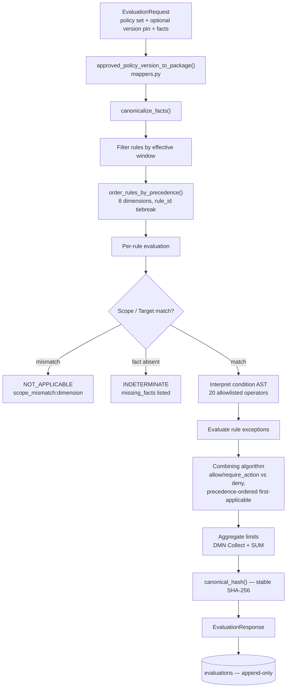

**Deterministic boundary.** `evaluator/` imports nothing from `infrastructure/`.
No database, no network, no model — enforced by module structure and unit tests.

**Outputs.** Overall status
(`SATISFIED` / `NOT_SATISFIED` / `NOT_APPLICABLE` / `INDETERMINATE` / `ERROR`),
outcome, per-rule results with `overridden_by`, triggered exceptions, aggregate
breaches, advice notes, evidence references, and a stable `result_hash`. Every
call appends an `evaluations` row.

**Human control.** None needed at decision time — that is the design. Control was
exercised earlier, at approval and publish.

**Limitations.** Missing facts always yield `INDETERMINATE` with the exact list,
never a guess. Supersession precedence resolves direct pairs but not every
multi-hop chain. The engine surfaces an aggregate breach but does not decide a
remediation.

---

## 8. Policy tests: definition, review and execution

**Purpose.** Pin worked examples as regression tests against the evaluator.
**Trigger:** the **Tests** tab, `POST /api/policy-tests/policy-sets/{key}`
(manual), `.../propose` (AI), `.../{test_id}/run`, or a publish.

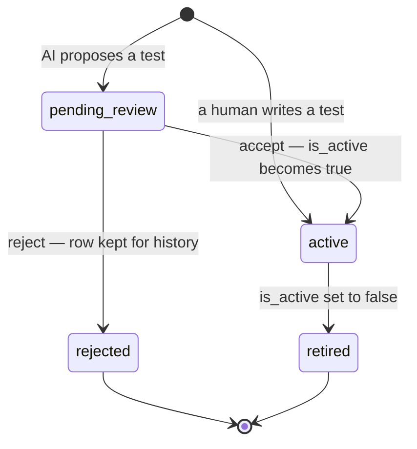

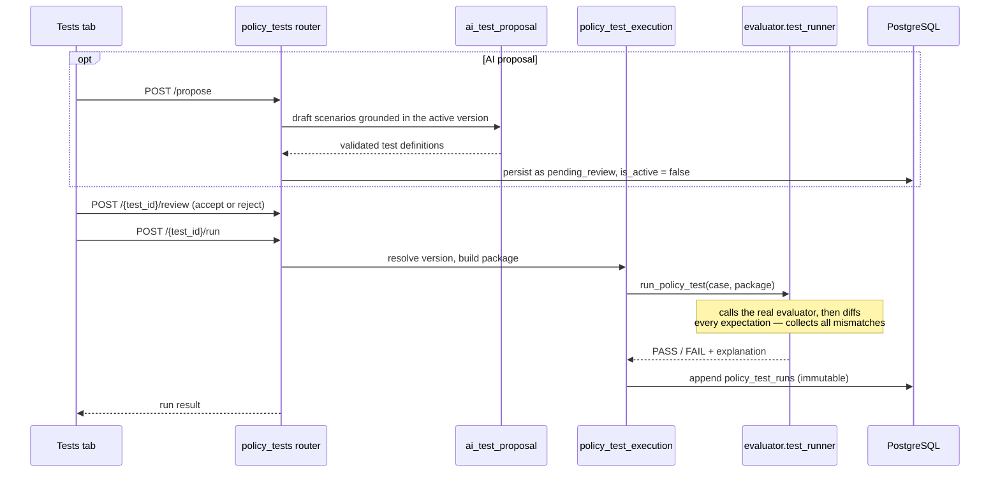

**Deterministic vs probabilistic.** AI may *propose*; only
`evaluator/test_runner.py` ever *executes*. `ai_test_proposal.py` is forbidden
by design from importing the evaluator.

**Outputs.** `policy_tests` rows (mutable — a QA artifact), and append-only
`policy_test_runs` recording the version each run targeted, the trigger
(`manual` / `on_publish`), the expected assertions snapshot and its hash.

**Limitations.** No hard delete or edit of an existing test (retire and
re-create), no "run all now" bulk action, and no scheduled execution — every run
is manual or publish-triggered.

---

## 9. Blind validation batches (Regression tab)

**Purpose.** Generate sealed scenarios for a chosen subset of published policies,
run them blind, then reveal. **Trigger:** the **Regression** tab →
`POST /api/policy-tests/policy-sets/{key}/validation-batches`.

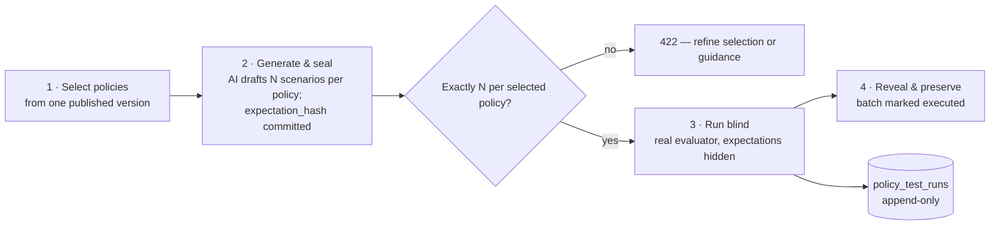

**Why sealed.** Committing an `expectation_hash` before execution means the
expected answer cannot be quietly adjusted after seeing the engine's result.

**Deterministic boundary.** Scenario *generation* is probabilistic; execution and
pass/fail are not. Execution is restricted to the reviewer-selected rule subset
so unrelated rules cannot turn the package `INDETERMINATE`.

**Limitations.** Batches run against a published version — running a suite
against a candidate version *before* publishing is not implemented.

---

## 10. Quality analysis, findings and inspection

**Purpose.** Answer "are these policies actually any good?" for both a published
version and pre-publish candidates. **Trigger:** the **Quality** tab →
`GET /api/ai/policy-sets/{key}/quality` or `.../candidates/quality`.

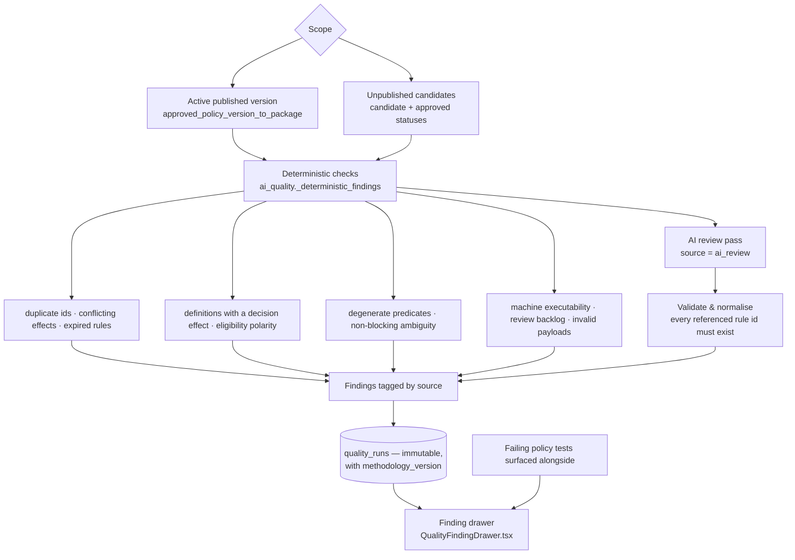

**Inspection and remediation.** The finding drawer resolves each finding against
the exact version it was raised on, explains the category in plain language, and
drills through to the affected policies and their source evidence. Remediation
itself is ordinary editing: fix the candidate or publish a corrected version,
then re-run and compare against the persisted history. There is **no** finding
disposition field for quality findings — persisted runs are the mechanism for
showing a fix stuck.

**Deterministic boundary.** Deterministic findings are exact by construction. AI
findings are judgement, explicitly framed as *potential* issues needing human
confirmation, and any finding referencing an unknown rule ID is rejected whole.

**Outputs.** A `quality_runs` row with the full findings payload, the rule count,
whether AI review was used, and the methodology version.

**Limitations.** A candidate-scope run over hundreds of rules is a single
long-running request with no incremental progress. Historic candidate-scope runs
do not snapshot the mutable candidate payload, so a later-superseded candidate is
reported as an unresolved reference rather than reconstructed.

---

## 11. Cross-rule correlation (hidden tab)

**Purpose.** Find rules that contradict, overlap, duplicate, supersede or
specialise one another. **Trigger:** `POST /api/ai/policy-sets/{key}/correlate`.
The **Correlation** tab is implemented but hidden in this phase; the API is
callable.

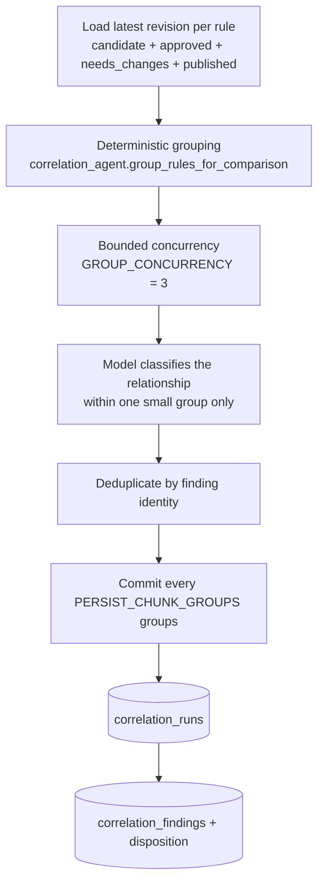

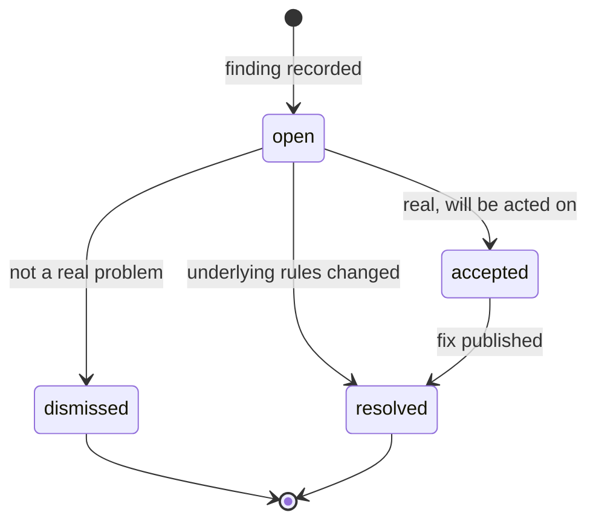

**Division of labour.** The application decides **which rules to compare**; the
model decides only **what the relationship is**. Exhaustive pairwise comparison
is arithmetically impossible on a large set — roughly a million pairs at 1,400
rules — so grouping must be deterministic and cheap.

**Outputs.** A `correlation_runs` row and `correlation_findings` rows, each
carrying a reviewer disposition (`open`, `accepted`, `dismissed`, `resolved`)
with the deciding actor, timestamp and notes. Setting a disposition also writes
an audit event, because "someone decided this was not a real problem" is a claim
an auditor needs attributed.

**Limitations.** Rejected rules are excluded deliberately. Findings are scoped to
a run, so they remain statements about the rules as they stood. Long runs commit
in chunks so a failure costs minutes, not hours.

---

## 12. Search: indexing and retrieval

**Purpose.** Ground AI answers in the organisation's own clauses. **Trigger:**
document upload (write side); Ask AI and test-scenario grounding (read side).
Requires `AZURE_SEARCH_*` configuration — this is the platform's mandatory
grounding layer, not an add-on, and the full grounding path is documented in
[How the AI is grounded](ai-assistance.md#how-the-ai-is-grounded).

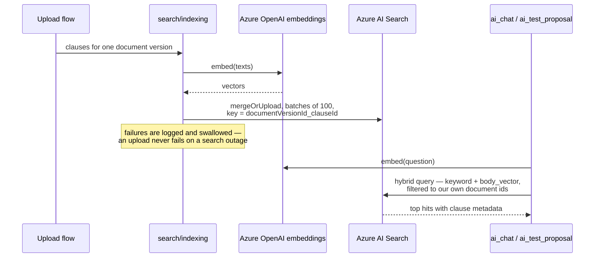

**Scoping.** The shared index also holds unrelated documents from another system.
Every write uses this platform's own `SourceDocument` UUID as `policy_id`, and
every read filters to the set of those IDs, so the two data sets cannot mix. The
client never creates or alters an index schema.

**Outputs.** Indexed clause documents; retrieved hits surfaced as provenance
chips in the UI.

**Limitations.** Best-effort by design: an indexing failure is logged and
swallowed, so a document can be fully usable and still invisible to retrieval.
Only the authoring index is written; the evidence index is untouched. Retrieval
failure degrades Ask AI to rules-only grounding rather than erroring. Automated
coverage is limited to the index-key contract
([`test_search_indexing.py`](../tests/unit/test_search_indexing.py)) — no test
contacts Azure AI Search. Full register:
[grounding limitations](ai-assistance.md#grounding-limitations-and-failure-modes).

---

## 13. Ask AI: grounded chat

**Purpose.** Answer plain-English questions about policy, citing what it used.
**Trigger:** the global **Ask AI** drawer, or `POST /api/ai/ask`. Also reachable
per-rule from the Review tab.

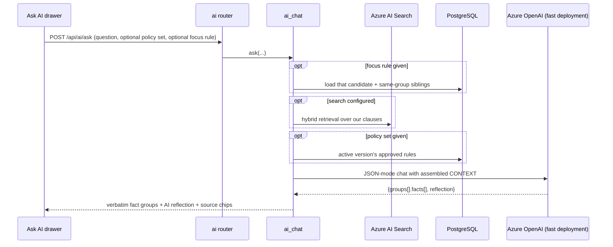

**Structured output contract.** The response schema forces a split between facts
copied character-for-character from context and the model's own synthesis, so a
reader can always tell which is which. This is JSON *object* mode
(`response_format: {"type": "json_object"}`), not JSON-Schema-constrained
structured outputs.

**Human control.** Advisory only. Nothing the chat says changes any record.

**Limitations.** Runs on the fast deployment for latency. If search or the rules
lookup fails, it answers from whatever context it did assemble and says so.
Retrieval is filtered to all of this platform's documents rather than to the
named policy set. There is no unit test for `ai_chat.ask` — see
[Testing and scripts](testing.md#active-test-capability-groups).

---

## 14. Aggregate limits

**Purpose.** Express a ceiling that spans several rules — "these leave types
together cannot exceed 70 days a year". **Trigger:** the **Aggregate Limits**
tab.

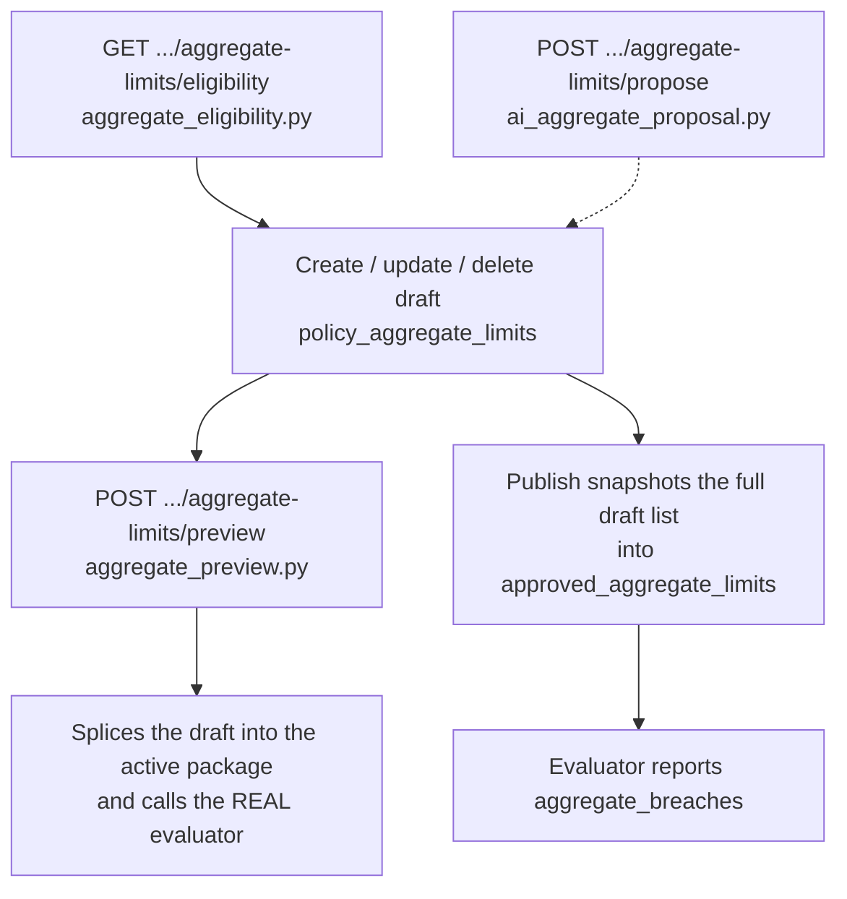

**Why eligibility and preview exist.** The engine skips a contribution silently
when a rule is not SATISFIED, was overridden, or its amount fact is missing or
non-numeric. Eligibility tells the author which rules can contribute *before*
they build the cap; preview runs the real evaluator rather than re-implementing
the arithmetic.

**Deterministic boundary.** Eligibility, preview and enforcement are all
deterministic. Only the *proposal* is probabilistic.

**Limitations.** Aggregate limits have no per-item review step — they are
policy-set configuration a manager maintains directly. The evaluator surfaces a
breach; it does not decide which contributing rule gets curtailed.

---

## 15. Version compare and change explanation

**Purpose.** Show exactly what changed between two published versions, and why a
candidate was flagged as changed. **Trigger:** the **Compare** tab
(`GET /api/ai/policy-sets/{key}/compare`) and the Review tab's change explainer
(`GET /api/ai/candidate-rules/{id}/explain-change`).

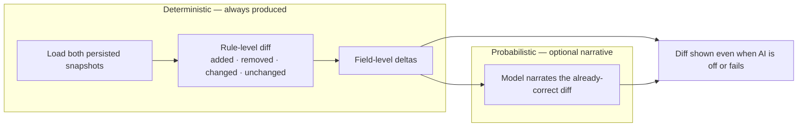

**Deterministic boundary.** The diff is never asked of the model; the model only
explains it. `rule_delta.py` provides the same guarantee for extraction runs, and
`rule_change_explainer.py` narrates that diff for one candidate.

**Limitations.** Comparison is read-only and on demand. There is no persistent
change-request/approval workflow wrapped around a diff.

---

## 16. Exceptions and waivers (hidden tab)

**Purpose.** Track a human-requested, time-bounded waiver of a rule for one
case. Distinct from the rule-level `exceptions` field the evaluator applies
automatically. **Trigger:** `POST /api/policy-exceptions/policy-sets/{key}`. The
**Exceptions** tab is implemented but hidden in this phase.

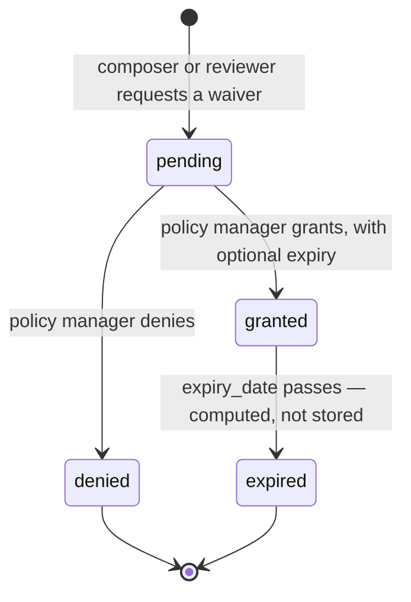

**Deterministic vs probabilistic.** Fully human and deterministic. No AI, and the
evaluator does not read `policy_exceptions` — a granted waiver is a governance
record, not an automatic runtime carve-out.

**Limitations.** No multi-level approval chain, no notification on request or
expiry.

---

## 17. Employee attestations (hidden surfaces)

**Purpose.** Track each person's obligation to acknowledge a specific published
version. **Trigger:** a manager launching a campaign
(`POST /api/policy-attestations/policy-sets/{key}/campaigns`); an employee
searching for their own items. Both the **My Attestations** page and the project
**Attestations** tab are implemented but hidden in this phase.

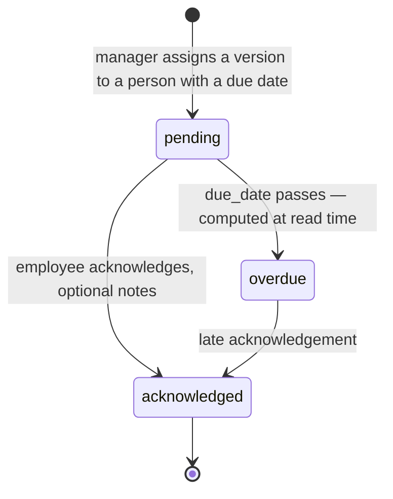

**Human control.** Campaign creation is manager-only (`403` otherwise).
Acknowledgement is self-service with no login — an employee finds their items by
name or identifier, because there is no identity system to key off.

**Outputs.** `policy_attestations` rows bound to a specific
`approved_policy_versions` row; status is computed, never stored.

**Limitations.** No reminder or escalation delivery, no automatic re-attestation
cascade when a new version is published, and no personnel directory — assignees
are free-text name/email captured per campaign.

---

## 18. Outputs: exports, decision log and audit trail

**Purpose.** Get governed data out of the platform, and prove what happened.
**Trigger:** export buttons in the Policies and Review tabs; the **Decision Log**
tab; `GET /api/audit-events`.

```mermaid
flowchart TD
    subgraph Files["Downloadable files"]
        E1["GET /api/policy-sets/{key}/versions/{id}/export<br/>?format=json|jsonl|csv"]
        E2["GET /api/policy-sets/{key}/candidate-rules/export<br/>?format=json|jsonl|csv"]
        E3["Policies tab client-side JSONL<br/>selected or all rules"]
    end
    subgraph Reads["Read APIs and UI history"]
        L1["GET /api/evaluations/policy-sets/{key} — decision log"]
        L2["GET /api/evaluations/{id} — full facts + response"]
        L3["GET /api/audit-events — immutable trail"]
        L4["Quality / correlation / test run history"]
    end
    Ser["export.py — verbatim re-serialisation,<br/>CSV nests structures as JSON cells, UTF-8 BOM"]
    Cons["Downstream: spreadsheets, archives,<br/>other systems, evidence packs"]

    E1 --> Ser
    E2 --> Ser
    Ser --> Cons
    E3 --> Cons
    Reads --> Cons
```

**Deterministic boundary.** Export is a verbatim structural re-serialisation of
persisted data. No field is summarised or reworded.

**Also readable, not shown above.** Free-form `notes` attached to any governed
entity (`GET`/`POST`/`DELETE /api/notes`) carry rationale and sign-off remarks.
They are collaboration context rather than evidence — unlike the tables above,
a note can be deleted by its author.

**Limitations.** Exports are point-in-time downloads, not a subscription or feed.
`outbox_messages` is modelled but no publisher consumes it, so there is no event
stream. There is no scheduled or automated export.

---

## Not diagrammed

These are named in the codebase or backlog but are **not implemented**, so no
diagram claims them:

- Microsoft Agent Framework / graph-workflow orchestration —
  `src/policy_platform/worker/` is an empty reserved package and no MAF
  dependency or workflow runtime exists. The current explicit, request-driven
  services do not need a framework-managed agent graph.
- Transactional outbox publishing — table only, no publisher.
- Authentication, multi-tenancy, and any identity provider integration.
- CI/CD pipeline. The prepared `azd`/Bicep path is operator-invoked, not automated delivery.
- Notification, reminder or escalation delivery of any kind.
- Scheduled or event-triggered runs — every flow above is request-driven.

See [Known limitations](known-limitations.md) for the full register.
