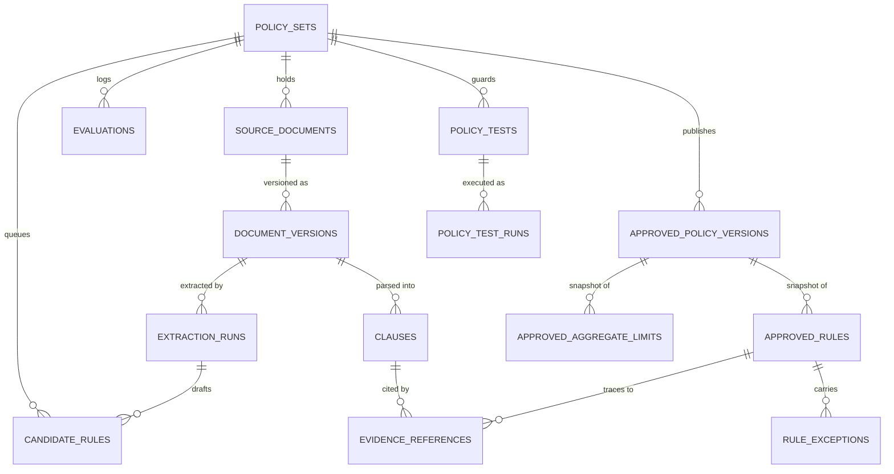

# Data model

26 tables, defined as SQLAlchemy models in `src/policy_platform/domain/models.py`
and migrated with Alembic (`alembic/versions/`). PostgreSQL 16.

Every table has a UUID primary key and `created_at` / `updated_at` timestamps.

## Core relationships



## Tables by area

### Projects and governance metadata

| Table | Purpose |
|---|---|
| `policy_sets` | A project: a named collection of policies for one business domain, addressed by a stable `key`. Also carries ownership/RACI fields, periodic-review dates, and the `trusted_config` used by extraction. |
| `policy_authorities` | Authority level, owner and rank, used for deterministic precedence. |
| `policy_aggregate_limits` | Mutable draft definition of a cross-rule aggregate cap. |

### Source documents

| Table | Purpose |
|---|---|
| `source_documents` | A registered source document (title, owner, optional project link). |
| `document_versions` | An immutable version of a document: content hash and storage pointer. |
| `clauses` | A stable clause within a document version, with source offsets and ordering. |
| `document_provisions` | One **section** of a document version — what the interface calls a *policy*. Keyed by a digest of the release and the normalised chain of governing headings. Holds no prose of its own beyond that chain, copied verbatim. |

#### Why `document_provisions` and not `policies`

`policy_sets` already means *a project*. A `policies` table beside it would read
as "the members of a policy set", which is equally true of `candidate_rules` and
`approved_rules`, and a reader would have to guess. This repository has already
paid for one field name meaning two things in sibling classes.

`provision` is the word the extraction pipeline has always used for exactly this
grouping — `_provisions`, `DividedProvision`, `test_provisions_are_read_whole` —
and it can only mean one thing. The API and the interface go on saying *policy*,
because that is the reviewer's word; the table says *provision*, because that is
the code's. The mapping is stated once, here and in the model's docstring.

#### What it deliberately does not have

No `extraction_run_id`, no `superseded_at`, no summary, title or statement
column. A provision is a fact about a *document version*, not about a run: two
runs over the same version compute the same graph from the same clauses and so
produce the same keys, and the second run's pass is a no-op on every row. A run
that supersedes candidates and then fails therefore cannot take a provision with
it — a table nothing removes from cannot participate in that failure. And a
column that does not exist cannot later be filled with a sentence the source
never wrote.

`heading_path_json` is a JSON **array**, never a joined path string. A separator
would be a character this system chose sitting between two of the document's own
headings.

### Extraction and review

| Table | Purpose |
|---|---|
| `extraction_runs` | One extraction attempt: fingerprint, status, error message. |
| `candidate_rules` | A non-authoritative drafted rule awaiting human review; carries the review status, reviewer, revision, delta identity against a previous run, the provision it is stated in, and the untouched formulation payload. |
| `correlation_runs` | One cross-rule correlation analysis over a policy set. |
| `correlation_findings` | One relationship found between rules, with its disposition. |
| `quality_runs` | An immutable record of one quality evaluation (deterministic + AI findings). |

`candidate_rules.provision_id` is nullable and stays nullable. A document whose
structure defeats grouping still extracts, and its rules still reach a reviewer
as policies assembled from `lineage.source_elements` the way they always were.
Nothing drops a rule for want of a provision.

### Published policy

| Table | Purpose |
|---|---|
| `approved_policy_versions` | An immutable, approved, versioned policy package — the unit the evaluator consumes. Exactly one is active per policy set. |
| `approved_rules` | A single approved rule belonging to a version, with the provision key and heading chain it was published under. |
| `approved_aggregate_limits` | Immutable snapshot of an aggregate limit as of one published version. |
| `rule_exceptions` | An approved exception attached to a rule. |
| `evidence_references` | Source lineage for a rule: document version, page, section, clause, offsets. |

`approved_rules.provision_key` and `provision_heading_json` are a **snapshot,
not a foreign key** — the same choice `formulation_json` already makes. A
published version records what was approved, and a later re-ingest that changes
how a document groups must not silently restate a decision a human already made.

### Runtime and assurance

| Table | Purpose |
|---|---|
| `evaluations` | An append-only record of a runtime evaluation request/response pair with its result hash. |
| `policy_tests` | A named, saved test case for a policy set, re-runnable across versions. |
| `policy_test_runs` | An append-only record of one test execution against one version. |
| `policy_test_batches` | One persisted blind-validation generation and execution set. |

### Lifecycle and operations

| Table | Purpose |
|---|---|
| `policy_exceptions` | A human-requested, time-bounded waiver — distinct from the rule-level `rule_exceptions` field. |
| `policy_attestations` | One person's obligation to acknowledge one published version. |
| `audit_events` | Immutable audit trail for authoritative actions (approvals, publications, dispositions). |
| `notes` | Human-authored, append-only notes attached to a governed entity. |
| `outbox_messages` | Reserved for future transactional outbox publishing; no publisher exists yet. |

## Invariants

These are enforced in the repository/API layer, not just by convention:

- **Published versions are immutable.** `approved_policy_versions` and
  `approved_rules` are never updated in place after publication. Change means a
  new version.
- **Exactly one active version per policy set**, enforced on every
  version-creation path.
- **Versions are numbered with a monotonically increasing integer**
  (`version_number`, unique per policy set). This is not semantic versioning —
  there is no major/minor/patch meaning.
- **Versions are full snapshots, not deltas.** Publishing carries forward every
  rule from the current active version.
- **`document_versions` are immutable.** A new upload creates a new version row.
- **Append-only tables:** `evaluations`, `policy_test_runs`, `audit_events`.
  `notes` are never edited in place, but can be deleted by their author
  (`DELETE /api/notes/{id}`) — they are collaboration context, not evidence.
- **Findings are scoped to a run.** Quality and correlation findings belong to a
  run so they remain statements about the rules as they stood at that moment.
- **`policy_tests` rows are mutable** (`is_active`, `review_status`, definition):
  a test case is a QA artifact, not an authoritative governance record. Its
  *runs* are not.
- **`document_provisions` is insert-only and never updated.** Two runs over the
  same document version leave the whole table byte-identical, digest included —
  `provision_row` is get-or-create and issues no `UPDATE`, because an update
  with no effect is exactly what makes a whole-table digest change on a
  timestamp. Only policy-set teardown removes rows, and it removes them before
  `document_versions` and after `candidate_rules`.
- **A rule belongs to at most one provision**, resolved from the elements it
  cites. A rule whose elements span two is filed under the earlier one by first
  logical order.

## Canonical rule shape

The persisted rule payload follows `policy_platform.contracts.policy`:

- `rule_type` — one of 19 values (`eligibility`, `permission`, `prohibition`,
  `obligation`, `approval_requirement`, `threshold`, `routing`, `escalation`,
  `definition`, `retention`, …).
- `effect` — `allow`, `deny`, `require_action`, or `informational`, plus an
  action string.
- `condition` — a recursive AST of `all` / `any` / `not` / fact comparisons, over
  20 allowlisted operators only.
- `required_facts`, `exceptions` (each with optional numeric limits), `advice`,
  `scope`, `priority`, `authority`, effective dates.
- Relationship fields: `group_label`, `related_rule_ids`, `supersedes_rule_ids`,
  `is_explicit_override`, `candidate_relationships`.
- `ambiguity_status` — `none`, `blocking`, `non_blocking`, or
  `human_judgment_required`.

Evaluation results use `SATISFIED`, `NOT_SATISFIED`, `NOT_APPLICABLE`,
`INDETERMINATE`, or `ERROR`.

### Routing: how a policy is meant to be decided

`evaluation_mode` states which of two routes a record takes. It is a property of
how the source sentence is written, **not** a quality grade — a policy is not
worse for being `ai_ready`.

| Value | The source states its test as | Decided by |
|---|---|---|
| `deterministic` | A computable comparison — a threshold, a date, a count | The rule engine, from `condition` |
| `ai_ready` | Words a reader has to weigh — "reasonable", "as deemed necessary" | A judge reading the record |

Both routes are products of this platform; neither is a defect, and the
vocabulary used about them is enforced by
`tests/unit/test_no_readiness_framing.py`. Running either route is the job of a
separate system.

### Derived views

Six fields are **derived on read** rather than stored, so a change to the
derivation reaches every record without a migration:

| Field | States |
|---|---|
| `evaluation_mode` | Which route above the record takes |
| `decision_readiness` | What a judge would still need to decide it |
| `fact_model` | Every fact the record names, and the type the sentence gives it |
| `attributes` | The reviewer-facing table: what the policy applies to, and what follows |
| `condition_provenance` | Where the stored condition came from |
| `xacml_view` | The access-control projection of the record's own effect |

A derived view must describe **the record it is attached to**, never re-answer
the question from the formulation — those are different questions and come apart
the moment either side changes. Two read paths exist (published and candidate);
`tests/unit/test_derived_views_agree.py` inspects both so a derivation added to
one and forgotten in the other fails the build.

### Candidate envelope

The fields around the rule carry review and version state:
`review_status`, `revision`, `delta_status`, `baseline_candidate_id`,
`extraction_run_id`, `superseded_at`, and `superseded_by_candidate_id`.

`superseded_by_candidate_id` is **derived over the returned set**, not stored.
Publishing deliberately leaves `superseded_at` unset so the audit trail keeps
every approved reading; the queue therefore computes which record is the latest
at read time, shows only that one, and offers its predecessor read-only. Without
this, a second extraction run leaves the reviewer holding two records for the
same sentence with no statement of which one is current.

`provision_id` is the exception among these: it is **stored**, because a
grouping is a fact about the document rather than a projection of the record,
and because deriving it kept it invisible to every consumer except the one
endpoint that derived it. That was the defect this change exists to fix.

`AssembledPolicy.persisted` says which of the two produced the grouping a
reader is holding — the pipeline's stored provision, or the read-time fallback
for rules that have none. A response that does not say cannot be told apart
later from one that does.

## Migrations

```powershell
.\.venv\Scripts\python.exe -m alembic upgrade head     # apply
.\.venv\Scripts\python.exe -m alembic revision --autogenerate -m "message"
```

Alembic uses `ALEMBIC_DATABASE_URL` (a sync psycopg URL), while the application
uses `DATABASE_URL` (async asyncpg). Both point at the same database.

Revision `b8e1c5f70a92` adds `document_provisions`, the nullable
`candidate_rules.provision_id`, and the two nullable `approved_rules` snapshot
columns. Every statement is additive and every new column on an existing table
is nullable, so it applies against a running API without a window: nothing
already deployed reads a column it does not know about, and no existing row is
rewritten. Rows for documents already ingested are filled in afterwards by
`scripts/backfill_provisions.py`, which is dry-run by default, inserts only,
and can be run repeatedly.

Downgrade drops the three additions and nothing else. No data that existed
before the migration is touched on the way up or on the way down — which is the
whole reason grouping is an added table rather than a rewrite of
`candidate_rules`.

## Deferred entities

Not modelled in this phase: `Tenant`, `User`, `Role`, `Permission`,
`SourceConnection`, `ParsedArtifact`, `ClauseRelationship`, `ModelInvocation`,
`Definition`, `FactDefinition`, `RuleDependency`, `ReviewTask`, `ReviewComment`,
`Approval`, `Publication`. See [known limitations](known-limitations.md).
