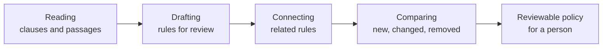

# From document to policy

This page is for compliance officers, policy owners, reviewers and evaluators. It explains how PolicyVerbAItim turns a source document into draft policy for review, and where the system checks its own work.

It does not describe the internal architecture. The important question here is simpler: what happens to the document, and why should a reviewer believe the draft?

The short answer is this:

- the AI drafts;
- the system checks the draft against the source;
- gaps and changes are reported rather than hidden;
- a human decides what can become policy.

Nothing is published just because the AI produced it.

## The cycle at a glance

The visible extraction cycle has four phases.

| Phase | What happens | Why it matters |
|---|---|---|
| Reading | The document is read into clauses, then policy passages are identified. | The system starts from source text, not from a summary. |
| Drafting | Rules are formulated from the verified passages and placed in the review queue. | The output is a proposal for review, not a live policy. |
| Connecting | Relationships between rules are discovered. | Reviewers can see when one rule depends on, qualifies or overlaps another. |
| Comparing | The run is compared with the previous extraction of the same document. | Reviewers see what moved instead of re-reading everything. |

## The source is preserved first

The system treats the uploaded document as evidence, not as a disposable input. Uploading a replacement creates a new document version. It does not overwrite the earlier source.

This matters because policy review often depends on history. A reviewer may need to know whether a rule came from the current source, from an earlier source, or from a draft that has since been replaced. The system keeps those distinctions instead of smoothing them away.

## Reading: finding policy text without trusting it blindly

The first phase reads the document into clauses and looks for passages that state policy. A passage might be a requirement, a permission, a restriction, an exception, a definition or another statement that can affect a decision.

This is where the most important check happens.

The model is asked to identify policy passages and to check itself. The system still does not take its word for it. Every selected passage is checked back against the canonical source text. The words must match exactly. If they do not, the passage is discarded.

That is the main guarantee of extraction: a rule cannot be drafted from a passage the system cannot find, word for word, in the source text it read.

This check does not prove that the model chose every relevant passage. It proves that a passage used as evidence was actually present in the source as read by the system. Those are different claims, and the distinction matters.

## Reading again when a batch was missed

Long documents are read in parts. If a part was not successfully read, the system makes a recovery pass rather than silently accepting the gap.

This is deliberately limited. A recovery pass is for material that was not read successfully. It is not a way to keep asking the model until it gives a more convenient answer.

If the recovery succeeds, the recovered material joins the same cycle as the rest of the document. If it does not, the run reports that it passed material over.

## Coverage is reported, not implied

A finished run and a complete reading are not the same thing. The system reports what it read and what it skipped, rather than letting a green-looking run imply that every part of the document was covered.

That matters because a skipped passage is a fact about the extraction, not a fact about the document. If a rule is absent because the system did not read the relevant material, it must not be reported as though the document stopped saying it.

Coverage reporting keeps that boundary visible.

## Drafting: turning verified passages into reviewable rules

Once a passage has passed the verbatim check, the system can draft rules from it. The draft is structured so a reviewer can inspect what it applies to, what it requires or permits, and what facts would be needed to decide it.

Every draft rule remains bound to its evidence. It keeps the document version, page, section and clause that produced it. A reviewer can trace the rule back to the exact source words rather than relying on a paraphrase.

This evidence binding is part of the control model. It lets a reviewer ask:

- did the rule come from the right document version?
- do the source words support the rule?
- did the rule preserve the intent of the passage?
- has the relevant source changed since the last extraction?

## Routing is about how the source is written

Each rule is classified by how it must be decided.

Some rules state a test as a computable comparison: a threshold, a date, a count or a similar condition. Those can go to the deterministic decision path.

Other rules are written in words a person must weigh: whether something is reasonable, appropriate, necessary or justified in context. Those go to a judge reading the record.

This route is not a quality score. A policy that contains many judgement-based rules is not a worse extraction. It reflects how the source document is written. The system should not pretend that a human judgement has become a calculation just because it would be easier to automate.

## Connecting: making relationships visible

After drafting, the system looks for relationships between rules. A rule may qualify another rule, depend on it, create an exception to it, or overlap with it.

These connections help the reviewer read the policy as a set rather than as isolated sentences. They do not remove the need for review. They are there to bring likely relationships to the surface so that a person can inspect them.

## Comparing: showing what changed

When the same document is extracted again, the new run is compared with the previous extraction of that document. The comparison classifies what is new, changed or removed.

This is useful because re-reviewing an entire document every time would be slow and error-prone. A reviewer needs to know what actually moved.

The comparison also respects prior human decisions. Re-extracting a document replaces unreviewed draft rules from the previous run, so the review queue does not hold competing drafts for the same source. But rules a human already approved or rejected are kept. A human decision is never silently discarded by a later extraction.

## Quality checks before publication

Before draft rules are published, the system can run quality checks over the review set. These checks look for problems that would affect trust, including:

- whether a rule is faithful to the source words it cites;
- whether the rule logic is faithful to its stated intent;
- whether a rule appears incomplete, inconsistent or hard to decide;
- whether the route assigned to the rule fits the way the source states the test.

These checks do not publish, approve or reject anything. They create evidence for the reviewer. The reviewer still decides what to change, approve or reject.

## What the double taps prove

The system uses several checks because no single check proves everything.

| Check | What it proves | What it does not prove |
|---|---|---|
| Verbatim verification | The cited passage exists word for word in the source text as read. | That every relevant passage was found. |
| Evidence binding | A rule can be traced to its document version, page, section and clause. | That the drafted logic is correct. |
| Recovery pass | Missed material gets another chance to be read. | That every possible miss can be recovered. |
| Coverage reporting | The run says what it passed over. | That a completed run read everything. |
| Route classification | The rule is sent to the right kind of decision path. | That one route is better than the other. |
| Supersession | Fresh unreviewed drafts replace older unreviewed drafts. | That approved or rejected human decisions are erased. |
| Delta classification | New, changed and removed rules are called out after a re-run. | That a reviewer can ignore the source evidence. |
| Quality checks | Source faithfulness and logic faithfulness are inspected before publication. | That publication can happen without human approval. |

These are the double taps: the places where the system checks a claim rather than simply accepting the model's answer.

## Where the cycle ends

The cycle described here ends when a reviewable policy exists: draft rules, tied to source evidence, checked for exact source grounding, classified, connected and compared with the previous extraction.

From there, a person reviews the policy. Approved rules can later be published as a new immutable version. Publishing creates a new version; it never edits the old one.
