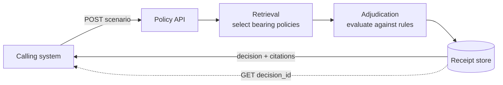
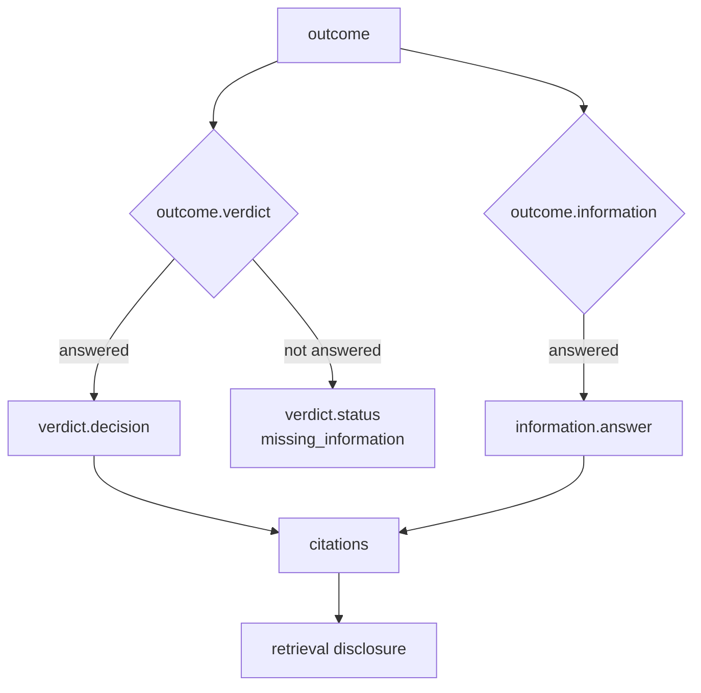
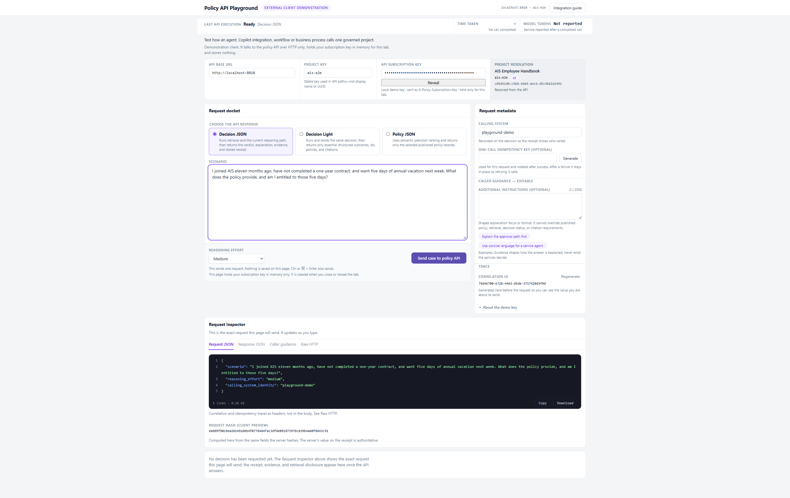
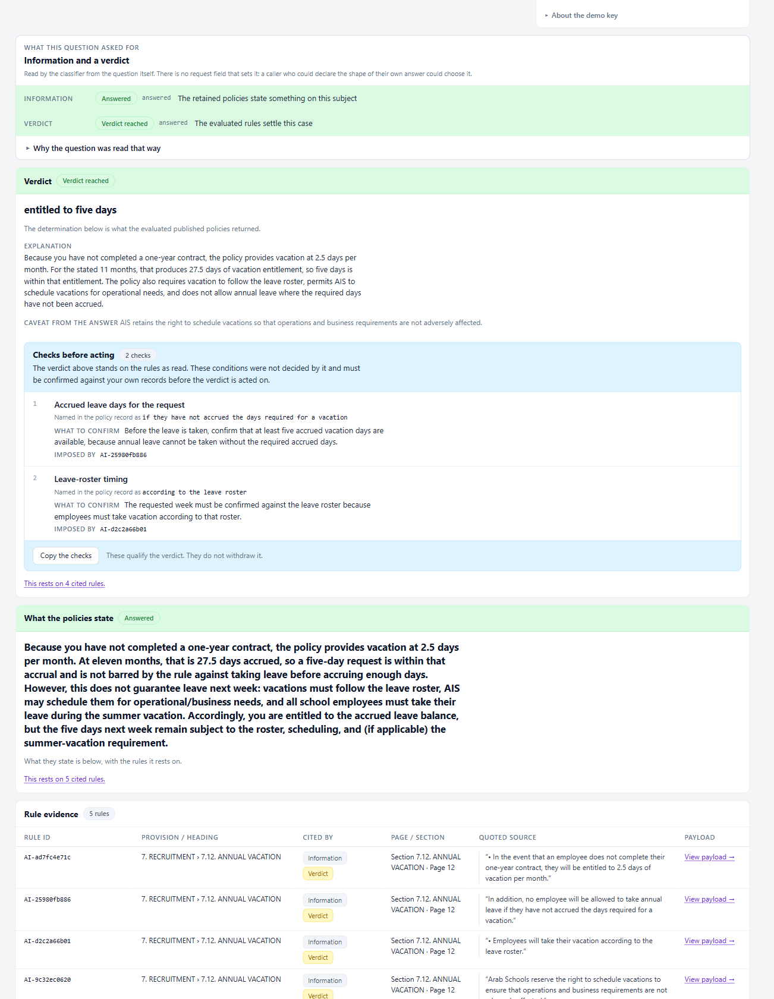
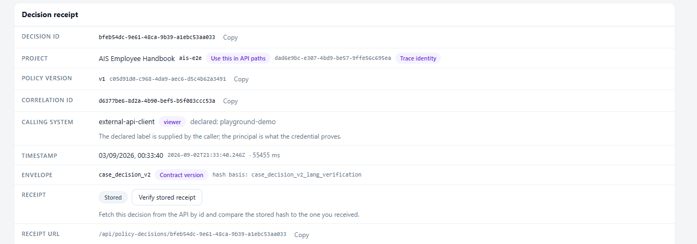

# Integration guide

Calling a governed policy project from another system, and verifying the integration before production use.

| Related | Purpose |
|---|---|
| [API guide](api.md) | Complete field, error and schema reference |
| [External consumption](external-consumption.md) | Integration constraints and their rationale |
| [Measured performance](measured-performance.md) | Latency and token measurements, and method |
| [Known limitations](known-limitations.md) | Current gaps |

---

## 1. Overview

A project holds published policy. The caller submits a situation in natural language. The service retrieves the policies that bear on it, adjudicates, and returns an answer with a verbatim citation for every claim.

Each decision is stored as an immutable, hashed receipt and can be replayed indefinitely.



---

## 2. Endpoints

| Operation | Endpoint | Returns | Receipt |
|---|---|---|---|
| Decision JSON | `POST /api/policy-decisions/{project_key}/case` | Decision, evidence, retrieval disclosure | Stored |
| Decision Light | `POST /api/policy-decisions/{project_key}/case/light` | Decision, identifiers, citations | Stored |
| Policy JSON | `POST /api/policy-decisions/{project_key}/policies` | Selected policy records | None |
| Receipt replay | `GET /api/policy-decisions/{decision_id}` | Stored receipt | — |

### Measured characteristics

Single call each, identical scenario and project:

| Operation | Wall time | Response size | Model calls | Total tokens |
|---|---:|---:|---:|---:|
| Policy JSON | 6.0 s | 104,738 B | 1 | 735 |
| Decision Light | 20.5 s | 7,007 B | 7 | 28,651 |
| Decision JSON | 36.5 s | 36,173 B | 7 | 28,854 |
| Receipt replay | 0.06 s | 36,511 B | 0 | 0 |

Three consequences for integration design:

1. **Decision Light performs the same adjudication as Decision JSON** and stores the same full receipt. The identical call count and near-identical token totals above are that work; only the response body differs, and the replayed receipt carries the same `decision_hash` as the Light response it came from.
2. **Policy JSON returns the largest payload.** It is fastest because it does not adjudicate. It returns the *selected grounding projection*, not the whole record — large policies are rule-sliced, and `match.rule_selection` reports `total_rules`, `selected_rules`, `rules_discarded` and `sliced`. In the measured call one policy returned 15 of its 74 rules.
3. **Receipt replay invokes no model.** Repeated reads of a known decision should use `decision_id`.

Both decision operations return `trace.token_usage` — `calls`, `prompt_tokens`, `completion_tokens`, `reasoning_tokens`, `total_tokens` — so a caller can attribute cost per decision without a separate telemetry channel.

### Selection

| Use | When |
|---|---|
| Decision JSON | The decision and its evidence are presented or audited in the same transaction |
| Decision Light | An automated caller stores `decision_id` and fetches evidence on demand |
| Policy JSON | The calling system performs its own reasoning over approved records |

Policy JSON performs no adjudication. Its output is not a determination.

---

## 3. Request

### Authentication

All operations require an authenticated caller, independent of RBAC configuration.

```http
X-Policy-Subscription-Key: <shared key>
```
```http
Authorization: Bearer <OIDC token>
```

A bearer token yields per-caller attribution in the audit trail. The shared key resolves every caller to a single identity, has no revocation list, and rotation invalidates it for all integrators simultaneously.

### Identifiers

| Identifier | Use |
|---|---|
| Project key | Path segment. Stable slug, e.g. `ais-e2e` |
| Project UUID | Trace identity on receipts. Never a path segment |
| Display name | Presentation only. Not an identifier |

### Headers

| Header | Required | Notes |
|---|---|---|
| `X-Policy-Subscription-Key` or `Authorization` | Yes | See above |
| `Idempotency-Key` | Recommended | Makes retry safe. Reuse the original key when retrying |
| `X-Correlation-Id` | Optional | May also be sent in the body; if both are sent they must match |
| `Content-Type: application/json` | Yes | |

The idempotency key is bound to `policy_set_key`, `scenario`, `provision_id`, `reasoning_effort` and the normalised `additional_instructions`. Reusing a key with any of those changed is a `409`, not a replay. `correlation_id` and `calling_system_identity` are deliberately excluded — retrying under a new correlation id is still the same request, and replays the original receipt.

Without an idempotency key, two identical requests produce two decisions. A request that fails after receipt reservation consumes its key; recovery requires a new one.

### Body

```json
{
  "scenario": "string, required",
  "reasoning_effort": "low | medium | high",
  "additional_instructions": "string, ≤2000 chars, optional",
  "calling_system_identity": "string, ≤200 chars, optional",
  "correlation_id": "string, ≤200 chars, optional",
  "provision_id": "string, optional"
}
```

Policy JSON accepts `scenario` and `correlation_id` only.

`additional_instructions` shapes explanation format. It cannot override published policy, retrieval, decision status or citation requirements.

### Timeouts

| Operation | Recommended |
|---|---|
| `/case`, `/case/light` | 120 s |
| `/policies` | 60 s |
| Receipt replay | 30 s |

Size timeouts from the tail, not the mean.

`reasoning_effort: low` is a **tail** lever. On the measured matrix it cut p95 by 22% and left p50 unchanged, because the median request reasons too few tokens to cut. Reach for it when a timeout or a p95 is the problem, not to speed up a median — see [measured performance](measured-performance.md#reasoning-effort).

---

## 4. Response

### Evaluation order



`outcome` carries two independent tracks. Either may be unanswered while the other succeeds.

```json
{ "outcome": { "information": "answered", "verdict": "answered" } }
```

Both are enumerations, not booleans. Branch on the value; treat any unrecognised value as unanswered.

| Value | Track | Meaning |
|---|---|---|
| `answered` | both | The track produced a result |
| `missing_required_facts` | verdict | The case lacked facts the rules require |
| `not_settled_by_rules` | verdict | Retained rules do not settle the case |
| `no_rule_bears` | both | No retained rule bears on the question |
| `declined` | both | The track declined to answer |
| `failed` | both | The track errored |
| `not_requested` | both | The question did not ask for this track |
| `not_evaluated` | both | The track did not run |

An unreached verdict contains no decision text. Reading `verdict.decision` without first checking `outcome.verdict` treats an undecided case as a decision.

### Verdict

| Field | Meaning |
|---|---|
| `status` | Adjudication result |
| `reached` | Whether a verdict was produced |
| `decision` | The determination. Non-empty only when `reached` is true |
| `explanation` | Reasoning, grounded in cited rules |
| `missing_information` | Facts required but not supplied |
| `verification_requirements` | Assumptions to confirm before acting |

### Citations

```json
{
  "rule_id": "AI-ad7fc4e71c",
  "policy": { "provision_id": "...", "provision_key": "...", "heading_path": ["7. RECRUITMENT", "7.12. ANNUAL VACATION"] },
  "source": { "state": "quoted", "text": "...", "page": 12, "section": "7.12. ANNUAL VACATION" },
  "serves": ["information", "verdict"]
}
```

`serves` is a list: a rule may support one track or both.

`source.text` is the exact published sentence. It must not be translated or paraphrased. Check `source.state` before rendering it — only `quoted` carries the sentence; `no_citation`, `unresolved` and `not_stored` are the three honest ways a quote can be absent, and in those cases `text` is `null`.

### Retrieval disclosure

Present on all three operations.

```json
{
  "retrieval": {
    "status": "narrowed",
    "method": "direct_policy_rrf_elbow_rule_rescue_v1",
    "policies_retained": 2,
    "rule_rescued_policies": 0,
    "reason": null
  },
  "size": { "combined_chars": 31254, "budget_chars": 200000, "oversize": false }
}
```

`size` is a sibling of `retrieval`, and is returned by Decision JSON and Policy JSON but not by Decision Light. Decision JSON carries a wider `retrieval` object than the fields shown here.

A case is evaluated against retrieved policies, not the entire corpus. The disclosure reports what was retained and why the remainder was discarded. Absence of a bearing rule is not evidence that the corpus is silent.

### Receipt identity

| Field | Use |
|---|---|
| `decision_id` | Replay key |
| `decision_hash` | Integrity seal |
| `hash_basis` | Algorithm identifier for recomputation |
| `receipt_url` | Canonical location |

Verify by recomputing `decision_hash` per the declared `hash_basis` (currently `case_decision_v2_lang_verification`). Do not compare response bytes.

A Decision Light response and the receipt replayed from its `decision_id` are **different envelopes** — `case_decision_light_v1` and `case_decision_v2` — carrying the **same `decision_hash`**. That is the point of the seal: it covers the decision-defining content, not the serialisation. It is also the evidence that Light stores the same full receipt.

`decision_hash` proves the stored receipt is unaltered. It is not a determinism guarantee — a language model is in the decision path. For a repeatable answer, replay `decision_id` or reuse an idempotency key.

### Envelopes

| Operation | `schema_version` |
|---|---|
| Decision JSON | `case_decision_v2` |
| Receipt replay | `case_decision_v2`, or `case_decision_v1` for a receipt stored before v2 |
| Decision Light | `case_decision_light_v1` |
| Policy JSON | `policy_retrieval_v1` |

Branch on `schema_version`; do not assume replay returns v2. A receipt is returned in the version it was stored in.

Decision Light omits `caller`, `considered`, `excluded`, `language`, `decided_at`, `receipt_status` and `size`, and adds `response_type` and `policies`. Everything omitted remains retrievable via `decision_id`.

---

## 5. Examples

```bash
curl -sS -X POST \
  "$POLICY_API_BASE/api/policy-decisions/ais-e2e/case/light" \
  -H "Content-Type: application/json" \
  -H "X-Policy-Subscription-Key: $POLICY_SUBSCRIPTION_KEY" \
  -H "Idempotency-Key: $(uuidgen)" \
  -d '{"scenario": "...", "reasoning_effort": "medium", "calling_system_identity": "my-service"}'
```

```python
import os, uuid, requests

response = requests.post(
    f"{os.environ['POLICY_API_BASE']}/api/policy-decisions/ais-e2e/case/light",
    headers={
        "X-Policy-Subscription-Key": os.environ["POLICY_SUBSCRIPTION_KEY"],
        "Idempotency-Key": str(uuid.uuid4()),
    },
    json={
        "scenario": "...",
        "reasoning_effort": "medium",
        "calling_system_identity": "my-service",
    },
    timeout=120,
)
response.raise_for_status()
decision = response.json()

decision_id = decision["decision_id"]      # store this; it replays the full receipt

if decision["outcome"]["verdict"] == "answered":
    result = decision["verdict"]["decision"]
    citations = decision["citations"]
else:
    result = None
    required = decision["verdict"]["missing_information"]
```

---

## 6. Verification client

`apps/consume-demo` is a REST-only demonstration client. It imports nothing from the product and persists nothing.

```bash
cd apps/consume-demo
npm install
npm run dev      # http://localhost:5179
```



Entering a project key resolves the project name and active version from the API, confirming connectivity and credential validity. The credential field is masked by default with an explicit reveal control, and is held in memory for the tab only. Copy and Download emit `$POLICY_SUBSCRIPTION_KEY` rather than the value.

The Request Inspector renders the exact outbound request — body, headers and request line — before transmission.



The result renders in evaluation order: outcome first, then the verdict and its explanation, the conditions the verdict did not itself decide, and the rule evidence with each verbatim source.



The receipt block carries what an integration stores: `decision_id`, the project key and its trace UUID, policy version, correlation id, the declared calling system beside the principal the credential actually proved, and the envelope with its hash basis.

### Integration test matrix

| Case | Expected | Verifies |
|---|---|---|
| Question outside the corpus | `outcome` unanswered | Caller handles undecided results |
| Repeated `Idempotency-Key` | Original receipt replayed | Retry safety |
| Invalid credential | `401` | Auth error path distinct from timeout |
| Receipt replay | `decision_hash` matches | Verification logic |
| Tail-latency request | Completes within timeout | Timeout sizing |

---

## 7. Errors

| Status | Code | Resolution |
|---|---|---|
| `401` | — | Verify header name and credential |
| `409` | `idempotency_key_reused` | Key bound to a different request; issue a new key |
| `409` | `decision_in_progress` | Decision running; poll the receipt |
| `409` | `decision_previously_failed` | Key consumed; issue a new key |
| `503` | — | Upstream AI or Search unavailable; check `GET /api/ai/status` |

---

## 8. Constraints

| Constraint | Reason |
|---|---|
| Do not assume identical output across calls | Model-mediated decision path |
| Do not treat absent rules as corpus silence | Retrieval narrows before adjudication |
| Do not translate cited source text | Citations are evidence |
| Do not embed a shared key in an untrusted client | Single identity, no revocation |
| Do not read `verdict.decision` before `outcome.verdict` | Unreached verdicts carry no text |
| Do not present Policy JSON as a determination | No adjudication performed |
