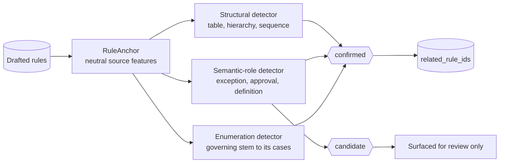

# Relationships and linking

How the platform decides that two rules belong together, and — more importantly
— what it refuses to claim.

## The problem

A document states one policy across many sentences. A severity matrix is one
policy with eight rows; a general rule and its exception are one decision; a
table row belongs to its table. Extraction produces one candidate rule per
statement, so without linking a reviewer sees unrelated rows and has to
reconstruct the policy in their head — and nothing tells them when they are
looking at only part of it.

## What changed, and why

Relationships used to be a **side effect of a successful DMN projection**.
`_group_labels()` linked two canonical rules only when one decision table
already named both. That had a precise failure: the moment a rule was
`ambiguous` or `enrichment_required` it had no relationships at all — exactly
when a reviewer most needs to see what else it touches.

> A relationship is a property of the **source document**, not of whether the
> platform managed to compile the rule. A table row belongs to its table whether
> or not the row is executable.

Two mechanisms were tried and rejected on the way, both recorded here because
the reasoning is the point:

- **Grouping by `group_label` across batches.** Could only ever re-link rules a
  decision table had already linked, so a topic split across a batch boundary
  stayed invisible — despite this being the pass meant to catch it.
- **Grouping by matching subject and predicate.** Measurably effective (26 → 82
  linked rules on a real document) and *wrong*: matching wording is an inference
  about phrasing, not a relation a reader of the source can point at. It wrote a
  machine's guess into `related_rule_ids`, which consumers read as established
  fact.

## The ontology

Closed and domain-neutral. Each member names a relation a reader of the source
could point at — statutes, HR handbooks, IT standards, procurement manuals and
control frameworks alike. It contains no domain-specific link types.

| Type | Meaning |
|---|---|
| `same_decision` | These rules must be evaluated together to answer one question |
| `table_row_of` | Formulated from a row of that table; target is the table's anchor |
| `definition_used_by` | A defined term, pointing at the rules that use it |
| `exception_to` | Carves out a case from that rule |
| `approval_for` | States who must approve the outcome of that rule |
| `overrides` | Takes precedence where both apply, without replacing |
| `supersedes` | Replaces that rule outright |
| `precedes` | Ordered process steps |
| `cross_references` | The text explicitly points at the other provision |

`same_decision` and `cross_references` are symmetric: an edge and its mirror
deduplicate. The rest keep direction, because `A overrides B` and `B overrides
A` are contradictory claims that must both survive to be reported as a conflict.

## Confirmed versus candidate

The distinction is the whole point of having the model.

| State | Meaning | Consequence |
|---|---|---|
| `confirmed` | The document establishes it — rows of one table, a heading hierarchy, numbered steps, a defined term used by name | May enter `related_rule_ids`; consumers act on it |
| `candidate` | Position *suggested* it — "the exception printed nearest above this rule" | Surfaced for review; **excluded** from `related_rule_ids` |

Two paragraphs sitting next to each other is a fact about page layout, not about
policy: a retention rule and an audit rule printed consecutively are not one
decision, and recording that as `same_decision` would put a guess into the
record a reviewer trusts.

Three members of the vocabulary — `cross_references`, `overrides` and
`supersedes` — have no detector. They are relations a reviewer may assert, not
relations extraction claims to find. A detector for explicit cross-references
was written and later removed because extraction never called it; see
[Detectors that were removed](#detectors-that-were-removed).

## How discovery works

Each rule becomes a `RuleAnchor` — element ids, text, section path, fact paths,
actor, action, rule kind, document order. Every field is read from what the rule
already carries, so an anchor asserts nothing the extraction did not record.
Rules that failed to compile are included deliberately: dropping them is how
orphaned table rows appear.

Structural detectors run first and unconditionally. They depend on no model
call and no successful DMN projection, which is what guarantees a
non-executable rule still carries its table, its hierarchy and its
ordering.

Discovery is additive and failure is contained: a broken detector must not lose
a run's rules, which are the expensive part.

### The section-hierarchy boundary

A subsection's rule links to the **lead rule of its parent section**. Two rules
sharing one flat section do **not** link — a retention rule and an audit rule
printed under one heading are not one decision. Only the lead rule of each
immediate ancestor is linked; relating every descendant to every ancestor would
relate a chapter to itself and say nothing.

### One trap worth naming

The anchor builder is the only place platform rule shape is translated into the
detectors' neutral shape, and **a field read from the wrong place there does not
raise.** It yields an empty anchor field, the matching detector silently never
fires, and discovery reports success while contributing nothing.

This happened: `section_path` was read from `rule.scope`, which is the
**targeting** scope — jurisdictions, personas, processes — and carries no
document position. Section lives on **evidence**. It cost a full extraction run
to notice, because nothing failed.

`tests/unit/test_relationship_anchors.py` now asserts that anchors produce a
confirmed edge end to end, not merely that the fields are populated.

## Document scoping

Clustering is scoped per source document. Two documents phrasing something
identically — "This policy applies to" — produce the same label and would merge
into one family. Measured on real data: seven topic keys spanning up to three
documents. That merge asserts a link neither document made. Cross-document
relationships need their own evidence.

## What the reviewer sees

- A **coloured spine** down the left of rows in one family, with rounded caps
  where a run starts and ends, and fading caps where the family continues beyond
  the visible run.
- A **composite header** above the band: the family as the one policy it states.
  Derived **by agreement** — a field appears only when every member states it
  identically; where members differ, the variation is reported instead. Nothing
  is summarised, because a summary of a policy is a new claim about it.
- An **Effective policy** view (families of more than one rule): read-only, one
  row per case with its when / then / review status. Not a rule — nothing is
  stored, published or evaluated.
- **Why nothing banded**, when nothing did. A flat unbanded list cannot
  otherwise distinguish "grouping is off", "grouping is broken" and "no
  relationship was derived", and the three call for different responses.

### Shared conditions are hoisted, not paired

When the source is a table, the formulator often projects the whole condition
column onto every row, so all members carry all conditions. Repeating them per
case reads as "each case requires all of these" — the opposite of a table — so
they are stated once for the policy.

They are deliberately **not** paired to cases by position. The i-th condition
does look like the i-th case, but that alignment is an artefact of emission
order, and binding them on that basis would state a mapping the source never
gave. The view says so and routes it to a reviewer.

## Detectors that were removed

Three detectors existed in `relationship_discovery.py` and were deleted once it
was established that extraction never called them:

| Detector | Produced | Why it went |
|---|---|---|
| Reference | `cross_references`, from "see section 11" | Written and tested, never wired into extraction |
| Lexical | `same_decision` candidates, from shared vocabulary | Same; and wording overlap is not a relationship |
| Embedding | `same_decision` candidates, from vector similarity | Nothing ever constructed a provider, so it had never run |

They were not removed because the idea is wrong. They were removed because
code that no run reaches cannot be trusted to work, and leaving it in place
made this document — and the extraction module's own comments — claim edges
that no policy record has ever carried.

Restoring any of them is a deliberate decision, not a wiring fix: it changes
the edges attached to rules a reviewer has already approved.

## Where this lives

| Concern | Module |
|---|---|
| Ontology, edge, graph | `contracts/relationships.py` |
| Detectors | `infrastructure/relationship_discovery.py` |
| Anchor construction, merge into `related_rule_ids` | `infrastructure/ai_extraction.py` |
| DMN-derived variation labels | `infrastructure/formulation_mapping.py::_group_labels` |
| Band geometry | `apps/web/src/bandGeometry.ts` |
| Clustering, document scoping | `apps/web/src/ruleDisplay.ts` |
| Composite and effective policy | `apps/web/src/familyComposite.ts` |
