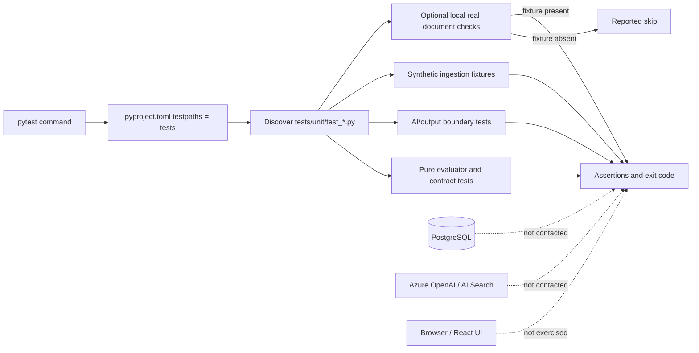

# Testing

This guide describes the **test process that is currently active**, what it
proves, how to invoke it, and what is intentionally outside it. It is organized
by capability rather than by source file.

## What the project currently uses

The automated test process is Python `pytest` only. Configuration in
[`pyproject.toml`](../pyproject.toml) sets:

```toml
[tool.pytest.ini_options]
asyncio_mode = "auto"
testpaths = ["tests"]
```

That means pytest discovers current `test_*.py` modules below `tests/`; there is
no separate suite manifest and no hand-maintained allowlist. The maintained
portable suite is under `tests/unit/`.

The following are **not** test runners:

- `npm run build` type-checks and bundles the frontend.
- `npm run lint` runs oxlint.
- files under `scripts/` are maintenance/backfill utilities and are never part
  of pytest.
- Alembic migration files initialize or change database schema; they are not
  tests.

## Active test capability groups

| Capability group | What the active tests prove | Expected boundary |
|---|---|---|
| Deterministic policy evaluation | Condition operators, missing-fact handling, target matching, rule precedence, combining behavior, aggregate limits, obligations/advice and stable result hashing | Pure functions; no database, network or AI call |
| Canonical policy contracts | Canonical serialization is stable and canonical-rule fields are not silently dropped by persistence mapping | ORM/model definitions may be inspected, but no PostgreSQL connection is opened |
| Document ingestion and evidence | Line joining, heading/list classification, column detection, table preservation, cross-page continuation, boilerplate suppression, source offsets and verbatim passage checks | Synthetic fixtures are portable; optional real-document checks depend on local source files |
| AI output acceptance boundaries | Model JSON parsing, formulation mapping, refusal to guess, scenario result selection, proposed-test validation and change explanation fields | Model calls are stubbed or excluded; tests validate application-owned deterministic seams |
| Quality and correlation | Deterministic quality findings, truthful AI-review status reporting, correlation batching, deduplication, budgets and partial-run durability | AI judgment and repository access are replaced with controlled test doubles where needed |
| Policy test lifecycle | Expectation commitments, stable hashes, deterministic test execution and pass/fail comparison | Does not exercise HTTP routes, publish transactions or PostgreSQL writes |
| Governance and audit helpers | Audit ownership/transaction rules, attestation role gate and status boundaries | Router/service helpers only; not authentication or browser behavior |
| Search indexing contract | The document-version/clause key generated by the application matches the index key contract | Does not contact Azure AI Search or validate live retrieval quality |

These groups map to the implemented flows in
[Capability flows](capability-flows.md). Tests protect deterministic decisions
and validation boundaries; they do not prove that Azure dependencies or the
complete deployed system are healthy.

## Prerequisites

Python 3.11+ and the repository installed with development dependencies:

```powershell
python -m venv .venv
.\.venv\Scripts\python.exe -m pip install --upgrade pip
.\.venv\Scripts\python.exe -m pip install -e ".[dev]"
```

PostgreSQL, Docker, Azure credentials, Azure OpenAI and Azure AI Search are not
required for the active unit-test process.

## Invoke the active suite

Run the configured suite:

```powershell
.\.venv\Scripts\python.exe -m pytest
```

Run the unit-test directory explicitly:

```powershell
.\.venv\Scripts\python.exe -m pytest tests\unit -q
```

Run one capability using a keyword rather than maintaining another suite list:

```powershell
# Deterministic evaluator behavior
.\.venv\Scripts\python.exe -m pytest tests\unit -k "engine or condition or precedence or target or aggregate"

# Ingestion and evidence boundaries
.\.venv\Scripts\python.exe -m pytest tests\unit -k "document or passage"

# Quality and correlation boundaries
.\.venv\Scripts\python.exe -m pytest tests\unit -k "quality or correlation"

# Saved policy tests
.\.venv\Scripts\python.exe -m pytest tests\unit -k "policy_test"
```

Useful pytest controls:

```powershell
.\.venv\Scripts\python.exe -m pytest -v          # show each selected test
.\.venv\Scripts\python.exe -m pytest -x          # stop on first failure
.\.venv\Scripts\python.exe -m pytest --lf        # rerun failures from the previous local run
.\.venv\Scripts\python.exe -m pytest -rs         # explain skipped checks
.\.venv\Scripts\python.exe -m pytest --collect-only -q  # show selection without executing tests
```

### What to expect

A successful run exits with code `0` and reports no failures or errors. The
exact test count is intentionally not fixed in this document because discovery
changes as capabilities evolve.

Some real-document checks in the ingestion area are conditional. They are
collected but skip when their private local PDF/DOCX fixtures are absent. The
portable baseline remains the synthetic ingestion tests committed to the
repository. Use `-rs` to see the skip reason.

## Test architecture



## Checking that the tests can fail

A passing suite proves nothing on its own — it may be passing because the tests
cannot detect the defect they name. `scripts/mutation_check.py` answers that
directly: it breaks a guarantee on purpose and requires a test to notice.

```powershell
.\.venv-graph\Scripts\python.exe scripts\mutation_check.py tests\mutations\core_guarantees.json
```

Each spec is a JSON list of mutations naming a file, an exact snippet to replace,
its replacement, and the test that must then fail.

| Spec | Guards |
|---|---|
| `core_guarantees.json` | Negation handling, effect derivation, span fidelity |
| `derived_view_consistency.json` | No derived view may contradict its own record |
| `ai_tool_wording.json` | `ai_ready` is described as a route, never a fault |
| `extraction_quality.json` | Duplicate, contradictory and unstable extraction checks |
| `latest_reading.json` | Which reading is current, and which it replaced |
| `vacuity_repairs.json` | Four tests found unable to fail, and the defects they now catch |

32 mutations across six specs. `tests/unit/test_mutation_specs_resolve.py` runs
inside the ordinary suite and fails if a spec names a file that moved, a snippet
that no longer appears, a snippet that appears twice, or a test — including a
`path::name` selector — that does not exist. The total is pinned there too, so
adding or retiring a mutation is a visible decision rather than a drift.

Seven exit codes, deliberately distinct:

| Code | Meaning |
|---|---|
| 0 | Every mutation was caught |
| 1 | A mutation survived — that guarantee is not actually tested |
| 2 | A target snippet was not found — the spec is stale and checked nothing |
| 3 | Another run holds the lock, so this one refused to start |
| 4 | A restore did not reproduce the original file |
| 5 | A file could not be written, so a mutation was never applied |
| 6 | pytest did not run the named tests, so nothing was measured |

Codes 2 to 6 all mean **nothing was measured**, and each is separate from 1 for
one reason: a run that could not check must never read as a run that checked and
found nothing wrong. Every one of them was added after the failure it describes
actually happened here.

- **3, 4, 5** exist because the harness edits source in place. Two runs over one
  checkout can interleave so that the second reads its "original" while the
  first has a mutation applied, then restores *that* — writing a deliberate
  defect into source permanently, behind a green result. Observed: two agents
  ran specs against one worktree and `git status` showed different files
  modified across consecutive calls. A run now takes an exclusive lock and
  verifies the restored file hashes to what it read.
- **5** specifically: on Windows `os.replace` fails while any handle is open — a
  scanner or a just-exited pytest holds one for milliseconds. It retries, then
  reports. Twice this surfaced as "exit 1, N of M caught" and read as a coverage
  finding when the harness had simply crashed.
- **6** exists because pytest exits 4 for an unresolvable path and 5 when a
  selector matches no test. Treating any non-zero status as "the suite noticed"
  meant a mistyped test name reported every mutation in its spec as caught,
  having run nothing at all.

Mutation testing has found four classes of worthless test here: tests iterating
over a corpus that contained none of the relevant records; tests reading derived
fields from a captured file rather than running the derivation; tests whose
witness record happened to exist in one corpus and not the next; and tests whose
only assertions sat inside a loop that never ran. A guard that depends on the
corpus containing the right accident is not a guard.

## Proving the tests can fail at all

The suite is also audited for tests that *cannot* fail, which a passing run by
definition cannot reveal. Two passes:

1. **Static.** Find tests with no assertion, loops whose body holds the only
   assertions over a collection that may be empty, and `assert all(...)` over an
   unproved sequence — vacuously true when empty. Literal collections are
   excluded, being non-empty by inspection.
2. **Empirical.** Run the suite under `coverage`, then check whether those
   assert lines ever executed. Static analysis says a loop *could* be empty;
   coverage says which ones *were*.

The second pass is the one that decides. Of 47 static candidates, 44 were
harmless and **3 were proven vacuous** — their assertions never executed in a
suite that passed. Two more tests had no assertion at all. All are repaired, and
`vacuity_repairs.json` breaks the code each now guards so the repairs cannot
regress into decoration.

Current result: **0 loop assertions never execute** across the whole suite. The
12 skips are the optional real-document checks, which state their reason
(`sample PDF not present`) rather than passing silently.

## Fixtures, isolation and mocking

Reusable policy/rule builders live in
[`tests/fixtures/factories.py`](../tests/fixtures/factories.py). There is no
repository-wide `conftest.py`; modules import shared factories explicitly.

The deterministic engine and mapping tests use ordinary in-memory objects.
AI-adjacent orchestration tests replace model clients and repositories only at
the external boundary, then assert application-owned parsing, validation,
batching and persistence decisions. This keeps results deterministic and
prevents tests from consuming Azure quota.

Temporary filesystem behavior uses pytest's `tmp_path`; committed tests should
not write into `data/documents` or mutate repository samples.

## Frontend checks

The frontend currently has no automated unit, component, browser or end-to-end
test runner. The available checks are:

```powershell
Set-Location apps\web
npm run build
npm run lint
```

`build` and `lint` are valuable validation steps, but they must not be reported
as frontend tests.

## Maintenance scripts are outside testing

The Python files under `scripts/` repair, backfill, re-extract, clean or
generate data. They can mutate PostgreSQL rows or files and are intentionally
excluded from pytest. Do not invoke them as a test command.

Use a maintenance script only for its named operational purpose, after reading
its arguments and transaction behavior. The main groups are:

| Group | Examples | Expected effect |
|---|---|---|
| Re-extraction | `reextract_document.py` | Reprocesses a selected stored document and may change clauses/search records |
| Sample generation | `generate_hardware_policy_samples.py` | Writes sample JSON/files rather than asserting behavior |
| Corpus capture | `capture_corpus.py`, `freeze_status_inventory.py` | Regenerates the test corpus and its frozen status inventory from a running API |
| Shadow reporting | `docling_corpus_report.py`, `docling_shadow_report.py` | Reads a corpus and writes a report; changes no records |
| Mutation checking | `mutation_check.py` | Edits a source file, runs a test, restores it. Exits 2 if a target is missing |

The one-off backfill and repair scripts were deleted: each existed to migrate
rows written before a specific migration, and the database has since been
dropped and rebuilt. A script that repairs a state which can no longer occur is
worse than absent — it invites someone to run it.

A fresh Azure deployment does not run any of these scripts. It initializes an
empty schema with Alembic and starts with no policy data.

## Current coverage gaps

The active test process does not include:

- FastAPI route/integration tests
- PostgreSQL repository or transaction tests
- Alembic upgrade/downgrade tests
- React unit/component tests
- browser or end-to-end tests
- live Azure OpenAI or Azure AI Search tests
- deployment/Bicep tests
- performance, load, resilience or security tests

These are gaps, not hidden suites. Azure deployment assets have their own
non-provisioning validation steps documented in
[Azure deployment](azure-deployment.md).

## Adding a current test

1. Put deterministic behavior in a `test_*.py` module below `tests/`.
2. Prefer the closest existing capability module instead of creating a new
   file for every function.
3. Use factories from `tests/fixtures/factories.py` where they express the
   domain clearly.
4. Replace only external I/O boundaries; do not mock the behavior under test.
5. Assert failure and indeterminate paths, not only the happy path.
6. Keep network, Azure and database access out of the portable unit suite.
7. Update the capability-group table only when the suite gains a genuinely new
   responsibility.
