# User guide

This guide is for the person who owns a policy and has to stand behind it — a compliance owner, a policy author, a risk or audit reader — and for the engineer wiring a system to the decisions that come out.

It follows one document all the way through: upload, extraction, review, publication, and then the four things you do with a published register that make the work worth doing — **put a real case to it**, **prove its behaviour**, **compare it against the next edition**, and **serve it to other systems**.

Everything shown here is the running product. Where a capability has a limit, the limit is stated next to it.

**Related pages:** [Workflows](workflows.md) for the short operational sequence · [From document to policy](from-document-to-policy.md) for what happens inside extraction · [API](api.md) for the integration surface · [Known limitations](known-limitations.md) for what this build does not do.

---

## The shape of the work

| Stage | You do | The platform does | Result |
|---|---|---|---|
| **Load** | Upload a PDF or DOCX | Preserves the source, segments it into clauses, reports what it could not read | A controlled document version |
| **Extract** | Start a run | Finds policy passages, verifies each one word-for-word, drafts candidate rules | Candidates, each carrying its source sentence |
| **Review** | Approve, reject, or ask for a rewrite | Shows the source beside the drafted logic, flags what it doubts | Decided candidates |
| **Assure** | Run a quality evaluation | Inspects source and logic faithfulness, grades findings | Evidence for a publication decision |
| **Publish** | Approve a version | Freezes it, numbers it, records who approved it | An immutable published version |
| **Use** | Ask, test, evaluate, compare | Answers with the rule, the version and the sentence | Decisions you can defend |

Two rules hold across all of it:

- **Nothing decides anything until a person approves it.** Extraction produces candidates, never live policy.
- **A published version never changes.** Corrections become a new version; the old one stays readable.

---

## 1. Sign in

Sign in with a local account or an identity provider, depending on how the instance is configured. Your role decides which surfaces you see.

| Role | Can |
|---|---|
| **Viewer** | Evaluate cases and read the register. Cannot upload, author or approve. |
| **Policy author** | Everything a viewer can, plus upload, review, approve and publish. |
| **Admin** | Everything, plus project lifecycle including deletion. |

The header shows who you are and which role is in effect. If an action is missing, the role is usually why.

> **Before you rely on this build:** authorization ships present but **off by default** (`RBAC_ENABLED`). Until an operator enables it and configures sign-in, roles are workflow attribution rather than a security boundary. See [Known limitations](known-limitations.md).

---

## 2. The dashboard

The dashboard answers one question — *what needs a person?*

- **Review queue** — how many policies and rules are waiting for a decision, across every project.
- **High findings** — the count from the latest quality checks, scoped so you can tell a published finding from a candidate one.
- **Decision routes** — how the live rules split between Deterministic and AI Ready. Not a score; see [§8](#8-two-routes-one-register).
- **Regression guards** — how many saved scenarios protect the published versions.

Below, the **portfolio register** lists each project with what it actually holds: policies, rules, what is in review, the route split, and the published version. Counts always name their unit — *policies* and *rules* are different things, and a policy contains rules.

---

## 3. Open a project

A project is one policy set — a handbook, a procurement policy, a leave scheme. Opening one gives you its governance status and the tabs you will work through: **Documents**, **Review**, **Policies**, **Compare**, **Quality**, **Validation** and **Decision Log**.

The header carries the project key, its owner, and the actions that apply to the whole set: **Edit**, **Record periodic review**, and **Test a Case**.

Each tab badge is a real count — documents held, rules awaiting a decision, published policies, versions available to compare. If a tab has no badge, it has nothing waiting for you.

---

## 4. Load a document

Go to **Documents**.

Upload a PDF or DOCX. The platform stores the source first, converts it to canonical text, and segments it into numbered clauses that keep their page, section and character offsets.

**Read the ingestion diagnostics before extracting.** They are how the load stage tells you it fell short:

| Diagnostic | Means |
|---|---|
| `low_coverage` | Much of the source text did not reach a logical element — content may be trapped in an unparsed region. |
| `fragment_offsets_unresolvable` | Some clause text cannot be located back in the page it came from. |
| `element_text_not_rebuilt_from_fragments` | An element's stored text is not its recorded fragments joined as declared. |
| `rtl_script_detected` | Right-to-left content was found; reading order was recovered where possible. |

A scanned PDF with no text layer will produce very few clauses. That is visible here, before you spend an extraction run on it.

Uploading a document with the **same title into the same project** creates a **new version** of that document rather than a second document — which is what makes version comparison possible later.

---

## 5. Extract candidate rules

Start extraction from the project. The run reads the clauses, finds the passages that state policy, verifies each passage back against the source, and drafts candidate rules from them.

Extraction is server-side and takes minutes on a real handbook. When it finishes you get candidates, each carrying:

- the **source passage**, word-for-word;
- **where it came from** — document version, page, section, clause;
- a drafted **subject, condition and outcome**;
- a **route** (see [§8](#8-two-routes-one-register));
- any **findings** the platform already doubts.

**Coverage is reported, not implied.** A run that finished and a run that read everything are different things, and the record says which. See [Extraction run coverage](extraction-run-coverage.md).

Re-running extraction on the same document supersedes *unreviewed* drafts only. **Approvals and rejections you have already made are never overwritten.**

---

## 6. Review against the source

This is where the work happens, and the queue is built so you can decide without leaving it.

**Narrow first.** Filter by document, by extraction run, by route, by finding severity, or search titles, actions, rule ids and tags. The banded family view groups rules that came from the same provision, so you can decide a topic as a unit rather than meeting the same clause six times as six unrelated cards.

**Then inspect.** Selecting a candidate opens it beside the queue with tabs:

| Tab | Shows |
|---|---|
| **Overview** | What the document says, and what was drafted from it, side by side |
| **Reading** | The passage in its surrounding context |
| **Logic** | The rule as *applies* and *outcome* attributes — subject, condition, effect |
| **Parties & routes** | Who it binds, who decides, and which route it takes |
| **Scope** | What it applies to, and what it excludes |
| **Tests** | Scenarios attached to this rule |
| **History** | Every prior sighting of this provision across runs |
| **Notes** | Reviewer commentary |
| **JSON** | The canonical record exactly as the evaluator reads it |

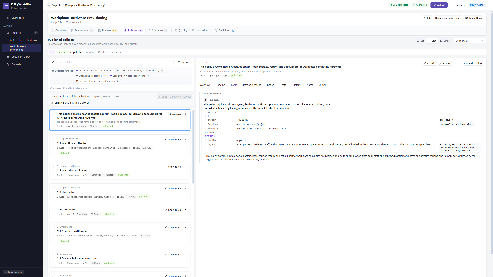

**Decide.** Approve, reject, or request a rewrite. The assistant can propose a rewording; it never changes a record on its own, and the proposal is shown against the source for you to accept or discard.

**Decided together.** Where several rules come from one provision, the inspector says so — approving one alone can leave a topic half-decided.

---

## 7. Run a quality evaluation before publishing

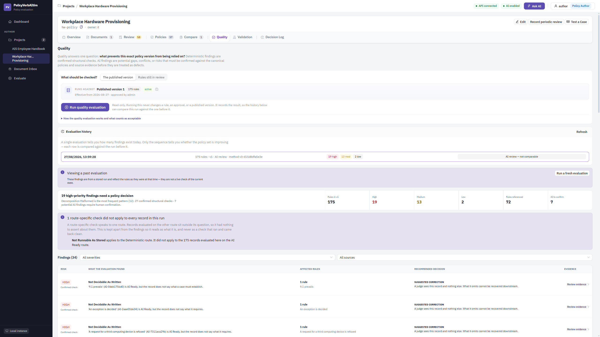

Quality answers one question: **what prevents this exact policy version from being relied on?**

**Choose the scope.** The published version, or the rules still in review. The two are different questions and the screen keeps them apart — a finding about published v1 says nothing about a candidate you have not decided yet.

**The evaluation is read-only.** Running it never changes a rule, an approval or a published version. It records the result, so the history below can compare this run against the one before it.

**Findings are graded and explained.** Each row gives the risk level, what the evaluation found, the affected rules, a recommended decision, and a link to the evidence. Two families run:

- **Source faithfulness** — does the rule still say what the document said? Negation preserved, quantities preserved, conditions represented, source conditions reached the record, the action is not a sentence fragment, the passage is the document's own words.
- **Logic faithfulness** — does the compiled logic hold up? Attributes and parties quoted from source, authority is a real delegation, discretion names who exercises it, malformed decomposition reported, polarity survives projection.

**Checks that did not apply are held apart from findings.** A route-specific check has nothing to say about records on the other route, and the screen reports that as what it is rather than as a check that ran and came back clean.

> Findings are evidence for a reviewer, not a gate. The platform does not approve, reject or publish anything on their basis.

---

## 8. Two routes, one register

Every rule is classed by **how its source is written**, not by how good the extraction was.

| Route | The source states | Decided by |
|---|---|---|
| **Deterministic** | A test you can compute — *"…a nominal value of less than 50.00 SAR."* | A FEEL evaluator running a compiled condition. Same input, same answer, every time. |
| **AI Ready** | A judgement in words — *"…dress in professional business attire."* | A judge reading the rule against the case, answering with the sentence it relied on. |

Neither is a grade, and neither is a fallback. Most real policy prose takes the AI Ready route because that is how humans write policy. Forcing a judgement into a computed threshold would invent a number the document never set.

---

## 9. Publish an immutable version

Publishing takes the approved rules and freezes them into a numbered version with an effective date and a named approver.

From that moment the version cannot be edited. A correction is a **new version**; the previous one stays readable, and anything that cited it still resolves.

Publishing also rebuilds the search index for the version and re-runs any active regression guards ([§12](#12-prove-behaviour-with-blind-tests)).

---

## 10. The published register

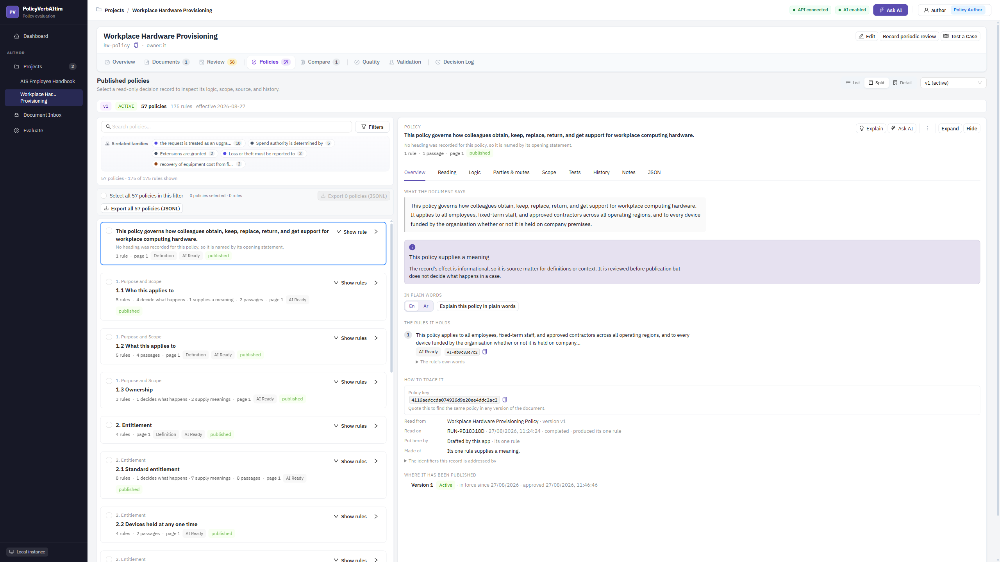

The **Policies** tab is the published register — read-only decision records, arranged under the provisions that stated them.

- The version strip names the version, its state, and how many policies and rules it holds.
- Search and filters narrow the register; related families group provisions that belong together.
- Selecting a policy opens the same inspector tabs as review, now against published content.
- **Export** the filtered set or the whole register as JSONL.

---

## 11. Put a real case to it

This is the shortest route to understanding what the platform is for. Use **Test a Case** from the project header.

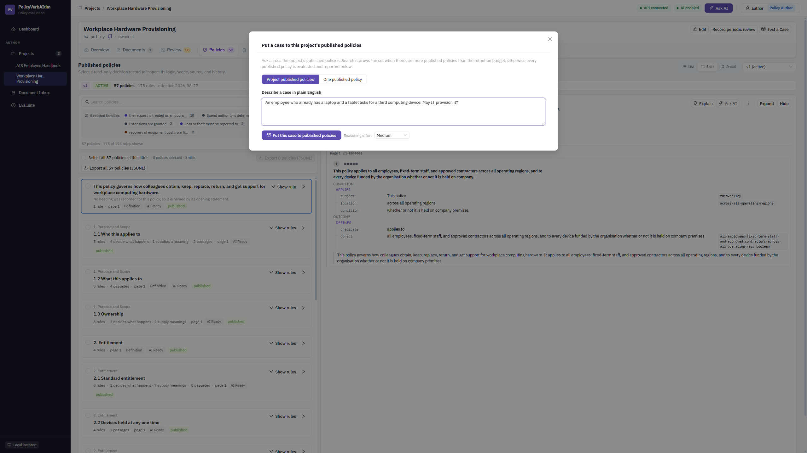

Describe a situation in plain English and put it either to one published policy or to the whole project. Choose a reasoning effort if the case is subtle.

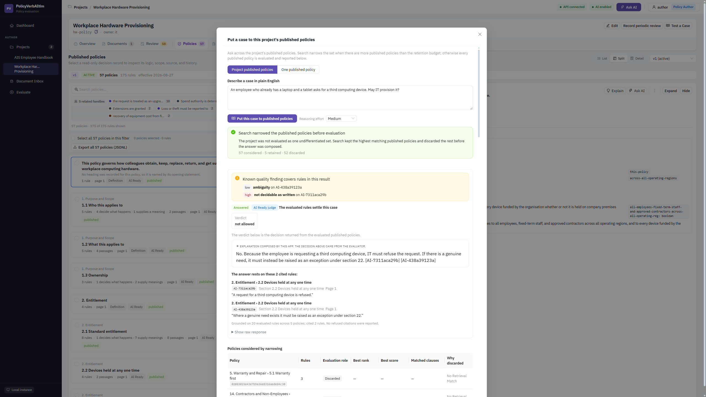

The result is the point. Read it top to bottom:

1. **Narrowing** — how many published policies were considered, how many were retained, how many were discarded, and *why* each one was discarded. The project is not evaluated as one undifferentiated blob, and the screen shows you the shortlist.
2. **Known quality findings** — if any rule in the answer is covered by an open finding, it is named here with its severity. A reviewer sees *"a known finding covers these rules"* rather than an unexplained answer.
3. **Which route answered** — the AI Ready judge or the FEEL evaluator. You always know what decided.
4. **The verdict** — the decision returned by the evaluated published policies.
5. **The explanation** — composed by the app, clearly labelled as such, citing rule ids.
6. **The rules it rests on** — each cited rule with its id, section, page, and the **exact sentence** from the document.

That last item is the whole proposition. The answer is not a summary of the handbook; it is a decision with the sentences that produced it, which a person can check against the source.

**Test a Case is a reviewer's surface.** It answers you on screen and records nothing: there is no decision id, and nothing correlates what you just read to a stored record. That is unchanged and deliberate. When another system needs an answer it can cite, replay or audit later, use the audited external channel instead — see [§14](#14-serve-decisions-to-other-systems), which writes a receipt for every call.

---

## 12. Prove behaviour with blind tests

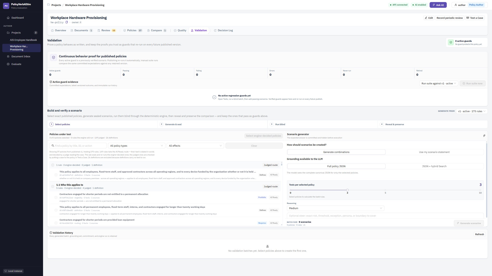

**Validation** proves a policy behaves as written, and keeps the proofs you trust as guards that re-run on every future published version.

The four-step method exists to stop a test being written to match whatever the engine already does:

1. **Select policies** — choose exactly which published policies are under test.
2. **Generate & seal** — scenarios are generated and the expected answer is **committed and hidden before execution**.
3. **Run blind** — the sealed scenarios go through the deterministic engine, which cannot see the expectation.
4. **Reveal & preserve** — the comparison is revealed, and the scenarios that pass can be kept as **regression guards**.

Guards then re-run automatically on every publish. The panel at the top shows how many are active, passing, failing, erroring, never run, or retired — and states plainly when **no guard protects the policy set yet**.

You can generate combinations across the selected policies, or supply your own scenario statement. Grounding is either the full policy JSON or JSON plus hybrid search, and the screen says which the model saw. Every generated batch, grounding set, commitment and engine run is retained in the validation history.

> Definitions carry no test to run, and are excluded from the batch rather than counted as passing.

---

## 13. Compare against the next edition

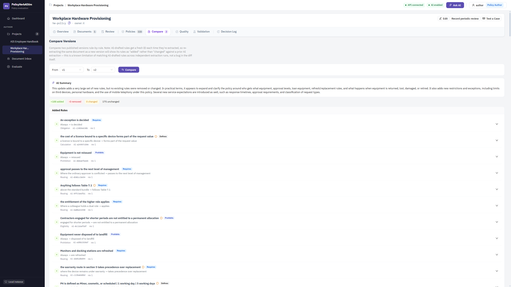

When the policy is revised, upload the new edition **under the same title** and extract it. It becomes the next document version, and its candidates are compared against the current baseline.

The **Compare** tab diffs two published versions rule by rule, with an AI-written summary of what the update does in practice, then the added, removed, changed and unchanged rules.

**One distinction worth understanding.** Re-reading a document does not reproduce byte-identical records — the same sentence can be read slightly differently on a later run. So a naive diff reports every re-reading as a change, and the handful of real revisions hide among them. The candidate delta separates:

- **changed in source** — the document's own words moved. This is what a reviewer must read.
- **re-extracted** — the same sentence, read differently. Reported separately so it cannot bury the above.

> The published-version compare shown above has a related limitation, stated on the screen itself: AI-drafted rules receive a fresh id on each extraction, so re-extracting a document and publishing it will show its rules as *added* rather than *changed* against a prior AI extraction. That is a property of matching drafted rules across independent runs, not a fault in the diff.

---

## 14. Serve decisions to other systems

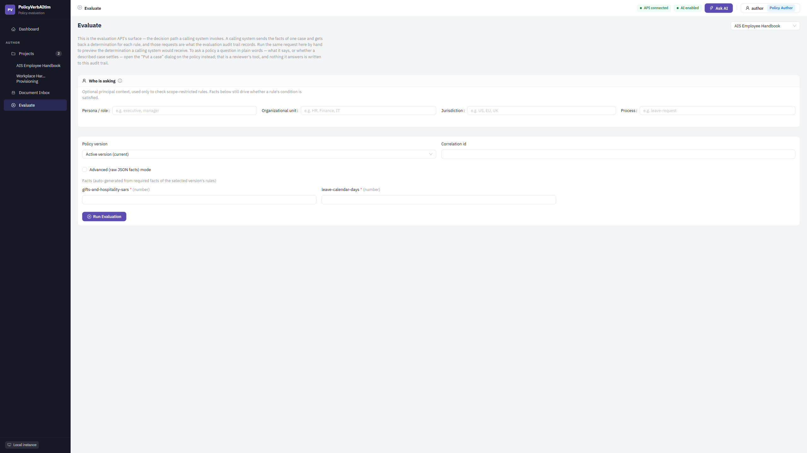

**Evaluate** is the evaluation API's own surface — the decision path a calling system invokes, run by hand so you can preview exactly what that system would receive.

Supply the facts of a case. The required facts are generated from the selected version's rules, so you can see what the register actually needs to decide. Optionally supply principal context — persona, organisational unit, jurisdiction — which is used only to check scope-restricted rules; the facts still drive whether a condition is satisfied.

Choose the active version or pin a specific one. Pinning gives a reproducible answer; following the active version means the caller inherits revisions when you publish them.

The response carries the determination for each rule, and those requests are what the evaluation audit trail records.

For the endpoint groups, request shapes and common sequences, see the [API guide](api.md).

### Integrate over REST

This is the shortest path from nothing to a working integration. It is a walkthrough, not the reference — every field, every error code and every response shape lives in the [API guide](api.md), and the rules an integrator must not get wrong live in [External consumption](external-consumption.md).

**1. Decide which of the four operations you need.** They are not variations of one call; they answer different questions.

| You want | Call | What you get |
|---|---|---|
| A decision you can defend later | `POST /api/policy-decisions/{project_key}/case` | The full audited receipt, stored and replayable |
| The same decision, smaller on the wire | `POST /api/policy-decisions/{project_key}/case/light` | A compact projection of that *same* stored receipt |
| Only the policies that bear on a situation | `POST /api/policy-decisions/{project_key}/policies` | Selected policy records — no verdict, no receipt |
| A receipt you already have | `GET /api/policy-decisions/{decision_id}` | The stored receipt, replayed |

Two of these are routinely misread. **Decision Light is not a faster decision** — it runs the identical adjudication and stores the identical receipt, and only the response is smaller. **Policy JSON is not a decision at all** — it never judges, and presenting its output as a determination is the one misuse the shape is designed to make obvious.

**2. Authenticate.** All four require a proved caller even when RBAC is off. Either a bearer token from your OIDC issuer in `Authorization`, or the operator's shared key in `X-Policy-Subscription-Key`. Use a bearer token when you need per-caller attribution in the audit trail; the shared key is one identity for everyone who holds it — see the entry in [Known limitations](known-limitations.md).

**3. Send the project key, never the display name.** Paths take the key. The UUID is trace identity and is not a path segment. The name changes whenever somebody renames the project.

**4. Send an `Idempotency-Key` on every decision.** It is what makes a retry safe. Without it, two identical questions are two decisions, and the endpoint will not pretend otherwise. Keep the original key when you retry — a new key is a new decision, not a retry. A call that fails *after* the receipt was reserved spends its key, so recovery from that state needs a fresh one.

**5. Set the timeout from the tail, not the average.** A case is a multi-call model operation running for tens of seconds. 120 s is a reasonable default; a receipt read-back needs 30 s because it calls no model at all.

**6. Read the response in the right order.** Read `outcome` first — it says, in two values, whether each track produced anything. Only then read `information` and `verdict`. A verdict that was not reached carries no decision text, deliberately, so there is nothing to mistake for one. Then check `citations`: every one names the rule and the exact source sentence it rests on.

**7. Verify the receipt if you are going to rely on it.** Recompute `decision_hash` according to the `hash_basis` the receipt names and compare that — do not compare response bytes. A replay is content-equivalent, not byte-identical, and JSON key order may differ.

**What not to build.** Do not expect two independent calls to produce identical text or an identical hash — this is a model-mediated decision, and `decision_hash` is an integrity seal, not a determinism guarantee. Do not treat "no rule bears on this" as proof the corpus is silent. Do not translate a quoted source sentence. Do not put a shared subscription key in a browser.

**If it is too slow**, the lever is `reasoning_effort`, not a shorter question — see [what `low` measured](api.md#what-low-measured-on-one-corpus). Shortening the scenario reduces tokens and cost without reliably reducing wall-clock time.

### Call from your app

**Call from your app** sits on the project header, immediately after **Test a Case**. It answers one question — *how does my service ask this project a question?* — and it answers it without anyone copying a UUID out of a URL bar by hand.

It opens a panel with five sections:

| Section | What it gives you |
|---|---|
| **Project identity** | The **project key**, marked *use this in API paths*; the **active version** number and id, marked *resolved for you when you omit it*; the **project id (UUID)**, marked *trace identity — not a URL segment*; the **display name**, marked *display only*; and the API base. |
| **cURL** | A runnable request against `POST /api/policy-decisions/{key}/case`. |
| **Python** | The same call with `requests`, including the status-before-verdict branch. |
| **Raw HTTP** | The request line, headers and body as they go on the wire, plus the `GET` that reads the receipt back. |
| **API docs** | Links to Swagger UI, ReDoc and the OpenAPI document served by the API at the base you set. |

The panel's snippets cover the **full decision** and its receipt read-back, because that is the operation a product reviewer is most likely to hand to an integrator. The other two response modes — Decision Light and Policy JSON — are demonstrated end to end in [the external playground](#the-external-playground), and specified in [External consumption](external-consumption.md).

Two things about identity are worth stating plainly, because getting them wrong is the most common integration mistake:

- **The key is the identifier.** Paths use it. It is stable, it is a slug, and it is what you send to an integrator.
- **The display name is never an identifier.** It changes whenever someone renames the project, and it has no copy control in this panel on purpose. The UUID is trace identity — it comes back on every receipt so a decision can be traced to this project in a support or audit conversation, and it is never a path segment.

**No snippet in this product panel contains a credential.** Every example reads the subscription key from the environment variable `POLICY_SUBSCRIPTION_KEY` and sends it in `X-Policy-Subscription-Key`. Your signed-in session token is not read, not rendered and not copied, and the panel has no access to whatever key an operator configured on the server — there is nothing here to reveal. Editing the API base only re-renders the snippets; it changes nothing about your session.

Changing the base URL is how you point the snippets at a real deployment. In Azure, the base an external caller uses is the **web** application's public address, whose gateway proxies `/api` through to the API — see [configuration](configuration.md#reaching-the-api-from-outside).

### The external playground

A separate demonstration client — not part of the product's signed-in surface — shows what an outside system sees. Anyone with an API base, a credential and a project key can watch a real case go to real published policies and read the receipt end to end. It is a **local demonstration**: see [External consumption](external-consumption.md#where-the-credential-may-live) for why a browser page is not where a shared credential belongs outside one.

You provide, in one docket:

- **API base**, **project key** and **API subscription key**. The credential renders as dots, with a **Reveal** beside it: masked so the page can be screen-shared and screenshotted without the value going with it, revealable because a credential nobody can read is one nobody can check against the `401` they just got. It is held in memory for that tab only — never written to storage, the URL or a log — and can be prefilled on a developer machine from a git-ignored `.env.local`. The project's name and active version resolve from the API as you type the project key.
- **The API response you want**, chosen from three: **Decision JSON**, **Decision Light** or **Policy JSON**. The choice changes which operation is called and therefore which fields the docket offers — Policy JSON has no idempotency key, no reasoning effort and no caller guidance, because it stores no receipt and runs no explanation stage.
- **Scenario** — the case, in plain English.
- **Reasoning effort**, a **calling system** label, and an optional **idempotency key**.
- **Additional instructions** (optional, up to 2000 characters) — guidance about how you want the explanation presented. The field carries its constraint next to it: it shapes explanation focus or format, and cannot override published policy, retrieval, decision status or citation requirements.

Before anything is sent, the **Request Inspector** shows the exact request:

- **Request JSON** — the body as it will be serialised, live as you type, with a client-side preview of the request hash. `additional_instructions` is omitted entirely when empty rather than sent as `""`.
- **Caller guidance** — two registers that are deliberately never merged. *Caller guidance — editable* is your text. *Server instruction profile — read only* names the server's framing by identifier and has no edit affordance of any kind, because there is nothing to unlock. Between them, the precedence is stated: server instructions and published policy take precedence; caller guidance applies only where it does not conflict.
- **Raw HTTP** — the request line, every header and the body. This local playground authenticates with `X-Policy-Subscription-Key`, not `Authorization`. The credential is masked here too, with its own **Reveal key** for comparing against a failing call. **Copy and Download never emit the value at all** — they write `$POLICY_SUBSCRIPTION_KEY`, whatever the reveal is set to, because a snippet that leaves this page is pasted into somebody else's service. The inspector takes the host from **API base** but builds a root-relative `/api/...` request target, so use an origin-only base such as `https://policy.example.com` here. For a gateway mounted below a path such as `/gateway`, use the separate Integration Guide examples, which preserve that prefix.

While the call is in flight and after it returns, a **run meter** stays visible with the elapsed time and the service-reported token usage. When any model call returned no usage, the token figure is shown as a floor — *at least N* — rather than as an exact total.

### Reading a Decision JSON run

The page reads top to bottom:

1. **Verdict band** — the decision status first, then the verdict *only* when the status is `answered`, then the explanation and the citation count. There is no state in which you can read a verdict without first reading the status that qualifies it.
2. **Decision receipt** — decision id, project (name, key, UUID, each labelled for what it is), policy version, correlation id, the authenticated principal beside the caller-declared label, timestamp, and the envelope name — `case_decision_v2` for every new decision, and `case_decision_v1` where a receipt written before the two-track redesign is being replayed.
3. **Request as sent** — the scenario and the caller guidance exactly as the *server* echoed them back, not as the page believes it sent them, with the scenario hash and the server instruction profile version.
4. **Result grid** — status, verdict (or `Not reached — status is "…"`), the route that decided, explanation, actions or missing facts, and the decision hash.
5. **Rule evidence** — each cited rule with its heading path, section or page, the verbatim quoted source, and a link to the policy payload. Where no verbatim text was returned, the page says so rather than substituting a paraphrase.
6. **Retrieval disclosure** — how many policies were considered, retained and discarded, and why each was set aside.
7. **Raw JSON** — the whole envelope, unmodified.
8. **Verify stored receipt** — a `GET` of the stored receipt, compared field by field against what you were returned: decision hash, policy version id, timestamp, caller guidance and server instruction profile. All of them must match for the comparison to read as verified.

### Reading a Decision Light run

Decision Light renders the outcome visually first — the per-track statuses, the verdict where one was reached, the citations — and the exact JSON below it. The compact envelope is `case_decision_light_v1`.

**It is not a faster or cheaper call.** It executes the same decision as Decision JSON and stores the same full `case_decision_v2` receipt; only the response is smaller. The identity fields it carries — `decision_id`, `decision_hash`, `hash_basis`, `receipt_url` — name that full receipt, so anything the compact view leaves out can still be fetched and verified.

If a Decision Light call times out and the stored full receipt is recovered, the playground switches explicitly to Decision JSON and shows that receipt, rather than presenting a full envelope under a light heading. That is the behaviour an integrator should copy: the recovered artefact is the full receipt, because that is what was stored.

### Reading a Policy JSON run

Policy JSON returns `policy_retrieval_v1`: the precision-ranked policy records with their rule selection, the retrieval disclosure, token usage and end-to-end latency. There is no decision id, no verdict, no citations, no hash and no receipt, because nothing was decided and nothing was stored — and the page does not offer a verify step, because there is nothing to verify against.

Use it when your own system will reason over the approved records. Do not present its output as a determination.

**Project scope retrieves; it does not evaluate everything.** Putting a case to a project does not run it against every published policy. The policies bearing on the question are retrieved from the project's own policy index and the rest are discarded before anything is evaluated — and the retrieval disclosure shows you the shortlist and the reason each discarded policy was set aside. The phrase *all published policies were evaluated* appears only when narrowing genuinely set nothing aside.

**What the receipt is worth.** The decision hash is an integrity seal: it proves the stored receipt's decision-defining content has not been altered. It is not a promise that asking the same question again produces the same words — a model is in the path. Send an idempotency key when you need the same receipt back.

For the request shapes, the envelope, the errors and the integration guidance behind all of this, see [External consumption](external-consumption.md) and the [API guide](api.md#audited-external-decisions-policy-decisions).

---

## 15. Ask the policy in plain words

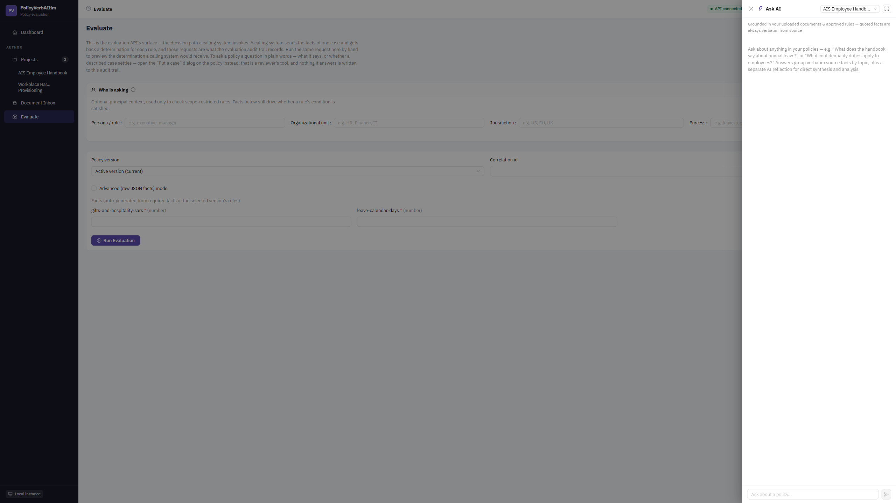

**Ask AI** answers questions about a policy set from its approved rules, grouping verbatim source facts by topic and keeping the AI's own synthesis separate and labelled.

Use it for *"what does this say about…"*. Use **Test a Case** ([§11](#11-put-a-real-case-to-it)) when you want a decision on a specific situation — that is a reviewer's tool, answered on screen and not persisted. When the decision has to be citable afterwards, use the audited external channel in [§14](#14-serve-decisions-to-other-systems).

---

## 16. Audit and periodic review

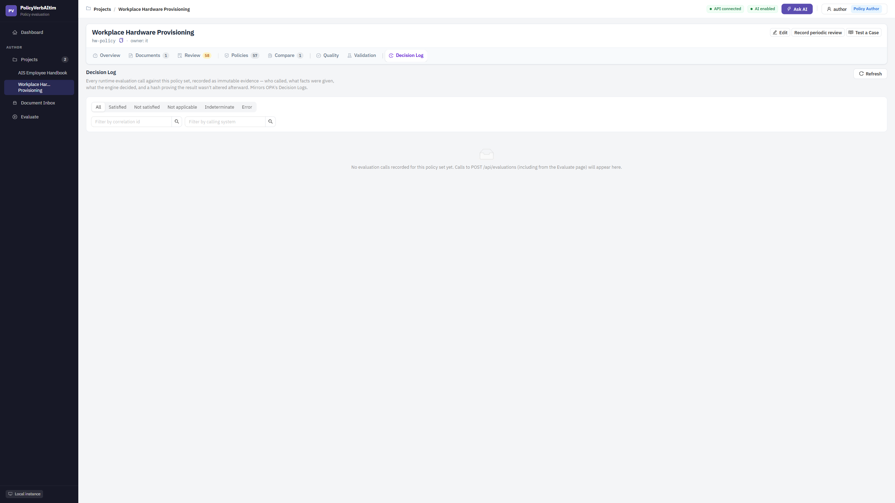

The **Decision Log** retains what was asked, what answered, and which version decided. Every mutation is audited, and evaluations are retained as evidence.

**Record periodic review** — on the project header — attests that a policy set has been reviewed, in the shape [ISO 37301](standards.md) §9.3 expects. It records the attestation and sets the next review date; the register shows when a project is overdue.

---

## 17. The document inbox

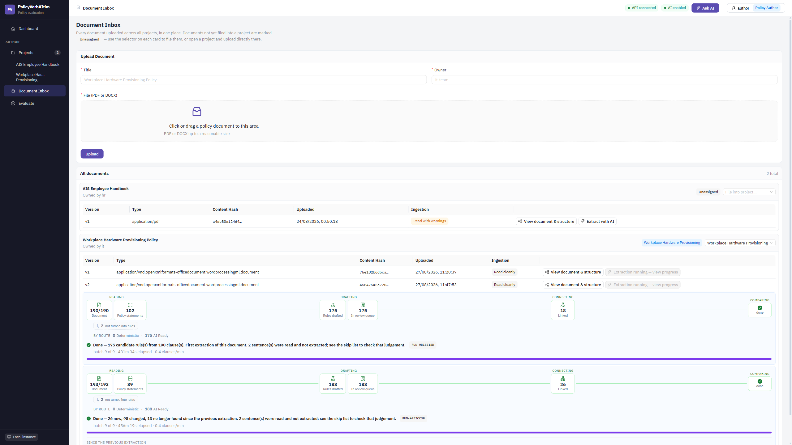

The inbox holds documents that have arrived but are not yet assigned to a project. Use it to triage sources before deciding which policy set they belong to.

---

## Troubleshooting

| Symptom | Likely cause | What to do |
|---|---|---|
| Extraction produced very few rules | The source has little readable text, or is a scan | Check the ingestion diagnostics on **Documents** before re-running |
| AI routes return `503` | Azure AI settings are blank or unreachable | Validate the settings; deterministic features keep working meanwhile |
| `clauses_search_indexed` is `0` | Search indexing was unavailable | The clauses are stored — this reports the search index only, and upload still succeeded |
| Quality shows no findings on a candidate set | The run was scoped to the published version | Switch the scope to rules still in review |
| Compare says it needs two versions | Only one version is published | Publish a second version before comparing |
| A version comparison looks noisy | Re-extraction produced different records for unchanged sentences | Read the *changed in source* group first — see [§13](#13-compare-against-the-next-edition) |

---

## Safe operating rules

1. **Read the ingestion diagnostics before extracting.** They tell you whether the document was readable at all.
2. **Decide a provision as a unit.** Approving one rule of a family can leave the topic half-decided.
3. **Check the quality scope before quoting a number.** Published and in-review are different questions.
4. **Publish deliberately.** The version is immutable, and downstream systems may pin it.
5. **Keep guards after they pass.** A scenario you verified is worth more re-running on every future publish than it was the day you wrote it.
6. **Treat a citation as the evidence.** If the sentence does not support the rule, the rule is wrong regardless of how confident the record reads.
