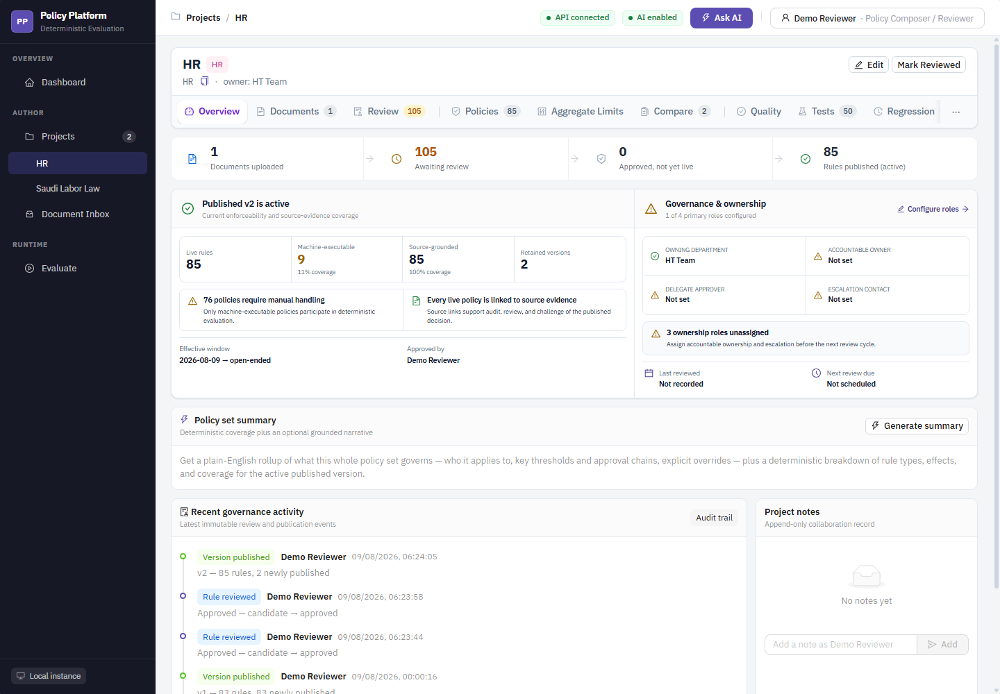
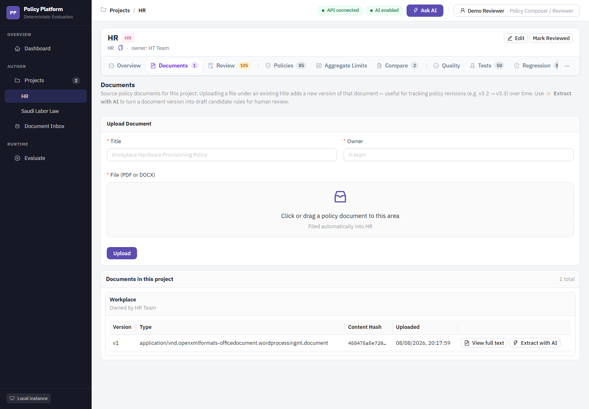
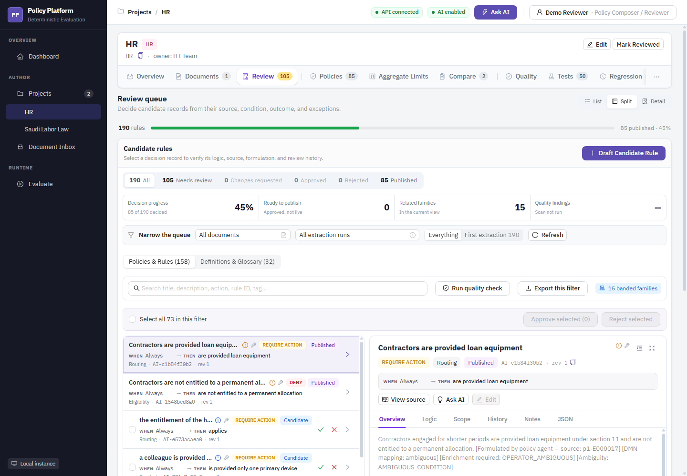
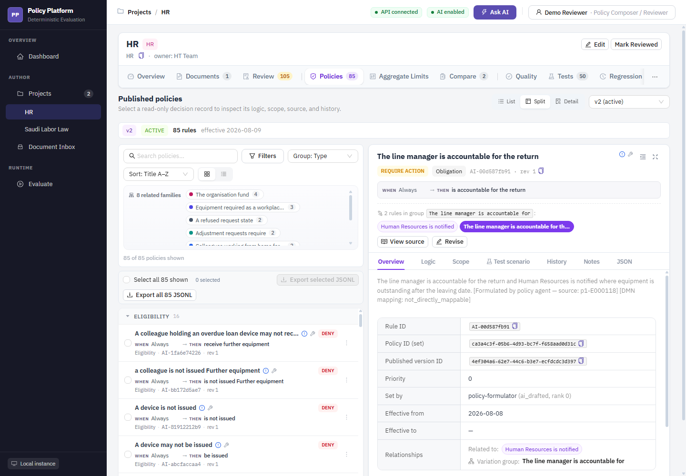
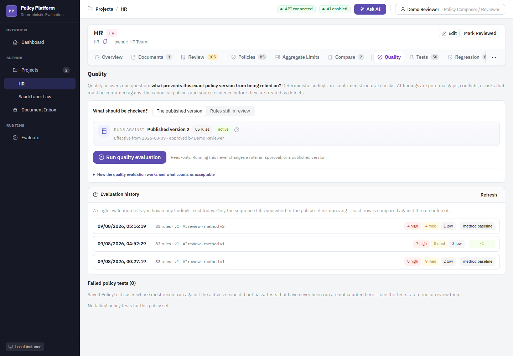
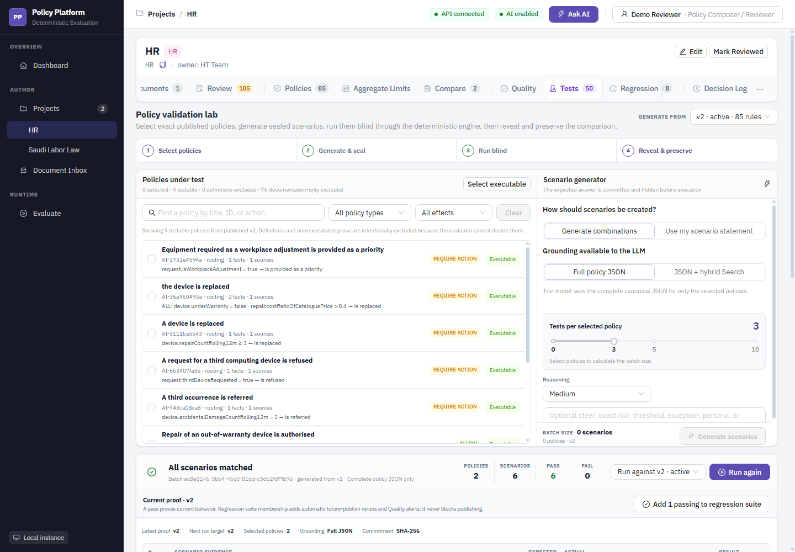
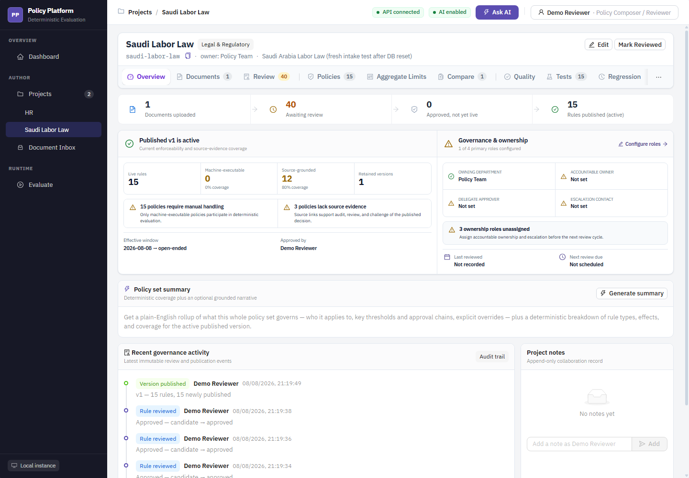

# User guide

This guide explains how to use the Policy Platform from document intake through
review, publication, deterministic evaluation, quality assurance, and grounded
AI assistance.

The screenshots use the local **HR** and **Saudi Labor Law** demonstration
projects. Counts and timestamps will differ in another environment. Personal
reviewer names have been replaced with **Demo Reviewer** in the screenshots.

## Before you begin

The current application has three local working personas:

| Persona | Main responsibilities |
|---|---|
| **System Admin** | Source documents, project setup, and platform configuration |
| **Policy Composer / Reviewer** | Document extraction, candidate drafting, review, quality, and tests |
| **Policy Manager** | Publication, manager overrides, governed exports, and lifecycle oversight |

Select your name and acting persona from the identity control in the top-right
corner. This value is used for attribution in the local application.

> **Current security limitation**
>
> The acting-persona selector is not authentication. It is stored in browser
> `localStorage`, and some manager actions trust a role sent by the client. Do
> not expose the current build to untrusted users. Entra authentication,
> server-side RBAC, managed users, and an administration page remain pending
> implementation work.

Confirm the header shows:

- **API connected** — the FastAPI backend is reachable.
- **AI enabled** — Azure OpenAI is configured.

Azure AI Search is also required for retrieval-grounded features such as
Ask AI and AI-proposed policy tests.

## 1. Start from the dashboard

The dashboard summarizes work across all projects:

- candidates awaiting a decision;
- high-severity quality findings;
- machine-executable coverage;
- saved regression guards;
- project readiness and the next actions for the selected persona.

Use the sidebar to open:

| Destination | Use it for |
|---|---|
| **Dashboard** | Portfolio activity, readiness, and shortcuts |
| **Projects** | The complete project register |
| A named project | Direct access to that project's workspace |
| **Document Inbox** | Uploaded files not yet assigned to a project |
| **Evaluate** | Deterministic runtime evaluation of a published policy set |
| **Ask AI** | Grounded questions across one project or the full portfolio |

## 2. Open a project workspace

A project is a policy set: it owns source documents, candidate rules, immutable
published versions, quality history, policy tests, and evaluation history.

The HR overview shows:

- document and review counts;
- the active published version;
- machine-executable and source-evidence coverage;
- ownership and review scheduling;
- recent governance activity;
- project notes.

### Project tabs

| Tab | Purpose |
|---|---|
| **Overview** | Readiness, governance ownership, lifecycle dates, and recent activity |
| **Documents** | Upload source files, inspect versions, view extracted text, and start AI extraction |
| **Review** | Verify, edit, approve, reject, request changes, or override candidate rules |
| **Policies** | Inspect the active immutable policy version |
| **Aggregate Limits** | Define shared ceilings across multiple rules |
| **Compare** | Compare two published versions |
| **Quality** | Run and review deterministic and AI-assisted quality checks |
| **Tests** | Generate, review, run, and preserve policy scenarios |
| **Regression** | Review immutable test runs across versions |
| **Decision Log** | Inspect recorded runtime evaluations |

Additional Correlation, Exceptions, and Attestations workspaces are implemented
but may be hidden behind the project overflow menu in the current UI.

## 3. Upload and extract a policy document

Open **Documents** inside the target project.

### Upload a new source

1. Enter a **Title** and **Owner**.
2. Drop a PDF or DOCX into the upload area, or click the area to select a file.
3. Select **Upload**.
4. Confirm the document appears under **Documents in this project**.

Uploading another file under the same document title creates a new immutable
document version instead of replacing the existing source.

### Inspect or extract

For a document version:

- select **View full text** to inspect parsed source text;
- select **Extract with AI** to create candidate rules.

Extraction is a long-running operation. The application:

1. parses the document into source-linked clauses;
2. extracts verbatim policy passages;
3. formulates structured candidate rules;
4. verifies source evidence;
5. stores candidates for human review;
6. indexes clauses into Azure AI Search when Search is available.

Nothing is published automatically. If the API restarts during extraction, the
run is marked failed; already committed candidates remain available for review.

## 4. Review candidate rules

Open **Review** to decide which AI-drafted or manually drafted rules are suitable
for publication.

### Narrow the queue

Use:

- document and extraction-run filters;
- review-status filters;
- **Policies & Rules** or **Definitions & Glossary**;
- search by title, action, rule ID, or tag;
- related-family grouping;
- quality findings;
- list, split, or detail view.

### Inspect a candidate

Select a candidate to review:

- outcome/effect and rule type;
- condition logic;
- target scope;
- required facts;
- exceptions and advice;
- relationship and precedence metadata;
- source passage and evidence;
- revision and review history;
- canonical JSON.

Use **View source** before deciding. Source evidence is the authoritative basis
for approving a candidate.

### Decide

A reviewer can:

- **Approve** — ready for the next publication;
- **Reject** — excluded from publication;
- **Edit/Revise** — correct the candidate before deciding;
- **Ask AI** — request a targeted explanation or rewrite;
- apply a bulk decision to selected candidates.

A Policy Manager can additionally request changes or override a prior review
decision with a recorded reason.

> AI output is advisory. Approval is a human governance decision.

## 5. Publish and inspect governed policies

Publishing creates a new immutable full snapshot. It does not edit the active
version in place.

Before publishing:

1. resolve or explicitly accept important quality findings;
2. approve the intended candidates;
3. check policy tests;
4. confirm ownership and lifecycle metadata;
5. switch to **Policy Manager**;
6. publish the approved set.

Publication activates one version and automatically reruns active policy tests.

Open **Policies** to inspect the active version.

Use the workspace to:

- switch retained versions;
- search and filter rules;
- group related policies;
- inspect readable condition logic;
- review source, scope, history, notes, and canonical JSON;
- export governed rules as JSON, JSONL, or CSV.

Published versions are read-only. Create a revised candidate and publish a new
version to change live behavior.

## 6. Check quality before and after publication

Open **Quality** and choose the evaluation scope:

- **The published version** — can the current live version be relied on?
- **Rules still in review** — are candidates safe to approve?

Select **Run quality evaluation** to create a read-only quality run. The check
does not modify rules or approvals.

Findings may come from:

- deterministic structural checks;
- AI review of ambiguity, gaps, overlaps, and conflicts;
- failed policy tests.

Review findings against the canonical rule and source evidence. AI findings are
potential risks, not automatically confirmed defects. Evaluation history lets
you demonstrate whether later versions improved.

## 7. Create and run policy tests

Open **Tests** to validate published behavior with sealed scenarios.

The workflow has four stages:

1. **Select policies** — choose machine-executable rules from a published
   version.
2. **Generate & seal** — use generated combinations or your own scenario
   statement. The expected result is committed and hidden.
3. **Run blind** — execute facts through the deterministic engine.
4. **Reveal & preserve** — compare expected and actual outcomes and retain the
   evidence.

AI may propose scenarios, but it does not decide pass/fail. The deterministic
evaluator executes the test.

Use **Add passing to regression suite** to preserve representative behavior.
Regression tests rerun automatically after publication and surface failures in
Quality.

## 8. Evaluate a published policy

Open the global **Evaluate** page.

1. Select the project.
2. Optionally enter principal context:
   - persona/role;
   - organizational unit;
   - jurisdiction;
   - process.
3. Select the active version or pin a retained version.
4. Optionally enter a correlation ID for an upstream transaction.
5. Complete the generated required-fact fields, or enable advanced JSON mode.
6. Select **Run Evaluation**.

The result includes:

- overall status;
- policy outcome;
- rule-by-rule results;
- missing facts;
- triggered exceptions;
- aggregate-limit breaches;
- required actions and advice;
- a stable result hash.

Missing required facts produce `INDETERMINATE`; the engine does not guess.
Every evaluation is appended to the project's **Decision Log**.

## 9. Ask grounded questions

Select **Ask AI** in the header and choose a project scope.

Good questions ask for:

- a policy threshold or approval requirement;
- differences between two rules or versions;
- the source wording behind a rule;
- a plain-language explanation of an evaluation;
- gaps that should be reviewed.

Grounded answers separate:

- verbatim source facts and citations;
- the model's explanatory synthesis.

Follow each source citation before relying on an answer. If the required
information is not in the indexed policy corpus, the expected behavior is to
say that it could not be established—not to invent an answer.

## 10. Use the overview for governance follow-up

The Saudi Labor Law example shows the same workflow with a smaller active
version and explicit evidence/ownership gaps.

Use overview warnings as follow-up work:

- assign accountable ownership and escalation contacts;
- schedule the next review;
- resolve missing source evidence;
- increase machine-executable coverage where deterministic evaluation is
  required;
- review the candidate backlog;
- rerun quality and regression checks after changes.

## Supporting workflows

### Compare versions

Open **Compare**, select two published versions, and review:

- added rules;
- removed rules;
- changed fields;
- unchanged rules;
- optional AI narrative based on the deterministic diff.

### Aggregate limits

Use **Aggregate Limits** when multiple rules contribute to one shared ceiling.
Preview eligibility before saving a limit, then verify it with a policy test.

### Regression and Decision Log

- **Regression** preserves versioned test executions and reveals behavior
  changes.
- **Decision Log** preserves runtime facts, status, outcome, and result hash for
  each evaluation.

### Export

Candidate and published-rule exports support:

- JSON for application integration;
- JSONL for streaming/batch processing;
- CSV for spreadsheet review.

Exports are point-in-time downloads, not subscriptions or event streams.

## Troubleshooting

| Symptom | What to check |
|---|---|
| **API disconnected** | Confirm PostgreSQL and the FastAPI process are running and `VITE_API_BASE_URL` points to the API |
| **AI disabled** | Confirm the required Azure OpenAI endpoint, credentials, reasoning/fast deployments, and embedding deployment |
| Ask AI has no citations | Confirm Azure AI Search is configured and the source document was indexed |
| Extraction appears slow | Large documents require many model calls; avoid API reload mode and watch extraction progress |
| Extraction failed after restart | The run is intentionally marked failed; review committed candidates and rerun if needed |
| Publish action unavailable | Switch to Policy Manager and confirm candidates are approved |
| Manager action returns `403` | The request is not using the Policy Manager persona |
| Evaluation returns `INDETERMINATE` | Supply the listed missing facts; do not reinterpret it as false |
| No policies are testable | The active version contains definitions or documentation-only prose rather than executable conditions |
| Quality finding looks incorrect | Compare the finding with the canonical rule and source evidence; AI findings require confirmation |

## Safe operating rules

1. Treat source evidence as authoritative.
2. Treat AI output as a proposal, not a policy decision.
3. Do not publish without human review.
4. Do not edit a published version; create a new one.
5. Preserve representative tests before changing live policy.
6. Investigate `INDETERMINATE` rather than forcing a result.
7. Keep the current local-trust build on a trusted network.
8. Use synthetic or approved policy content in demonstrations.

For implementation-level flow diagrams, see
[Capability flows](capability-flows.md). For the AI grounding boundary, see
[AI assistance](ai-assistance.md#how-the-ai-is-grounded).
