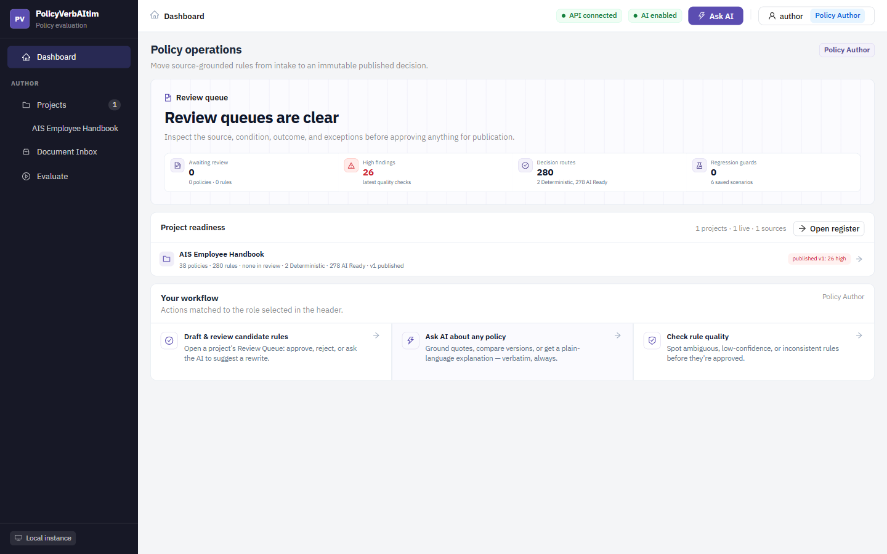
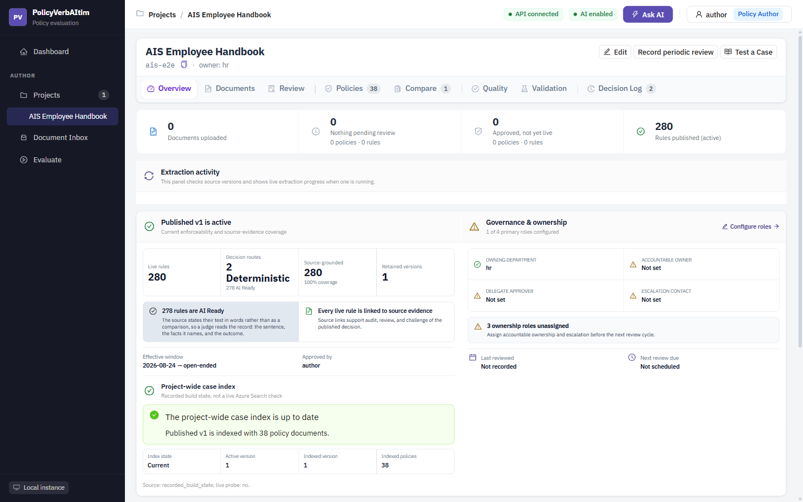
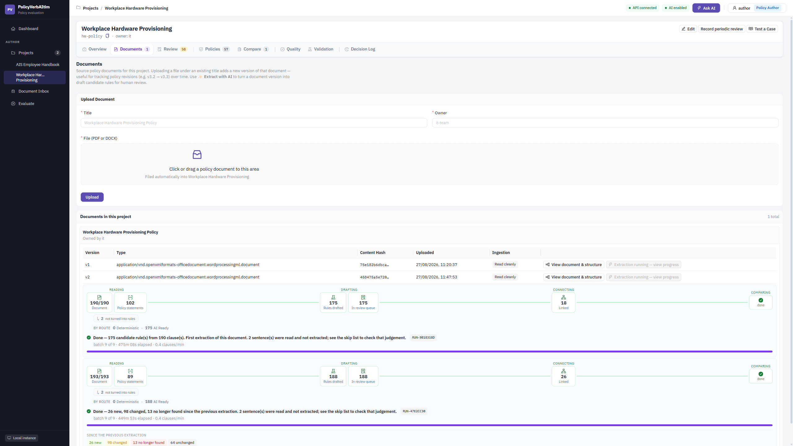
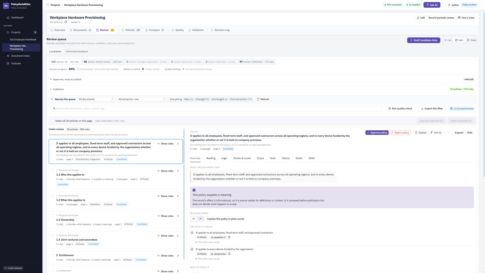
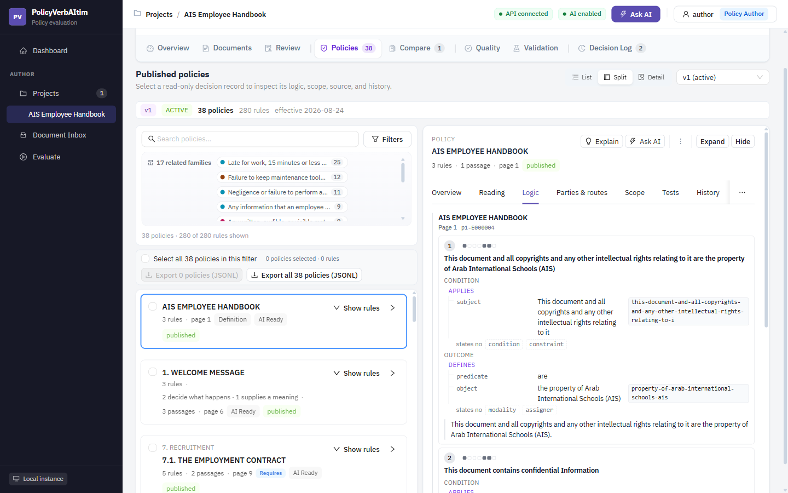
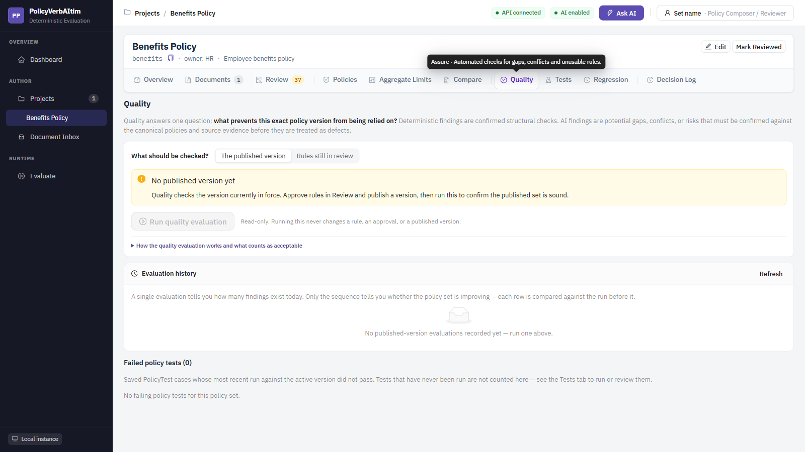
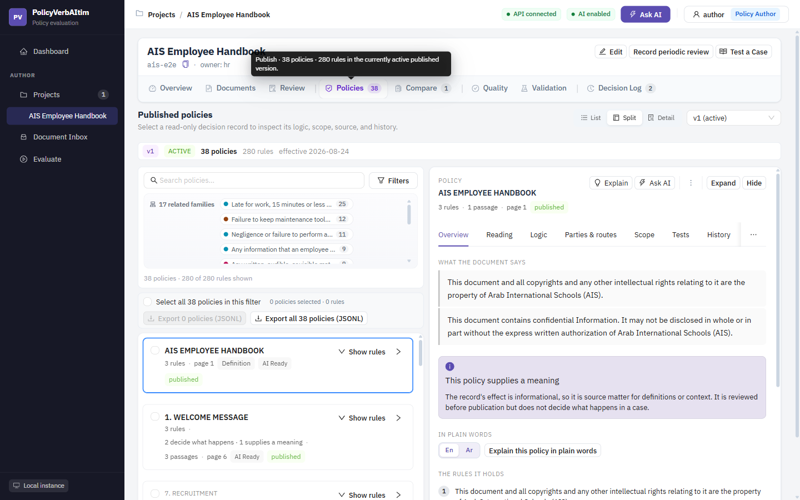
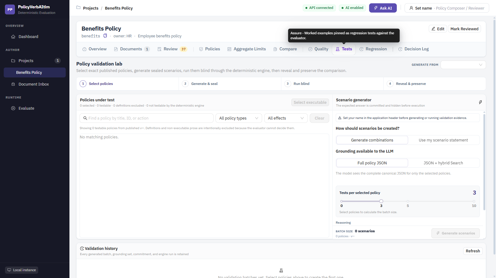
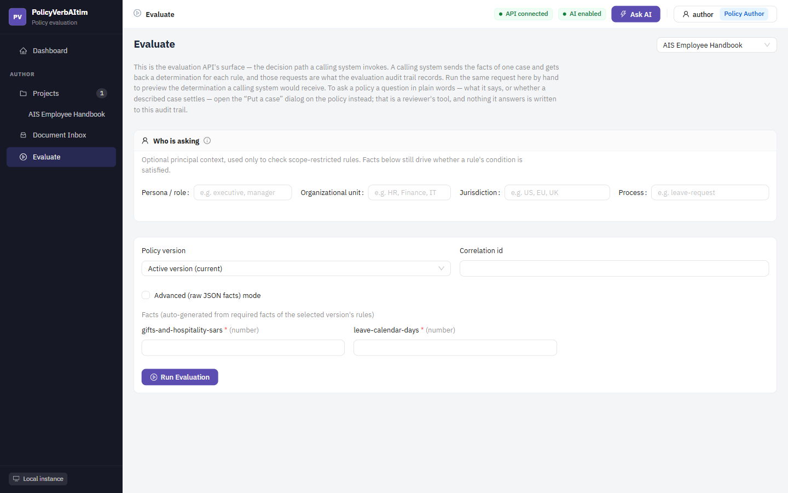
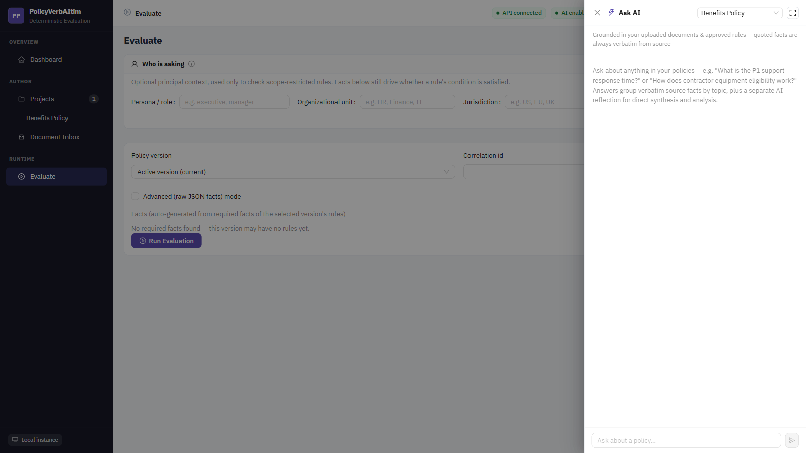

# User guide

This guide follows the user journey from source document to governed policy
decision. Screenshots come from a local instance with one project loaded from a
single extraction run. Project names, counts and dates will differ in another
environment.

## Deployment status

| Deployment | Status | Meaning |
|---|---|---|
| **Local deployment** | **Available** | The web app, API, and PostgreSQL run locally. The local API may call configured Azure OpenAI and Azure AI Search endpoints. |
| **Azure deployment** | **Pending** | Docker, Bicep, azd, networking, and operations assets are prepared and statically validated, but no Azure-hosted environment has been provisioned from this repository. |

Using Azure OpenAI or Azure AI Search endpoints from a locally running API is
still a **Local deployment**. It becomes an **Azure deployment** only when the
application itself is provisioned and running in Azure.

## Journey at a glance

```text
Set identity
-> choose or create a project
-> upload source
-> extract candidate rules
-> review source and logic
-> run pre-publish quality
-> approve and publish
-> inspect the immutable package
-> create tests and regression guards
-> evaluate live behavior
-> monitor evidence and governance
```

## 1. Set your identity and understand the dashboard

The top-right identity control is the single place to set:

- your display name;
- the persona you are acting as.

| Persona | Main responsibility |
|---|---|
| **System Admin** | Project setup, source documents, and platform configuration |
| **Policy Composer / Reviewer** | Extraction, drafting, review, quality, and tests |
| **Policy Manager** | Publication, overrides, exports, and lifecycle oversight |

The identity is used for attribution. In the current Local deployment it is not
authentication or trusted authorization.

Confirm the header shows:

- **API connected**;
- **AI enabled** when Azure OpenAI is configured.



The dashboard leads with work that needs attention:

- candidates awaiting review;
- high quality findings;
- how policies are routed — deterministic or AI Ready;
- regression guards;
- project readiness.

## 2. Choose a project and assess readiness

Open **Projects**, then select a policy set.



The Overview answers whether the current package is:

- published and effective;
- linked to source evidence;
- assigned to accountable owners;
- scheduled for review.

It also shows how the package's policies are routed. Each carries an
`evaluation_mode` stating how it must be decided:

| Route | The source states its test as | Decided by |
|---|---|---|
| `deterministic` | A computable comparison — a threshold, a date, a count | The rule engine |
| `ai_ready` | Words a reader has to weigh — "reasonable", "as deemed necessary" | A judge reading the record |

**AI Ready is a route, not a fault.** Most policy text is written in words, and
a package that is largely `ai_ready` reflects how its source document is
written, not a shortfall in extraction. There is nothing to "fix" about it, and
the platform will not ask you to.

Use the tabs in journey order:

```text
Documents -> Review -> Quality -> Policies -> Tests -> Regression
```

Supporting tabs include Compare and Decision Log.

## 3. Upload and control a source document

Open **Documents** inside the project.



### Upload

1. Enter the source title and owner.
2. Select or drop a PDF/DOCX.
3. Select **Upload**.
4. Confirm the document appears in the project.

Uploading a replacement creates a new immutable document version; it does not
overwrite the earlier source.

### Inspect before extraction

Use **View full text** to confirm parsing quality. The system stores clauses with
page, section, sequence, and source offsets. These references later connect a
policy decision back to its exact wording.

## 4. Extract candidate rules

Select **Extract with AI** on the intended document version.

The extraction process:

1. selects verbatim policy passages;
2. verifies each passage against the parsed source;
3. formulates candidate rules;
4. maps conditions, effects, facts, and executability;
5. stores candidates for human review;
6. indexes clauses into Azure AI Search when Search is available.

Nothing is published automatically. A long extraction uses many model calls. If
the API restarts, the run is marked failed and already committed candidates stay
available.

## 5. Review candidate rules against source evidence

Open **Review**.



### Narrow the queue

Filter by:

- document and extraction run;
- review status;
- policy rules versus definitions/glossary;
- title, action, rule ID, or tag;
- related policy family;
- quality findings.

### Inspect a candidate

Select a row and verify:

- `WHEN -> THEN` logic;
- effect and rule type;
- required facts;
- target scope;
- exceptions and advice;
- precedence and relationships;
- verbatim source text;
- canonical JSON.

The **Logic** tab shows the policy as a table of attributes in two groups —
what the policy applies to, and what follows:

| Group | Rows |
|---|---|
| Applies | `subject`, `beneficiary`, `recipient`, `candidate`, `actor`, `location`, `condition`, `prerequisite`, `trigger`, `temporal_constraint`, `constraint` |
| Outcome | `modality`, `predicate`, `object`, `threshold`, `calculation`, `unit`, `currency`, `frequency`, `deadline`, `sequence`, `consequence`, `remedy`, `assigner`, `exception` |

Only the attributes a rule actually states appear; a rule naming no deadline
shows no deadline row. Each row gives the attribute, its value, and the fact the
value was matched to.



The values are the record's own words, not a paraphrase: if the table and
the source read differently, that is an extraction defect worth reporting, not
a display choice.

Use **View source** before deciding. AI output is a proposal; source evidence and
human judgement are authoritative.

### When a rule has been extracted more than once

Running extraction twice over one document produces a second reading of the
same sentence. The queue shows only the **latest** reading; each card offers the
one it replaced, read-only, so you can see what changed rather than deciding
between two records with no statement of which is current.

Approving a reading does not delete its predecessor — the audit trail keeps
every approved version.

### Decide

- **Approve** when the candidate is correct and publishable.
- **Reject** when it should not enter policy.
- **Edit/Revise** when logic or wording must change.
- **Ask AI** for an advisory explanation or rewrite.
- Use bulk actions only after filtering to the intended set.

## 6. Run quality before publication

Open **Quality** and choose **Rules still in review**.



Run the evaluation before approving a large batch. Review:

- confirmed deterministic findings;
- potential AI findings that need human confirmation;
- affected policy records;
- exact source evidence;
- acceptable and unacceptable conditions;
- reviewer questions and suggested correction.

Quality does not modify rules. Fix the candidate in Review, then run Quality
again.

## 7. Approve and publish

When the intended candidates are approved:

1. switch to **Policy Manager**;
2. confirm your name in the header;
3. review the publication summary;
4. choose the effective date;
5. publish the next version.

Publication creates a complete immutable snapshot. It carries forward unchanged
rules, adds or supersedes approved candidates, records the approver, and reruns
active regression guards.

## 8. Inspect the governed policy package

Open **Policies**.



Use the workspace to:

- switch retained versions;
- search and filter;
- isolate related policy families;
- inspect `WHEN -> THEN` decisions;
- review source, scope, history, and notes;
- inspect evaluator, canonical, and DMN/FEEL JSON;
- export selected or all rules as JSONL.

Published versions are read-only. Change live behavior by revising a candidate
and publishing another version.

## 9. Prove behavior with blind tests

Open **Tests**.



The four-stage flow is:

1. **Select policies** from a published version.
2. **Generate & seal** AI-generated combinations or your own scenario.
3. **Run blind** through the deterministic evaluator.
4. **Reveal & preserve** expected-versus-actual evidence.

The page distinguishes:

- the version used to generate scenarios;
- the latest proof version;
- the next run target;
- JSON-only versus JSON + hybrid Search grounding;
- exact tests per selected policy.

AI may draft scenarios. Only the deterministic evaluator decides pass/fail.

## 10. Preserve representative regression guards

After a scenario passes, select **Add passing to regression suite**.

Open **Regression** to:

- run active guards against a retained version;
- inspect exact versioned policy evidence;
- review immutable run history;
- retire or reactivate guards.

Publishing automatically reruns active guards. A failure is evidence for review;
it does not block publication.

## 11. Evaluate live policy behavior

Open the global **Evaluate** page.



1. Select the project and version.
2. Enter principal context when scope requires it.
3. Complete generated fact fields or use advanced JSON.
4. Optionally add a correlation ID.
5. Select **Run Evaluation**.

The result includes overall status, outcome, per-rule results, missing facts,
exceptions, aggregate breaches, required actions, advice, source evidence, and a
stable result hash.

Missing facts produce `INDETERMINATE`; the engine does not guess. Every call is
stored in the project's **Decision Log**.

## 12. Ask grounded questions

Select **Ask AI** and choose the project scope.



Useful questions ask for:

- a threshold or approval requirement;
- the source wording behind a policy;
- differences between rules or versions;
- a plain-language explanation of an evaluation;
- a potential gap to review.

Grounded responses separate source facts from model synthesis. Follow citations
before relying on an answer.

## 13. Monitor governance and improve the next version

Return to Overview after publication.


Use the readiness docket to:

- assign accountable ownership and escalation contacts;
- schedule the next review;
- resolve missing source evidence;
- clear the review backlog;
- rerun Quality and Regression after changes.

Use **Compare** for exact rule-level changes between versions and **Decision Log**
for runtime evidence.

## Supporting tasks

| Task | Workspace |
|---|---|
| Export candidates for offline review | Review |
| Export governed rules | Policies |
| Compare two immutable packages | Compare |
| Inspect runtime decisions | Decision Log |

## Troubleshooting

| Symptom | Check |
|---|---|
| API disconnected | Local PostgreSQL/API processes and `VITE_API_BASE_URL` |
| AI disabled | Azure OpenAI endpoint, key, chat deployments, and embedding deployment |
| Ask AI has no citations | Azure AI Search configuration and indexed source clauses |
| Extraction is slow | Large documents require many model calls; avoid API reload mode |
| Publish unavailable | Policy Manager persona, header identity, approved candidates |
| Evaluation is `INDETERMINATE` | Supply the listed missing facts |
| No testable policies | Active rules may be definitions, or routed `ai_ready` for a judge rather than the engine |
| Quality finding seems wrong | Compare it with the exact versioned policy and source evidence |

## Safe operating rules

1. Treat source evidence as authoritative.
2. Treat AI output as a proposal.
3. Do not publish without human review.
4. Never edit an immutable published version.
5. Preserve representative tests before changing live policy.
6. Investigate `INDETERMINATE`; do not force a result.
7. Keep the current Local deployment on a trusted network.
8. Treat Azure deployment as pending until live validation is complete.

For implementation-level diagrams, see
[Capability flows](capability-flows.md).
