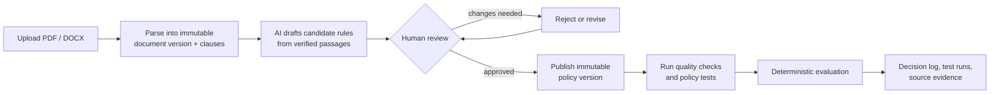

# Workflows

This page is the short operational view of the platform. For screenshots, use the
[User guide](user-guide.md). For implementation boundaries, use
[Capability flows](capability-flows.md).

## Document control workflow



The important control points are:

1. **Source is immutable.** Uploading a replacement creates a new
   `DocumentVersion`; it does not overwrite the earlier source.
2. **AI produces drafts only.** Extraction creates candidate rules linked to
   verbatim clauses.
3. **A human publishes.** Approved candidates become a new full policy snapshot.
4. **The engine is deterministic.** AI is never in the decision path.
5. **Evidence is append-only.** Evaluations, quality runs, and test runs retain
   the version they were executed against.

## 1. Ingest and control source documents

Upload PDF or DOCX from a project **Documents** tab or the global
**Document Inbox**. The API:

- stores the file;
- creates a `SourceDocument` and immutable `DocumentVersion`;
- parses layout-aware `Clause` rows with page, section, sequence, and offsets;
- indexes clauses into Azure AI Search on a best-effort basis.

Duplicate content hashes are rejected. Search failure does not invalidate the
stored source.

## 2. Extract candidate rules

**Extract with AI** starts an `ExtractionRun`:

1. Stage 1 selects verbatim policy passages.
2. Python verifies each passage against the canonical source text.
3. Stage 2 formulates structured rules.
4. Deterministic mapping derives conditions, effects, facts, and executability.
5. Candidate rows are persisted for review.

Nothing is published automatically. A restart marks an interrupted run failed
while keeping candidates already committed.

## 3. Review and approve

The **Review** tab is the governance gate. Reviewers can filter, inspect source
evidence, edit, request an AI rewrite, approve, reject, or apply a bulk decision.
Manager-only request-change and override actions require the manager persona.

All evidence-creating actions use the shared actor identity from the application
header.

## 4. Publish an immutable version

Publishing:

- carries forward unchanged live rules;
- adds or supersedes approved candidates by `rule_id`;
- snapshots aggregate limits and evidence references;
- activates one new `ApprovedPolicyVersion`;
- writes an audit event;
- re-runs active regression guards.

Published rules are read-only. A correction requires a new candidate and another
version.

## 5. Assure policy behavior

| Workspace | Purpose |
|---|---|
| **Quality** | Confirm structural defects and review AI-raised potential gaps, conflicts, and risks against exact versioned evidence. |
| **Tests** | Generate or author sealed scenarios, run them blind, and compare expected to actual behavior. |
| **Regression** | Preserve representative passing scenarios and re-run them across later published versions. |
| **Compare** | Compute an exact rule-level diff between two published snapshots, with an optional AI narrative. |
| **Aggregate Limits** | Define and preview ceilings shared across several rules. |

AI may propose findings or scenarios. Python validation and the deterministic
engine decide what is accepted, executable, passing, or failing.

## 6. Evaluate and retain evidence

The global **Evaluate** page and `POST /api/evaluations` accept a policy set,
optional version pin, and facts.

The result includes:

- overall status and outcome;
- per-rule results;
- missing facts;
- exceptions and overrides;
- aggregate-limit breaches;
- advice;
- source evidence;
- stable result hash.

Every call is appended to the project **Decision Log**. Missing facts yield
`INDETERMINATE`; the engine never guesses.

## Supporting workflows

| Capability | Current behavior |
|---|---|
| **Ask AI** | Grounded read-only answers from approved rules and retrieved clauses. |
| **Correlation** | Deterministic grouping plus AI relationship classification; implemented but hidden. |
| **Exceptions** | Human waiver records; implemented but hidden and not consumed by the evaluator. |
| **Attestations** | Version-bound acknowledgement campaigns; implemented but hidden. |
| **Exports** | JSON, JSONL, and CSV re-serialization of persisted rules or candidates. |
| **Notes** | Collaboration context attached to governed entities; not immutable evidence. |

## Navigation

The sidebar exposes Dashboard, Projects, Document Inbox, Evaluate, and named
projects. Inside a project, tabs follow the lifecycle:

```text
Author:   Overview -> Documents -> Review
Publish:  Policies -> Aggregate Limits -> Compare
Assure:   Quality -> Tests -> Regression
Operate:  Decision Log
```

Correlation, Exceptions, and Attestations remain hidden in the current phase.
