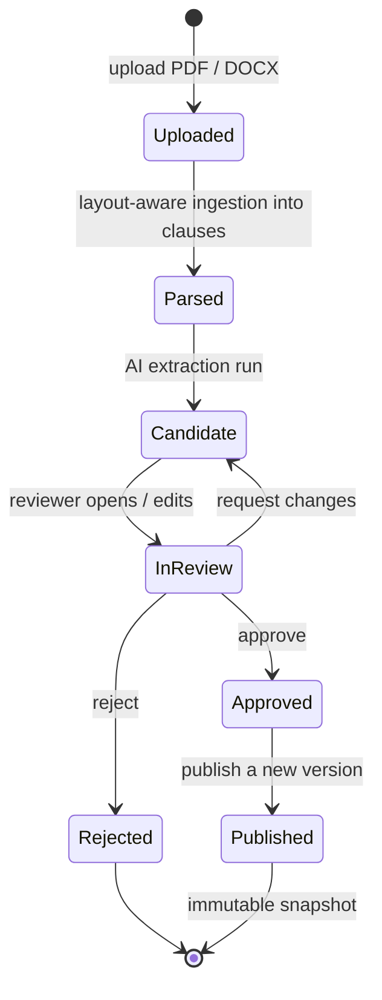

# Workflows

How people actually use the platform, and what happens behind each action.
Each flow below has a matching diagram in
[Capability flows](capability-flows.md).

For a task-oriented walkthrough with screenshots from the HR and Saudi Labor
Law demonstration projects, see the [User guide](user-guide.md).

## Navigation

The web app is a sidebar shell with four visible destinations, grouped by intent
(`apps/web/src/App.tsx`):

| Group | Destination | Purpose |
|---|---|---|
| Overview | **Dashboard** | Activity and health across every project. |
| Author | **Projects** | The project register; each project (policy set) opens its own workspace. Projects are also listed directly in the sidebar. |
| Author | **Document Inbox** | Files uploaded but not yet filed into a project. |
| Runtime | **Evaluate** | Run facts against a published version and see the decision. |

A **My Attestations** page exists and is fully wired, but is hidden from the menu
in this phase. The header carries an API-connected pill, an AI enabled/disabled
pill, an **Ask AI** button (when AI is configured), and the "acting as" switcher.

Opening a project shows the workspace tabs (`ProjectWorkspace.tsx`):

| Tab | Purpose |
|---|---|
| Overview | Where the project stands and what to do next; governance/ownership card. |
| Documents | Source documents, their versions, and AI extraction runs. |
| Review | Candidate rules waiting for a human decision. |
| Policies | Rules in the currently active published version. |
| Aggregate Limits | Caps that combine several rules into one shared ceiling. |
| Compare | Diff two published versions. |
| Quality | Automated checks for gaps, conflicts and unusable rules. |
| Tests | Worked examples pinned as regression tests. |
| Regression | Versioned suite runs and immutable result history. |
| Decision Log | Every evaluation this project has served, with inputs and result. |

Three further tabs — **Correlation**, **Exceptions**, **Attestations** — are
implemented end to end but hidden from the tab bar in this phase. Their APIs
remain callable.

## The main flow

### 1. Ingest a document

Upload a PDF or DOCX from **Documents** (inside a project) or the **Document
Inbox**. The API stores the file under `data/documents/`, creates a
`SourceDocument` plus an immutable `DocumentVersion`, and parses it into `Clause`
rows.

Parsing is layout-aware: text is reconstructed from word positions and stitched
across page boundaries, so a paragraph split by pagination stays one clause and
DOCX table rows are not flattened into invented prose. Each clause keeps its
source offsets, which is what makes verbatim traceability possible later. Clauses
are also indexed into Azure AI Search on a best-effort basis — failures are logged
and never break the upload.

Uploading a new file under an existing title creates a *new version* of the same
document rather than replacing it.

### 2. Extract candidate rules

From a document version, run **Extract with AI**. This starts an
`ExtractionRun` and drives the two-stage pipeline described in
[AI assistance](ai-assistance.md). Output is always `candidate_rules` rows —
nothing is published automatically.

Extraction over a real document is long-running (many model calls). Live progress
is published in memory and polled by the UI; the authoritative record is the
committed rows plus the `extraction_runs` status. If the API restarts mid-run,
the run is marked `failed` at startup and the rules already committed are kept.

Rules can also be drafted by hand — the manual path creates the same
document/version/run scaffolding so a hand-written rule goes through the identical
lifecycle.

### 3. Review

The **Review** tab is where governance happens. A reviewer can:

- filter and facet the queue, and split policy rules from definitions/glossary
  entries;
- read each rule as a card — effect and rule-type badges, a rendered condition
  tree, required facts, exceptions, scope, and the source clause it came from;
- edit a candidate, or ask the AI for a targeted rewrite and apply or discard it;
- approve or reject, individually or in bulk (needed when one document yields
  hundreds of candidates);
- **request changes** or **override** a decision — these two are restricted to
  the `policy_manager` role and are rejected with `403` otherwise.

Every decision records the reviewer and the timestamp.

### 4. Publish

Publishing merges all approved-but-unpublished candidates into a **new approved
version**. Versions are full immutable snapshots, not deltas: every rule from the
current active version is carried forward. Exactly one version per policy set is
active at a time.

On publish, all active policy tests are automatically re-run against the new
version, so a regression shows up immediately in Quality.

### 5. Evaluate

The **Evaluate** page (global) and the evaluations API take a policy set, an
optional version pin, and a set of facts. The facts form is generated from the
union of `required_facts` across the target version's rules, with an advanced
JSON escape hatch.

The result shows the overall status
(`SATISFIED` / `NOT_SATISFIED` / `NOT_APPLICABLE` / `INDETERMINATE` / `ERROR`),
the outcome, a per-rule breakdown, triggered exceptions, aggregate-limit
breaches, advice notes, and a stable result hash. Missing facts produce an
explicit `INDETERMINATE` with the list of what was missing — never a guess.

Every call is appended to the evaluations table and is browsable read-only in the
**Decision Log** tab.

## Supporting flows

### Quality

The **Quality** tab runs two kinds of check and labels each finding by source:

- **Deterministic** — duplicate identifiers, ambiguity flags, conflicting
  effects, expired rules, review backlog, degenerate predicates, eligibility
  polarity inversions, non-executable rules. Computed in plain Python, always
  exact.
- **AI review** — judgement about gaps, redundancy and ambiguous wording, with an
  impact statement and a recommendation.

Two scopes are available: the **published** active version, and **pre-publish
candidates** — the way to ask "are these freshly extracted candidates any good?"
*before* deciding what to approve. Findings are filterable by severity and
source, and each run is persisted so a fix can be shown to have stuck.

Failing policy tests also surface here.

### Cross-rule correlation

Correlation answers what a per-rule review cannot: which rules contradict,
overlap, duplicate, supersede or specialise one another. Rule *grouping* is
deterministic and lives in code (exhaustive pairwise comparison is arithmetically
impossible on a large policy set); the model only classifies the relationship
within a group. Results are stored as runs with findings that a reviewer can
dispose of.

### Policy tests and regression

A policy test is a named, saved scenario with expected assertions. The AI may
**propose** tests; only the deterministic engine ever **executes** one.
AI-proposed tests start as `pending_review` and must be accepted before they
count. Runs are append-only and record which version they ran against. Validation
batches group tests into a suite run.

### Compare versions

Pick two published versions and get a rule-level diff — added, removed, changed,
unchanged — computed deterministically from the persisted payloads. The AI is
handed the already-correct diff and asked only to narrate what changed and why it
matters.

### Ask AI

The global drawer answers plain-English questions, scoped to one policy set or all
of them, grounded in indexed clauses and the currently approved rules, and cites
the source clauses used. It runs on the fast deployment for lower latency.

### Aggregate limits

Some policies impose a shared ceiling across several rules (for example, several
leave types that together cannot exceed an annual cap). The **Aggregate Limits**
tab lets a reviewer create, edit and delete these caps, preview their effect, and
check which rules are eligible to contribute. The evaluator enforces them at
decision time and reports any breach.

### Export

Approved rules and in-review candidates can be exported as JSON, JSONL or CSV.
Export is a verbatim structural re-serialisation of persisted data — no field is
summarised or reworded. The full inventory of outputs and what each is good for
is in the [root README](../README.md#outputs-and-how-to-use-them).
